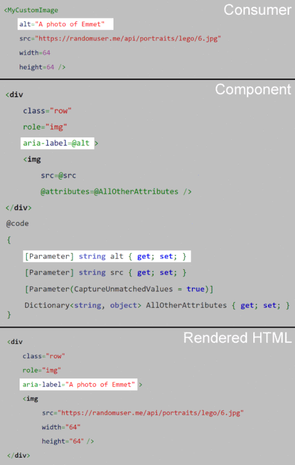

> 原文链接：https://blazor-university.com/components/capturing-unexpected-parameters/

# 捕获意外参数
[源代码](https://github.com/mrpmorris/blazor-university/tree/master/src/Components/CapturingUnexpectedParameters)

之前我们已经看到了如何使用特定名称声明参数和级联参数。例如，一个将 `` 元素包装在一些自定义 HTML 中的自定义组件。

```
<div class="row">
  
</div>

@code 
{
  [Parameter]
  public string src { get; set; }
}
```

在代码稽核过程中，有人指出没有 alt 标签的图像对于视力障碍者来说不太容易访问，因此添加了另一个参数并更新了 HTML。

```
<div class="row" role="img" aria-label=@alt>
  
</div>

@code 
{
  [Parameter]
  public string src { get; set; }
  
  [Parameter]
  public string alt { get; set; }
}
```
随着时间的推移，需要更多属性：

- align
- width
- height

此时您可能不再对图像组件有额外的要求，但是每次编写组件时都必须为每个可能的属性编写参数可能会很烦人，尤其是当您实际上并不处理这些值而只是将它们传递给 HTML 元素的标记时。 `<input>` 控件有大约 30 个属性，需要我们为其编写参数代码。

## 在没有编码参数的情况下捕获值

之前我们看到了如何利用[属性展开](https://feiyun0112.github.io/blazor-university.zh-cn/components/code-generated-html-attributes/)以编程方式生成 HTML 属性及其值。这涉及将 `Dictionary<string, object>` 的值分配给一个特别命名的 `@attributes` 属性。

在不匹配参数的情况下捕获属性值的工作方式类似。我们只需创建一个 `Dictionary<string, object>` 类型的属性，将其装饰为 `[Parameter]`，但在 `Parameter` 中我们需要指定 `CaptureUnmatchedValues = true`。

```
<div class="row" role="img" aria-label=@alt>
  
</div>

@code 
{
  [Parameter]
  public string src { get; set; }

  [Parameter]
  public string alt { get; set; }

  [Parameter(CaptureUnmatchedValues = true)]
  public Dictionary<string, object> AllOtherAttributes { get; set; }
}
```
现在，当您的组件的使用者使用 `[Parameter]` 修饰属性（正常行为）添加您未明确允许的属性值时，Blazor 不会抛出异常，而是将它们作为键/值对收集到我们的字典中。

在前面的示例中，我们组件的使用者指定的任何 `attributes=value` 分配都将添加到我们组件内的 `` 元素中。

```
<MyCustomImage src="https://randomuser.me/api/portraits/lego/6.jpg" alt="A photo of Emmet" width=64 height=64 />
```



**[下一篇 - 替换子组件上的属性](https://feiyun0112.github.io/blazor-university.zh-cn/components/replacing-attributes-on-child-components)**