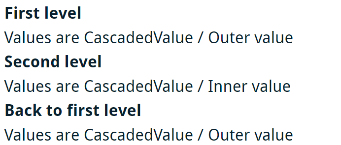
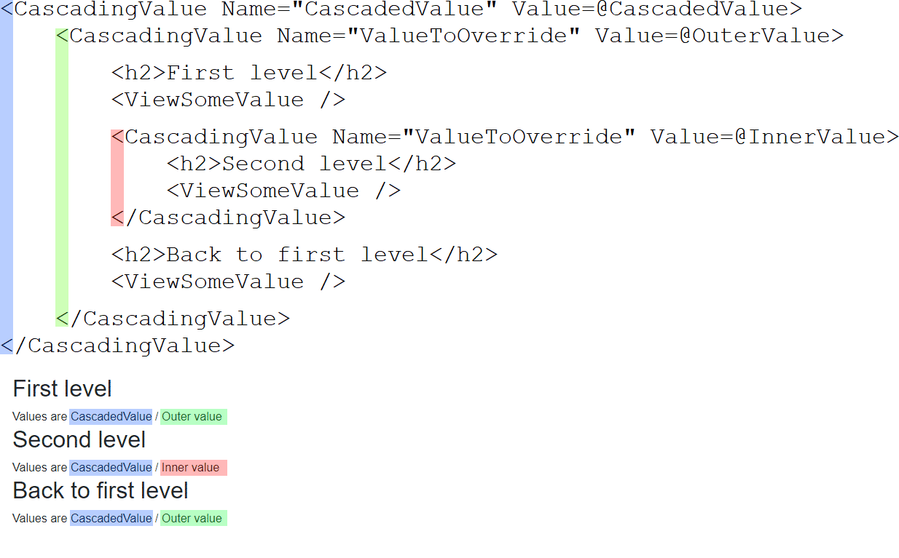

> 原文链接：https://blazor-university.com/components/cascading-values/overriding-cascaded-values/

# 重写级联值
[源代码](https://github.com/mrpmorris/blazor-university/tree/master/src/CascadingValues/OverridingCascadedValues)

级联值和级联参数允许它们的值向下级联渲染树，而无需从父级显式传递到子级。 Blazor 的另一个特性是它允许我们在渲染树的下方重写 `CascadingValue` 的值。

给定以下 `ViewSomeValue` 组件，该组件显示名为 `ValueToOverride` 的 `CascadingValue` 的值：

```
<div>Values are @SomeValue1 / @SomeValue2</div>

@code
{
  [CascadingParameter(Name = "CascadedValue")]
  private string SomeValue1 { get; set; }

  [CascadingParameter(Name = "ValueToOverride")]
  private string SomeValue2 { get; set; }
}
```
以及使用该组件的以下页面：

```
@page "/overridden"

<CascadingValue Name="CascadedValue" Value=@CascadedValue>
  <CascadingValue Name="ValueToOverride" Value=@OuterValue>

    <h2>First level</h2>
    <ViewSomeValue />

    <CascadingValue Name="ValueToOverride" Value=@InnerValue>
      <h2>Second level</h2>
      <ViewSomeValue />
    </CascadingValue>

    <h2>Back to first level</h2>
    <ViewSomeValue />

  </CascadingValue>
</CascadingValue>

@code
{
  string CascadedValue = "CascadedValue";
  string OuterValue = "Outer value";
  string InnerValue = "Inner value";
}
```
我们看到以下输出：



请注意第三个组件的 `ValueToOverride` 值如何自动恢复为“Outer value”。这是因为该值是由元素的深度决定的。第三个组件在最外面的  `CascadingValue` 中呈现，因此它是它找到的最近的包含匹配值的父级。

还要注意 `CascadedValue` 的值如何可用于所有组件。


**[下一篇 - 代码生成 HTML 属性](/components/code-generated-html-attributes)**