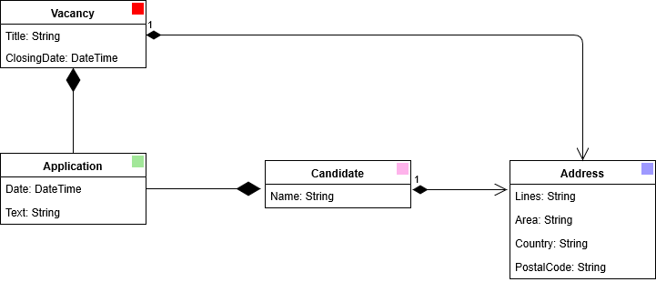
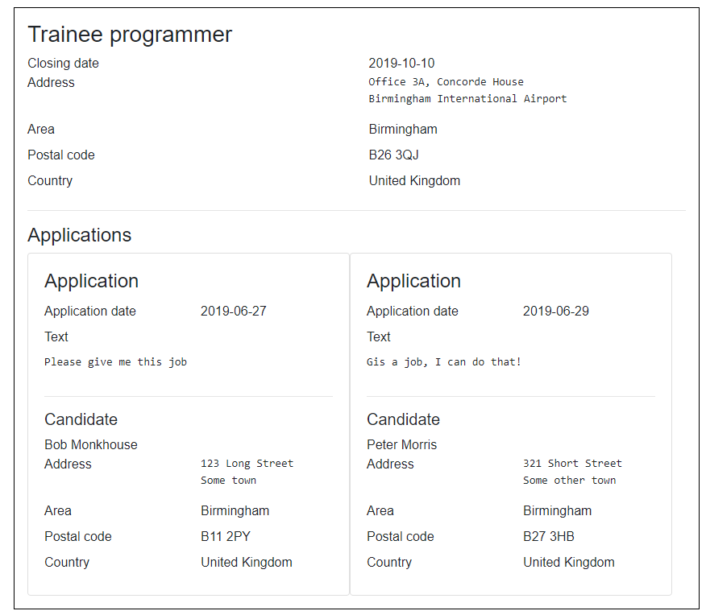
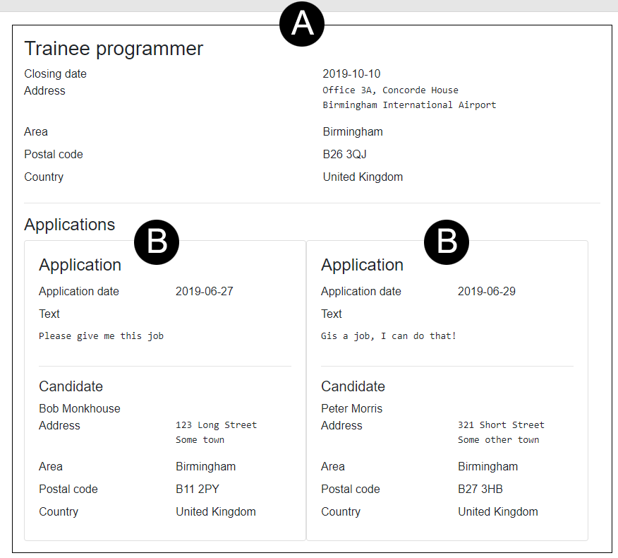
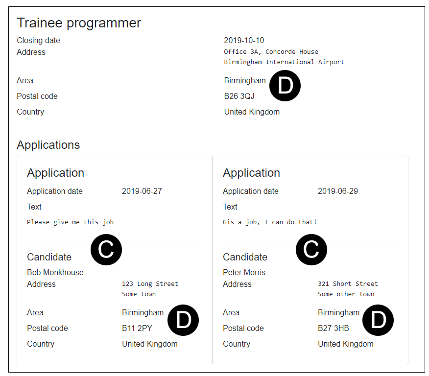
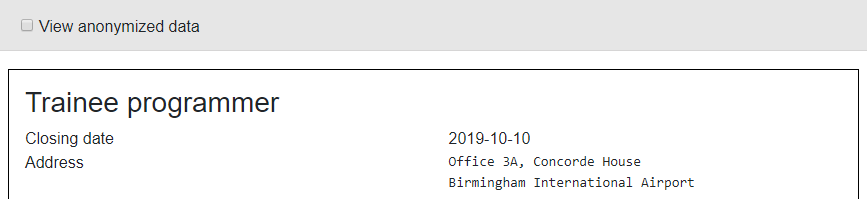
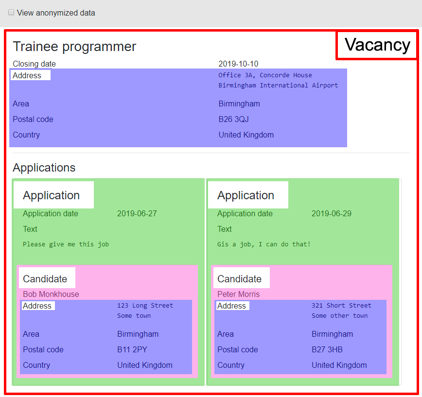
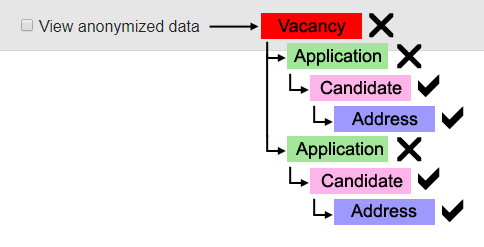

> 原文链接：https://blazor-university.com/components/cascading-values/

# 级联值
[源代码](https://github.com/mrpmorris/blazor-university/tree/master/src/CascadingValues/ManualParameterPassing)

我们已经看到 Blazor 如何允许我们使用[参数](https://feiyun0112.github.io/blazor-university.zh-cn/components/one-way-binding/)将上下文从父组件传递给子组件。随着组件变得越来越复杂，将其拆分为子组件的情况并不少见。在某些时候，一个组件可能会要求其使用者传递它自身不使用但它的一个子组件需要的状态。随着我们组件的结构随着时间的推移变得越来越复杂，我们可能会发现自己的组件需要添加多个参数，而这些参数并不被使用，而是简单地传递，因为它们在更深层次的某个地方需要。

以求职申请为例。一个 `Vacancy`(空缺) 可以有很多 `Applications`(申请)；每份 `Application` 针对一个 `Vacancy`，属于一个 `Candidate`(候选人)；`Vacancy` 和 `Candidate` 都有一个 `Address`(地址)。

查看空缺显示所有申请。在某些时候，需要允许用户单击单个申请并在申请详情页面上详细查看它，因此创建了一个新的 **ViewApplication.razor** 组件，该组件将在查看空缺或查看单个申请时使用.

现在我们有一个 **ViewVacancy.razor** 组件（标记为 A），它遍历所有针对空缺的申请，并为每个申请呈现一个 **ViewApplication.razor** 组件（标记为 B）。

作为标准化应用程序的练习，决定应使用 **ViewCandidate.razor** 组件（标记为 C）显示候选人，并且应使用 **ViewAddress.razor** 组件（标记为 D）显示所有地址。

为了机会平等，显示空缺申请的页面需要在不透露候选人姓名或完整地址的情况下查看申请的选项，因此在“查看匿名数据”页面中添加了一个复选框。事实上，这个功能被认为对应用程序非常重要，复选框被添加到 **MainLayout.razor** 页面，因此它在整个系统的任何地方都可用。

**ViewVacancy.razor** 组件没有敏感数据，因此它不需要知道用户是否正在查看匿名数据。其中的 **ViewApplication.razor** 组件也没有敏感信息，所以它也不需要知道；但是 **ViewCandidate.razor** 组件需要匿名候选人的姓名，而 **ViewCandidate.razor** 组件中的 **ViewAddress.razor** 组件也需要匿名数据。

因为 **ViewAddress.razor** 和 **ViewCandidate.razor** 需要一个布尔参数来标识它们是否应该显示敏感信息，因此某些组件也必须需要相同的参数才能将其直接或间接传递给它托管的任何组件。

这是用级联值解决的挑战。

**[下一篇 - 按名称级联值](https://feiyun0112.github.io/blazor-university.zh-cn/components/cascading-values/cascading-values-by-name)**