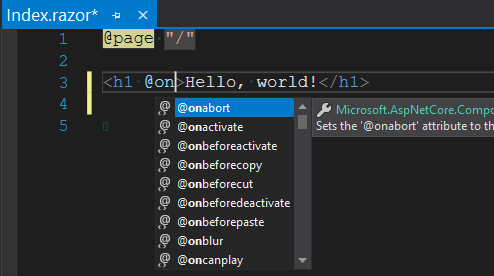

> 原文链接：https://blazor-university.com/components/component-events/browser-dom-events/

# 浏览器 DOM 事件
呈现任何标记时，可以在呈现的 HTML 元素上分配标准 JavaScript 事件，以便执行我们自己的 Blazor C# 方法。例如，我们在其他地方的许多示例中使用了 `@onclick` 指令：
```
<button @onclick=ButtonClicked>Click me</button>
```

这些事件指令在 Visual Studio 编辑器中具有完整的 IntelliSense 支持，因此开始键入 `@` 符号应该会为我们提供可用指令的完整列表，以及标识事件在我们的事件处理程序中传递给我们的参数类类型的描述。 DOM 事件以 `@on` 开头。




***警告：在编写完全在服务器上运行的 Blazor 应用程序时，Blazor 将 hook 浏览器中的事件并将它们发送到服务器，以便可以调用我们的 C# 方法。这可能会导致频繁触发的事件（例如 onmousemove）明显变慢。***

**注意：** 因为 C# 方法的 JavaScript 调用是异步的，这意味着在 C# 方法中我们不能像在 JavaScript 中那样取消事件。这是因为取消浏览器 DOM 事件是一个同步操作，当我们的 C# 被异步调用时，取消事件已经太迟了。

可用的 DOM 事件及其参数类型包括：

## 一般事件
DOM 事件 | 参数类型
--- | ---
onactivate | 	EventArgs
onbeforeactivate| 	EventArgs
onbeforedeactivate	| EventArgs
ondeactivate	| EventArgs
onended	| EventArgs
onfullscreenchange| 	EventArgs
onfullscreenerror| 	EventArgs
onloadeddata| 	EventArgs
onloadedmetadata	| EventArgs
onpointerlockchange| 	EventArgs
onpointerlockerror	| EventArgs
onreadystatechange| 	EventArgs
onscroll| 	EventArgs


## 焦点事件
DOM 事件 | 参数类型
--- | ---
onfocus		| FocusEventArgs
onblur	| 	FocusEventArgs
onfocusin		| FocusEventArgs
onfocusout		| FocusEventArgs


## 鼠标事件
DOM 事件 | 参数类型
--- | ---
onmouseover	| 	MouseEventArgs
onmouseout	| 	MouseEventArgs
onmousemove		| MouseEventArgs
onmousedown	| 	MouseEventArgs
onmouseup	| 	MouseEventArgs
onclick	| 	MouseEventArgs
ondblclick	| 	MouseEventArgs
oncontextmenu		| MouseEventArgs
onwheel		| WheelEventArgs
onmousewheel	| 	WheelEventArgs


## 拖动事件
DOM 事件 | 参数类型
--- | ---
ondrag	| DragEventArgs
ondragend| 	DragEventArgs
ondragenter| 	DragEventArgs
ondragleave| 	DragEventArgs
ondragover| 	DragEventArgs
ondragstart	| DragEventArgs
ondrop| 	DragEventArgs


## 键盘事件
DOM 事件 | 参数类型
--- | ---
onkeydown | 	KeyboardEventArgs
onkeyup	 | KeyboardEventArgs
onkeypress | 	KeyboardEventArgs


## 输入事件
DOM 事件 | 参数类型
--- | ---
onchange| 	ChangeEventArgs
oninput| 	ChangeEventArgs
oninvalid	| EventArgs
onreset	| EventArgs
onselect| 	EventArgs
onselectstart	| EventArgs
onselectionchange	| EventArgs
onsubmit	| EventArgs


## 剪贴板事件
DOM 事件 | 参数类型
--- | ---
onbeforecopy	 | EventArgs
onbeforecut | 	EventArgs
onbeforepaste | 	EventArgs
oncopy	 | ClipboardEventArgs
oncut	 | ClipboardEventArgs
onpaste | 	ClipboardEventArgs


## 触摸事件
DOM 事件 | 参数类型
--- | ---
ontouchcancel | 	TouchEventArgs
ontouchend | 	TouchEventArgs
ontouchmove	 | TouchEventArgs
ontouchstart | 	TouchEventArgs
ontouchenter	 | TouchEventArgs
ontouchleave | 	TouchEventArgs


## 指针事件
DOM 事件 | 参数类型
--- | ---
ongotpointercapture	 | PointerEventArgs
onlostpointercapture | 	PointerEventArgs
onpointercancel	 | PointerEventArgs
onpointerdown	 | PointerEventArgs
onpointerenter | 	PointerEventArgs
onpointerleave | 	PointerEventArgs
onpointermove	 | PointerEventArgs
onpointerout	 | PointerEventArgs
onpointerover	 | PointerEventArgs
onpointerup	 | PointerEventArgs


## 多媒体事件
DOM 事件 | 参数类型
--- | ---
oncanplay	 | EventArgs
oncanplaythrough | 	EventArgs
oncuechange	 | EventArgs
ondurationchange | 	EventArgs
onemptied	 | EventArgs
onpause	 | EventArgs
onplay	 | EventArgs
onplaying	 | EventArgs
onratechange | 	EventArgs
onseeked | 	EventArgs
onseeking | 	EventArgs
onstalled	 | EventArgs
onstop | 	EventArgs
onsuspend	 | EventArgs
ontimeupdate | 	EventArgs
onvolumechange | 	EventArgs
onwaiting	 | EventArgs


## 进度事件
DOM 事件 | 参数类型
--- | ---
onloadstart	 | ProgressEventArgs
ontimeout	 | ProgressEventArgs
onabort	 | ProgressEventArgs
onload	 | ProgressEventArgs
onloadend | 	ProgressEventArgs
onprogress | 	ProgressEventArgs
onerror	 | ErrorEventArgs

**[下一篇 - 双向绑定](/components/two-way-binding)**