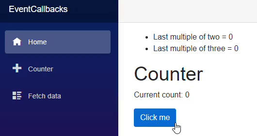

> 原文链接：https://blazor-university.com/components/component-events/

# 组件事件
[源代码](https://github.com/mrpmorris/blazor-university/tree/master/src/Components/EventCallbacks)

`EventCallback<T>` 类是一个特殊的 Blazor 类，可以作为参数公开，以便组件可以在发生感兴趣的事情时轻松通知使用者。

一旦声明了 `EventCallback<T>` 类型的公共属性并使用 `[Parameter]` 属性进行了修饰，使用组件就可以在 Razor 标记中指定触发事件时要调用的方法。

## 向 Counter 组件添加事件
在新的 Blazor 应用中，编辑 **/Pages/Counter.razor** 文件并添加新的回调参数。

```
[Parameter]
public EventCallback<int> OnMultipleOfThree { get; set; }
```

这声明了一个名为 `OnMultipleOfThree` 的新 `EventCallback`，任何使用组件都可以注册它。 `<int>` 指定事件回调发出的值将是 `System.Int32`。

现在，如果我们编辑 `IncrementCount` 方法，我们可以在计数器增加到 3 的倍数时发出此事件。

```
private async Task IncrementCount()
{
  currentCount++;
  if (currentCount % 3 == 0)
    await OnMultipleOfThree.InvokeAsync(currentCount);
}
```

## 订阅 EventCallback<T>
编辑 **/Pages/Index.razor** 页面，以便我们嵌入 **Counter** 组件并订阅其 **OnMultipleOfThree** 事件。将其标记更改为以下内容。

```
@page "/"

Last multiple of three = @LastMultipleOfThree

<Counter OnMultipleOfThree=@UpdateLastMultipleOfThreeValue/>

@code
{
  int LastMultipleOfThree = 0;

  private void UpdateLastMultipleOfThreeValue(int value)
  {
      LastMultipleOfThree = value;
  }
}
```

- 第 9 行

    声明一个 int 类型的类成员，它存储 3 值的最后一个倍数。
- 第 3 行

    显示 LastMultipleOfThree 的值

- 第 5 行

    嵌入 **Counter** 组件并设置其 OnMultipleOfThree 事件以在发出事件时执行 **UpdateLastMultipleOfThreeValue** 方法。

- 第 11 行

    从事件接收到的值用于更新 **LastMultipleOfThree** 的值。

## EventCallback<T> 和 .NET 事件之间的区别
### 单播与多播
最显着的区别是 `EventCallback<T>` 是单播事件处理程序，而 .NET 事件是多播。 Blazor `EventCallback<T>` 旨在分配单个值，并且只能回调单个方法。

```
// Setting a Blazor EventCallback
<MyComponent SomeEvent=@MyMethodToCall/>

// Setting a .NET event
MyComponent.SomeEvent += MyMethodToCall;
// Unscrubscribing from the event
MyComponent.SomeEvent -= MyMethodToCall;
```

### 类与结构
.NET 事件（委托）是类，而 Blazor `EventCallback<T>` 是只读结构。与 .NET 委托不同，`EventCallback<T>` 不能为 null，因此在发出事件时无需进行任何 null 检查。

```
// Invoking a .NET event
MyNetEvent?.Invoke(this, someValue);

// Invoking a CallbackEvent<T>
MyEventCallback.InvokeAsync(someValue);
```

### 等待回调
标准 .NET 事件是同步的，而 Blazor `EventCallback<T>` 是异步的。正如我们在前面的示例代码中看到的，`EventCallback<T>.InvokeAsync` 返回一个可以等待的 `Task`。

### Razor 标记兼容性
无法使用 `[Parameter]` 装饰标准 .NET 事件并通过 Razor 标记设置它，而使用 `EventCallback<T>` 可以。这使我们能够在视图标记本身中表达事件回调，这使得开发人员的意图更容易看到。

### 自动状态变化检测
每当从 `EventCallback<T>` 调用方法时，在方法执行后，Blazor 将在使用组件上执行 `StateHasChanged()`，以便在方法调用更改状态时重新渲染它。如果使用者的方法是通过标准 .NET 事件、Action<T> 或不是由 `EventCallback<T>` 发起的任何其他方法回调的，则不会发生这种情况。

例如，如果我们将一个新的 `[Parameter]` 添加到 `Action<int>` 类型的 **Counter** 组件中，并在当前计数是 2 的倍数时调用它，我们可以看到使用组件的渲染行为是如何受到影响的。

更改 Counter 组件以匹配以下代码：

```
@page "/counter"

<h1>Counter</h1>

<p>Current count: @currentCount</p>

<button class="btn btn-primary" @onclick=IncrementCount>Click me</button>

@code {
  private int currentCount = 0;

  [Parameter]
  public Action<int> OnMultipleOfTwoAction { get; set; }

  [Parameter]
  public EventCallback<int> OnMultipleOfThree { get; set; }

  private async Task IncrementCount()
  {
    currentCount++;
    if (currentCount % 2 == 0)
      OnMultipleOfTwoAction?.Invoke(currentCount);

    if (currentCount % 3 == 0)
      await OnMultipleOfThree.InvokeAsync(currentCount);
  }
}
```

- 第 13 行

    添加了 `Action<int>` 类型的 `[Parameter]`

- 第 21-22 行

    如果当前计数是 2 的倍数，则调用 `OnMultipleOfTwoAction`

现在更改 **Index** 组件，使其在值为 2 的倍数时设置回调方法，因此它也会存储并显示从 `OnMultipleOfTwoAction` 接收到的最后一个数字在使用的组件上。

```
@page "/"

<ul>
  <li>Last multiple of two = @LastMultipleOfTwo</li>
  <li>Last multiple of three = @LastMultipleOfThree</li>
</ul>


<Counter OnMultipleOfThree=@UpdateLastMultipleOfThreeValue OnMultipleOfTwoAction=@UpdateLastMultipleOfTwoValue />

@code
{
  int LastMultipleOfTwo = 0;
  int LastMultipleOfThree = 0;

  private Task UpdateLastMultipleOfThreeValue(int value)
  {
    LastMultipleOfThree = value;
    return Task.CompletedTask;
  }

  private void UpdateLastMultipleOfTwoValue(int value)
  {
    LastMultipleOfTwo = value;
  }
}
```

- 第 13 行

    定义一个新成员来存储从使用组件传递的最新“二的倍数”值

- 第 4 行

    在用户界面中显示 LastMultipleOfTwo 的值

- 第 9 行

    在使用的组件上设置 `OnMultipleOfTwo` 以便在当前值是 2 的倍数时通知我们的组件

- 第 24 行

    记录使用组件通知我们的最后 2 的倍数

当我们现在运行应用程序并多次单击按钮时，我们会看到当通过 `Action<int>` 回调 `UpdateLastMultipleOfTwoValue` 时，视图没有更新，但是当下一次单击通过 `EventCallback<int>` 回调 `UpdateLastMultipleOfThreeValue` 时，视图更新并显示两者的最新值。


 
点击计数 | 回调执行 | 使用者重新渲染
--- | ---  | ---
1 | 	无 | 	N/A
2	 | `Action<int>` | 	No
3	 | `Action<int>` `EventCallback<int>` | 	Yes
4	 | `Action<int>` | 	No
5	 | None | 	N/A
6	 | `Action<int>`  `EventCallback<int>`	 | Yes


`EventCallback<T>` 通常回调带有签名 `private Task SomeName(T value)`的方法——其中方法的暴露级别并不重要。但是，Blazor 将允许我们设置一个 `EventCallback<T>` 来回调具有几个变体的方法。

如果我们的方法不执行任何异步操作，那么下面的实现可能会开始变得乏味：

```
public Task SomethingHappenedInChildComponent(string value)
{
  // Do something with value
  return Task.CompletedTask;
}
```

因此，Blazor 将允许我们设置 `EventCallback<T>` 以回调具有 `void` 返回类型的方法。

```
public void SomethingHappenedInChildComponent(string value)
{
  // Do something with value
}
```

有时我们只想知道一个事件何时发生，而不是对它传递的值感兴趣。 Blazor 还将回调一个排除 value 参数的方法。

```
// Either
public void SomethingHappenedInChildComponent()
{
  // Do something that doesn't need the value
}

// Or
public Task SomethingHappenedInChildComponent()
{
  // Do some asynchronous work that doesn't need the value
  return SomeTask;
}
```

**[下一篇 - 浏览器 DOM 事件](/components/component-events/browser-dom-events)**