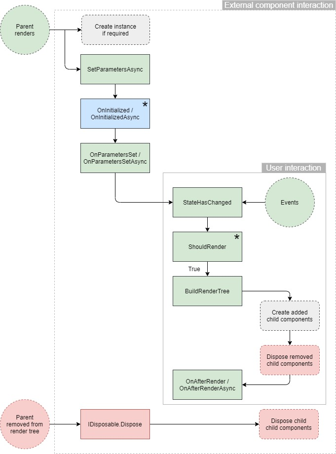
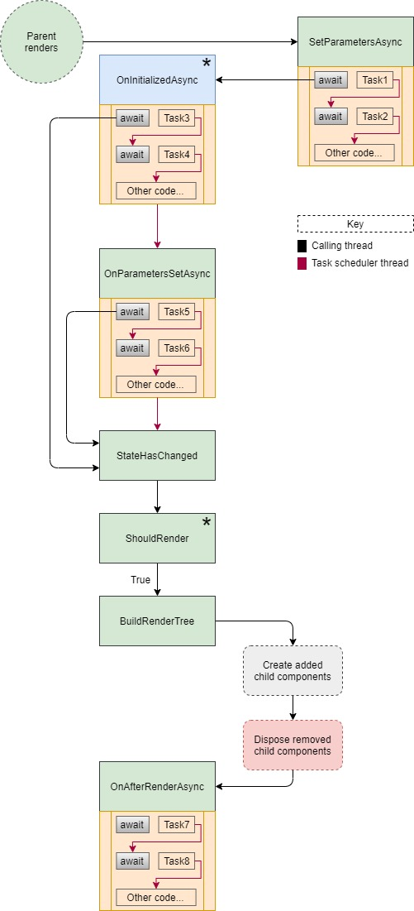

> 原文链接：https://blazor-university.com/components/component-lifecycles/

# 组件生命周期
[源代码](https://github.com/mrpmorris/blazor-university/tree/master/src/Components/ComponentLifecycles)

Blazor 组件具有许多我们可以重写以影响应用程序行为的虚拟方法。这些方法在组件生命周期的不同时间执行。下图概述了这些生命周期方法的流程。

## 组件生命周期图


## SetParametersAsync
每当父级渲染时执行此方法。

传递给组件的参数包含在 `ParameterView` 中。这是基于传递给组件的状态对服务器（举例）进行异步调用的好时机。

当您在重写中调用 `base.SetParametersAsync(parameters)` 时，将为组件的 `[Parameter]` 属性分配它们的值。

这也是分配默认参数值的正确位置。有关完整说明，请参阅[可选路由参数](/routing/optional-route-parameters/)。

## OnInitialized / OnInitializedAsync
一旦 `ParameterCollection` 的状态被分配给组件的 `[Parameter]` 属性，这些方法就会被执行。这与 `SetParametersAsync` 一样有用，但可以使用组件的状态。

***该方法仅在组件首次创建时执行一次。如果父级稍后更改组件的参数，则跳过此方法。***

**注意：** 当组件是 一个 `@page`，并且我们的 Blazor 应用导航到渲染同一页面的新 URL 时，Blazor 将重用该页面的当前对象实例。因为对象是同一个实例，所以 Blazor 不会在对象上调用 `IDisposable.Dispose`，也不会再次执行其 `OnInitialized` 方法。

## OnParametersSet / OnParametersSetAsync
如果这是组件的新实例，则此方法将在 `OnInitializedAsync` 之后立即执行。如果它是由于其父组件正在重新渲染而正在重新渲染的现有组件，则不会执行 `OnInitialized` 方法，而是在 `SetParametersAsync` 之后立即执行此方法。

## StateHasChanged
此方法标记要渲染的组件。

每当组件想通知 Blazor 发生了会导致渲染输出不同的更改时，它都会调用此方法。例如，在 `Clock` 组件中，我们可能会设置一个循环 1 秒的计时器，然后执行 `StateHasChanged` 以便以正确的时间重新渲染。

另一个用途是指示 Blazor 通过异步方法部分执行重新渲染。

```
private async Task GetDataFromMultipleSourcesAsync()
{
  var remainingTasks = new HashSet<Task>(CreateTheTasks());
  while (remainingTasks.Any())
  {
    Task completedTask = await Task.WhenAny(remainingTasks);
    remainingTasks.Remove(completedTask);
    StateHasChanged();
  }
}
```
当等待发生时（第 6 行）或方法完成时（第 10 行），将处理对 `StateHasChanged` 的​​调用。

## ShouldRender
该方法可以通过返回 `false` 来防止组件的渲染树被重新计算。请注意，第一次创建和渲染组件时不会执行此方法。

当我们知道我们的状态自上次渲染后未更改或仅以会导致渲染相同输出的方式更改时，指示 Blazor 不执行 `BuildRenderTree` 操作可以节省处理时间并改善用户体验。

***第一次渲染组件时不执行此方法。***

## BuildRenderTree
此方法将组件的内容渲染为应渲染给用户的内存表示（[RenderTree](/components/render-trees/)）。

```
<h1>People</h1>
@foreach(Person currentPerson in people)
{
  <ShowPersonDetails Person=@currentPerson/>
}
```
前面的标记将在渲染树中添加一个 `h1`，其中“People”作为其内容。然后它将为 `people` 中的每个 `Person` 创建一个 `ShowPersonDetails` 的新实例。

如果我们的组件稍后在 `people` 中使用附加项重新渲染，则将创建 `ShowPersonDetails` 组件的新实例并将其添加到我们组件的渲染树中。如果 `people` 中的项目较少，那么之前创建的一些 `ShowPersonDetails` 组件实例将从我们组件的渲染树中丢弃，如果它们实现 `IDiposable`，则会对它们执行 `Dispose()`。

**注意：** 为了提高渲染效率，在任何类型的循环中渲染标记时，请尽可能始终使用 [@key 指令](/components/render-trees/)。

## OnAfterRender / OnAfterRenderAsync
每次 Blazor 重新生成组件的[渲染树](/components/render-trees/)时，都会执行最后两个方法。这可能是由于组件的父级重新渲染、用户与组件交互（例如鼠标单击）或组件执行其 `StateHasChanged` 方法来调用重新渲染的结果。

这些方法有一个名为 `firstRender` 的参数。此参数仅在当前组件上第一次调用该方法时为 `true`，从那里开始它将始终为 `false`。在需要附加组件连接的情况下（例如，通过 JavaScript），知道这是第一次渲染很有用。

直到 `OnAfterRender` 方法执行之后，才能安全地使用通过 @ref 指令设置的组件的任何引用。

```
<ChildComponent @ref=MyReferenceToChildComponent/>

@code
{
  // This will be null until the OnAfterRender* methods execute
  ChildComponent MyReferenceToChildComponent;
}
```

直到 `OnAfterRender` 方法被执行并且 `firstRender` 设置为 `true` 之后，使用通过 @ref 指令设置的 HTML 元素的任何引用是安全的。

```
<h1 @ref=MyReferenceToAnHtmlElement>Hello</h1>

@code
{
  // This will be null until the OnAfterRender* methods execute
  // with firstRender set to true
  ElementReference MyReferenceToAnHtmlElement;
}
```

## Dispose
尽管这并不是 `ComponentBase` 的生命周期方法之一，但如果组件实现了 `IDisposable`，那么一旦从其父级的渲染树中删除该组件，Blazor 就会执行 `Dispose`。要实现 `IDisposable`，我们需要将 `@implements IDisposable` 添加到我们的 razor 文件中。

```
@implements IDisposable
<h1>This is MyComponent</h1>

@code {
  void IDisposable.Dispose()
  {
    // Code here
  }
}
```

## 在异步生命周期方法中等待
请务必注意，Blazor 不会在能够渲染组件之前等待长时间运行的异步方法完成，而是会尽快触发渲染。

这使组件能够在执行后台任务（例如从服务器检索数据）时渲染标记供用户查看。

### SetParametersAsync
- 第一次 await 的动作

  继续生命周期过程
  （如果是新实例则为 OnInitialized*，否则为 OnParametersSet*）

- 退出方法的动作

  没有进一步的动作

**注意：** `base.SetParametersAsync` 方法必须在方法中的任何 `await` 指令之前执行，否则会抛出 `InvalidOperationException`。

### OnInitializedAsync
- 第一次 await 的动作

  渲染组件

- 退出方法的动作

  继续生命周期过程

### OnParametersSetAsync
- 第一次 await 的动作

  渲染组件

- 退出方法的动作

  继续生命周期过程

### OnAfterRenderAsync
- 第一次 await 的动作

  没有进一步的动作  

- 退出方法的动作

  没有进一步的动作 

简单的规则是 `SetParametersAsync` 是唯一不能通过等待任务来暂停生命周期过程的方法。

所有其他异步方法都可以暂停生命周期过程，直到执行退出该方法，并且第一个 `await` 将通过 `BuildRenderTree` 进行渲染，以防止用户不得不等待查看更新。

`OnAfterRenderAsync` 可能看起来像一个异常，因为它在任何一种情况下都不会执行进一步的操作。如果我们考虑渲染是执行链的末端这一事实，那么我们可以将其视为完成链而不是什么都不做。至于等待渲染，如果需要，程序员必须通过调用 `StateHasChanged` 显式完成，否则 `OnAfterRenderAsync` 中的等待将导致无限循环。

## 具有异步等待的组件生命周期


## 异步方法和多个等待
Blazor 在异步方法中的 `await` 上执行的代码只会在第一次 `await` 时执行。后续等待不会导致多次渲染。例如

```
protected override async Task OnParametersSetAsync()
{
  // Automatically renders when next line starts to await
  await Task.Delay(1000); 

  // No automatic render when next line starts to await
  await Task.Delay(1000); 

  // No automatic render when next line starts to await
  await Task.Delay(1000); 
}
```
如果我们想在其他点进行渲染，那么我们必须在所有其他 `await` 语句之前调用 `StateHasChanged`。

```
protected override async Task OnParametersSetAsync()
{
  // Automatically renders when next line starts to await
  await Task.Delay(1000); 

  // Explicitly render when next line starts to await
  StateHasChanged();
  await Task.Delay(1000); 

  // Explicitly render when next line starts to await
  StateHasChanged();
  await Task.Delay(1000); 
}
```
有关如何安全地使用在同一组件上运行的不同线程的更多信息，请参阅[多线程渲染](/components/multi-threaded-rendering/)部分。

**[下一篇 - 多线程渲染](/components/multi-threaded-rendering)**