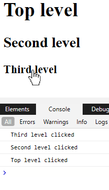

> 原文链接：https://blazor-university.com/components/literals-expressions-and-directives/directives/

# 指令
指令是内置宏，可更改从 Razor 标记生成的已转译 C# 代码。通过在标识符前面加上 `@` 符号来使用指令，标识符是我们通常期望的 HTML 属性的名称或组件属性的名称。如果您还没有这样做，请阅读[字面量、表达式和指令](/components/literals-expressions-and-directives)。

**注意：** 目前，与 Angular 等其他框架不同，Blazor 不允许开发人员创建自己的指令。

因为分配给指令的值的类型是已知的（它在 C# 代码中是强类型的），所以值将被推断为一个表达式。因此，与组件属性一样，在赋值的开头添加 `@` 是不必要的，除非我们希望将表达式传递给需要字符串值的指令。一个例外是当我们希望传递一个 lambda 时； lambda 必须用 `@` 符号转义并用括号括起来。

```
@onclick=@( args => Debug.WriteLine("Clicked") )
```

以下代码显示了如何使用 `@onclick` 指令将 DOM onclick 事件添加到呈现的 H1 元素。

```
// Razor mark-up with @ref directive
<h1 @onclick=H1Clicked>Hello, world!</h1>

@code
{
  public void H1Clicked(MouseEventArgs args)
  {
    System.Diagnostics.Debug.WriteLine("H1 clicked");
  }
}

// Transpiled C#
public partial class Index : Microsoft.AspNetCore.Components.ComponentBase
{
  protected override void BuildRenderTree(RenderTreeBuilder __builder)
  {
    __builder.OpenElement(0, "h1");
    __builder.AddAttribute(1, "onclick", EventCallback.Factory.Create<Microsoft.AspNetCore.Components.Web.MouseEventArgs>(this, H1Clicked));
    __builder.AddContent(2, "Hello, world!");
    __builder.CloseElement();
  }
}
```

- 第 2 行

  使用 `@onclick` 指令定义 H1 元素。

- 第 18 行

  显示如何转换 `@onclick=H1Clicked` 指令，以便在呈现的元素上设置 DOM `onclick` 事件。


适用于 Razor 文件本身的一些标准指令是：

- `@code`

  此指令标识应按原样输出到生成的 C# 文件中的 C# 代码块。单个 Razor 标记文件中可以有多个 `@code` 指令； Blazor 会将这些整理到转译文件中的单个 C# 代码块中。

- `@page`

  此指令在转译的类上生成一个 `[PageAttribute]`，使 Blazor [路由](/routing)（稍后介绍）能够识别在 URL 中给定特定地址的情况下要呈现哪个组件（页面）。

- `@layout`

  在转译的类上生成 `[LayoutAttribute]`。 Blazor 使用它来确定使用哪个布局（如果有）来包装页面的内容。

- `@typeparam`

  指示 Blazor 从 Razor 标记生成泛型类。

- `@inject`

  允许组件指定 Blazor 在创建组件的新实例时需要注入的依赖项。

- `@attribute`

  将指定的 DotNet 属性添加到生成的 C# 类。


以下是一组可应用于当前 Razor 文件正在使用的组件和 HTML 元素的指令示例。例如 `<h1 @ref=MyH1Element>Hello</h1>`。

- `@ref`

  标识当前组件的成员或属性，该成员或属性应包含对将呈现的 HTML 元素或组件的引用。在使用 JavaScript 互操作时，这些可以用作引用，或者获取对 Blazor 嵌入组件的引用，以便我们可以在其上调用方法。

- `@bind`

  允许我们将数据绑定（双向绑定）到正在使用的组件的属性或 HTML 元素的属性。

- `@attributes`

  将[名称-值](/components/code-generated-html-attributes/)对作为 HTML 属性输出。

- `@key`

  使我们能够为元素/组件提供唯一标识符，这有助于在[渲染](/components/render-trees/) HTML 时保持较小的更改增量。

以下是可用的 HTML DOM 元素事件的子集。这些将在[组件事件](/components/component-events)中更详细地讨论。

- `@onmousemove`
- `@onclick`
- `@onkeypress`
- `@onscroll`

## 指令属性
[源代码](https://github.com/mrpmorris/blazor-university/tree/master/src/Components/DirectiveAttributes)

指令属性允许我们将附加信息传递给指令。如果我们将指令视为一个类，那么指令属性就是它的成员。

要传递这些附加信息，我们需要重复指令，然后附加一个 `:` 后跟指令支持的属性名称。

例如，默认情况下，我们的浏览器会将元素的事件向上传播，直到它最终到达 HTML 文档本身。一个普通的 HTML + JavaScript 演示将在单击元素时将文本输出到控制台。

```
<html>
  <body>
    <div onclick="console.log('Top level clicked')">
      <h1>Top level</h1>
      <div onclick="console.log('Second level clicked')">
        <h2>Second level</h2>
        <div onclick="console.log('Third level clicked')">
          <h3>Third level</h3>
        </div>
      </div>
    </div>
  </body>
</html>
```

因为 `div` 元素是嵌套的，所以当其中一个被点击时，该事件不仅会触发 `div` 本身的 `onclick` 代码，还会触发其父 `div` 上的 `onclick`，而父元素又会触发其自己的父级上的事件 – 以此类推，直到当前元素没有父元素。




为了防止事件在元素树上传播，JavaScript 在事件上有一个 [stopPropagation 方法](https://www.w3schools.com/jsref/event_stoppropagation.asp)。 Blazor 使用指令属性防止传播 - `@onclick:stopPropagation`。

```
@page "/"
@using System.Diagnostics

<div @onclick=TopLevelClicked>
  <h1>Top level</h1>
  <div @onclick=SecondLevelClicked @onclick:stopPropagation>
    <h2>Second level</h2>
    <div @onclick=ThirdLevelClicked>
      <h3>Third level</h3>
    </div>
  </div>
</div>

@code
{
  private void TopLevelClicked()
  {
    Debug.WriteLine("Top level clicked");
  }

  private void SecondLevelClicked()
  {
    Debug.WriteLine("Second level clicked");
  }

  private void ThirdLevelClicked()
  {
    Debug.WriteLine("Third level clicked");
  }
}
```

第 4、6 和 8 行都定义了 `@onclick` 属性，并声明了触发浏览器 `onclick` 事件时要执行的 C# 方法。第 6 行添加了一个额外的 `@onclick:stopPropagation` 以防止浏览器将点击从第二级传播到第一级。更多 DOM 事件将在关于 DOM 事件的部分中介绍。

一些指令属性期望我们以 `@directive:attribute="value"` 的形式指定一个值。我们将在[双向绑定](/components/two-way-binding/)一节中详细介绍这一点。

**[下一篇 - 组件事件](/components/component-events)**