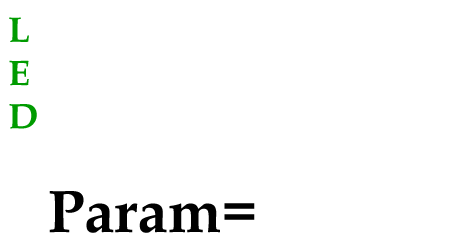
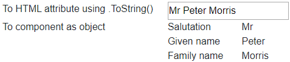

> 原文链接：https://blazor-university.com/components/literals-expressions-and-directives/

# 字面量、表达式和指令
[源代码](https://github.com/mrpmorris/blazor-university/tree/master/src/Components/LiteralsExpressionsAndDirectives)

请注意，本节一般不涵盖 Razor 标记。它不会涵盖诸如条件输出、循环等内容。该主题在网络和书籍中的其他地方得到了广泛的介绍。

使用组件时，我们可以将信息作为参数传递。这些参数可以是简单类型，例如整数、字符串、布尔值，也可以是复杂类型，例如 `Func<T>`、Action 或复杂对象的实例。与 HTML 属性不同，我们不限于可以在纯 HTML 文件中表示为值的值。

Blazor 如何解释我们传递给组件的值取决于我们正在设置的 `[Parameter]` 的类型，以及我们是否通过使用 `@` 符号明确了我们的意图。

参数使用 `name=value` 格式分配，就像它们在 HTML 标记中一样。我们是否使用表达式来确定值、指令（一种特殊情况）或文字取决于 `@` 符号的位置（或不存在）。

位置 | 类型 | 示例
---  | --- | ---
不存在 | 字面量  | <MyComponent MyParameter=42/>
右 | 表达式 |  <MyComponent Value=@SomeValue/>
左 | 指令 | <MyComponent @Bind-Value=SomeValue/>
记住这一点的一个简单方法是“灯泡法”。我们从右到左拼出缩写 [L.E.D](https://en.wikipedia.org/wiki/Light-emitting_diode)。



与 HTML 标记一样，Blazor 标记允许我们选择是否希望将值括在引号中。以下是等价的。

```
<MyComponent Value=@SomeValue/>
<MyComponent Value="@SomeValue"/>
```
我个人的偏好是仅在传递文字字符串时才将参数值括在引号中。

## 字面量
任何传递给 HTML 属性的值（不以 `@` 开头）都被视为字面量。将值传递给 Blazor 组件上的 `[Parameter]` 修饰属性时，情况并非总是如此（我将在[此处](https://feiyun0112.github.io/blazor-university.zh-cn/components/literals-expressions-and-directives/#inferred-expressions)详细介绍），但在大多数情况下，此规则适用。

类型 |  Razor 视图 |  HTML
---  | --- | ---
HTML 属性  | `<input size=8/>`  | `<input size=”8″/>`
组件参数  | `<MyHeader Text="Hello" Visible=true/>`  | `<h1>Hello</h1>`

**MyHeader** 的定义如下：

```
@if (Visible)
{
  <h1>@Text</h1>
}

@code
{
  [Parameter]
  public bool Visible { get; set; } = true;

  [Parameter]
  public string Text { get; set; }
}
```

除了[推断表达式](https://feiyun0112.github.io/blazor-university.zh-cn/components/literals-expressions-and-directives/#inferred-expressions)（仅适用于组件上的参数，而不适用于 HTML 属性）之外，在渲染组件时，您在 HTML 中看到的内容实际上就是您在标记中编写的内容。

## 表达式
当我们需要渲染包含动态值而不是固定文字值的 HTML 时，我们需要使用表达式。我们通过在我们分配的值之前添加 `@` 符号来向 Blazor 表明我们正在使用表达式。然后，Blazor 将尝试将 `@` 后面的文本解释为一段有效的 C# 代码，例如成员名称或方法调用。

给定我们组件中定义以下成员和值的代码部分：

```
int InputSize = 8;
bool HeaderVisible = true;
string HeaderText = "Value of variable";

private int DoubleInputSize()
{
  return InputSize * 2;
}
```
我们希望看到以下内容：

Razor 视图 | HTML
--- | ---
`<input size=@InputSize/>` |	`<input size=”8″/>`
`<input size=@DoubleInputSize()/>` |	`<input size=”16″/>`
`<MyHeader Text=@HeaderText Visible=@HeaderVisible/>` |	`<h1>Value of variable</h1>`

我们甚至可以通过将表达式文本括在括号中来传递更复杂的表达式，例如字符串插值和/或计算值。

Razor 视图 | HTML
--- | ---
`<input size=@(InputSize * 3) />` |  `<input size=”24″/>`
`<input value=@($"Size is {InputSize}") />`  | `<input value=”Size is 8″/>`
`<input value=@($"Size is {DoubleInputSize()}") />`  | `<input size=”Size is 16″/>`

## 计算为复杂类型的表达式
复杂类型也可以作为参数值传递给 HTML 属性和 Blazor 组件的 `[Parameter]` 属性。将非简单值作为表达式传递给 HTML 属性时，Blazor 将使用 `ValuePassed.ToString()` 呈现该值；当值被传递到 Blazor 组件上的 `[Parameter]` 属性时，对象本身被传递。

以下面的 Person 类为例：

```
public class Person
{
  public string Salutation { get; set; }
  public string GivenName { get; set; }
  public string FamilyName { get; set; }

  public override string ToString() => $"{Salutation} {GivenName} {FamilyName}";
}
```
如果我们在其中一个视图中创建 Person 的实例，我们可以将该实例作为值传递给标准 HTML 属性，并且 Blazor 将使用重写的 ToString() 方法来表示该值。

```
<div class="row">
  <div class="col-4">To HTML attribute using .ToString()</div>
  <div class="col-8"><input readonly value=@MyPerson /></div>
</div>

@code
{
  Person MyPerson;

  protected override void OnInitialized()
  {
    base.OnInitialized();
    MyPerson = new Person
    {
      Salutation = "Mr",
      GivenName = "Peter",
      FamilyName = "Morris"
    };
  }
}
```
- 第 8 行
声明 `Person` 类型的成员
- 第 13 行
创建 `Person` 的实例
- 第 3 行
将 `Person` 实例作为 HTML 属性传递

呈现的 HTML 如下：

```
<div class="row">
  <div class="col-4">To HTML attribute using .ToString()</div>
  <div class="col-8"><input readonly value="Mr Peter Morris" /></div>
</div>
```
要证明 Blazor 通过引用其他组件来传递对象，请创建一个将 `Person` 实例作为 `[Parameter]` 的新组件。创建一个名为 PersonView 的新组件并输入以下标记：

```
<div class="row">
  <div class="col-2">Salutation</div>
  <div class="col-10">@Person?.Salutation</div>
</div>
<div class="row">
  <div class="col-2">Given name</div>
  <div class="col-10">@Person?.GivenName</div>
</div><div class="row">
  <div class="col-2">Family name</div>
  <div class="col-10">@Person?.FamilyName</div>
</div>
@code
{
  [Parameter]
  public Person Person { get; set; }
}
```
 - 第 14-15 行

声明一个名为 `Person` 的属性，该属性是 `Person` 类型，并使用 `[Parameter]` 属性对其进行装饰，以便任何使用组件都可以在 Razor 标记中设置其值。

- 第 3、7 和 10 行

如果 `Person` 不为 null，则会显示 Salutation、GivenName 和 FamilyName。


最后，更改我们的视图，使其将 **MyPerson** 传递给我们的新 `PersonView` 组件：

```
<div class="row">
  <div class="col-4">To component as object</div>
  <div class="col-8">
    <PersonView Person=@MyPerson />
  </div>
</div>
```

运行应用程序时，我们现在可以看到将 **MyPerson** 传递给 HTML 属性的结果，以及作为 `Person` 的实例传递给另一个 Blazor 组件的结果。


## 推断表达式
将字面量传递给使用组件的参数时，Blazor 需要确保传递的值与目标兼容。例如，给定具有布尔参数 **Visible** 的组件 **MyHeader**，以下组合是有效的。

标记 | 结果
--- | ---
`<MyComponent Visible=@true/>`  | 表达式为真。
`<MyComponent Visible="@true"/>`  | 引号中的表达式。
`<MyComponent Visible="true"/>`  | 字符串类型的文字，推断为表达式@true。
`<MyComponent Visible=true/>`  | 不带引号的文字字符串，再次推断为表达式@true。

该表的第一行是一个显式表达式，true。其他行实际上是在尝试将布尔参数设置为字符串值。在这些情况下，Blazor 将推断我们的意图并改为传递布尔值。

除非分配的属性是字符串，否则 Blazor 将取消引用作为参数传递给其他组件的值，并假定它们是表达式。下表显示了标记以及该标记如何转换为 C#。

标记  |  C#
--- | ---
`<MyComponent Visible=”true“/>`	 | `Visible = true`
`<MyComponent Visible=@HeaderVisible/>`	 | `Visible = HeaderVisible`
`<MyComponent Visible=”HeaderVisible“/>` | 	`Visible = HeaderVisible`

在分配的属性是字符串的情况下，Blazor 将假定没有 `@` 分配的值是字面量。

假设我们的使用组件有一个成员 `string HeaderText = "Value of variable"`，并且嵌入组件有一个 `[Parameter]` 修饰属性 `public string Text { get; set; } ` 下表显示了标记以及如何将其转换为 C#。

标记  |  C#	| 值
--- | --- | ---
`<MyComponent Text=”Hello”/>`	 | `Text = “Hello”` | 	`“Hello”`
`<MyComponent Text=@HeaderText/>`	 | `Text = HeaderText` | 	`“Value of variable”`
`<MyComponent Text=”HeaderText”/>` | 	`Text = “HeaderText”` | 	`“HeaderText”`
`<MyComponent Text=HeaderText/>` | 	`Text = “HeaderText”` | 	`“HeaderText”`

- 第一个例子是明确的，在我们的使用组件中没有名为 **Hello** 的成员，因此编译器知道我们打算将 **Text** 设置为文字字符串。

- 第二个例子也很明确，因为我们已经通过在我们的值之前添加一个 `@` 符号来明确地确定这是一个表达式。

- 第三个示例不明确，因为我们有一个名为 HeaderText 的成员。 Blazor 必须确定这是文字字符串还是表达式。

- 第四个示例可能看起来像一个明确的成员引用，但由于 HTML 和 Blazor 都支持传递不带引号的值，因此这很容易成为不带引号的文字字符串。

在 Visual Studio 中很容易看到 Blazor 如何解释分配。表达式是突出显示的语法，而文字则不是。

- `<MyHeader Text=HeaderText Visible=`HeaderVisible`/>`

HeaderText 是一个文本字符串，HeaderVisible 是一个表达式。

- `<MyHeader Text=`@HeaderText` Visible=”`HeaderVisible`“/>`

两者都是表达。


为了避免意外地被推断的字面量绊倒，我的建议是坚持使用灯泡方法。始终通过在表达式前面加上 @ 符号来明确表达式。


## 指令
指令是一个复杂的主题。因为本节是关于如何区分字面量、表达式和指令，所以这里不会深入介绍它们。

相反，指令将在[指令](https://feiyun0112.github.io/blazor-university.zh-cn/components/literals-expressions-and-directives/directives)部分中介绍。

**[下一篇 - 指令](https://feiyun0112.github.io/blazor-university.zh-cn/components/literals-expressions-and-directives/directives/)**