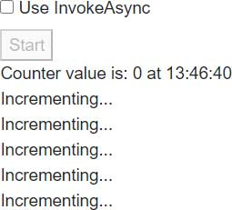
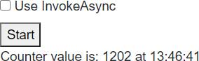
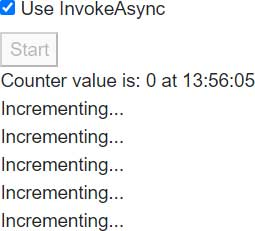
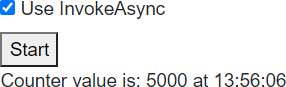
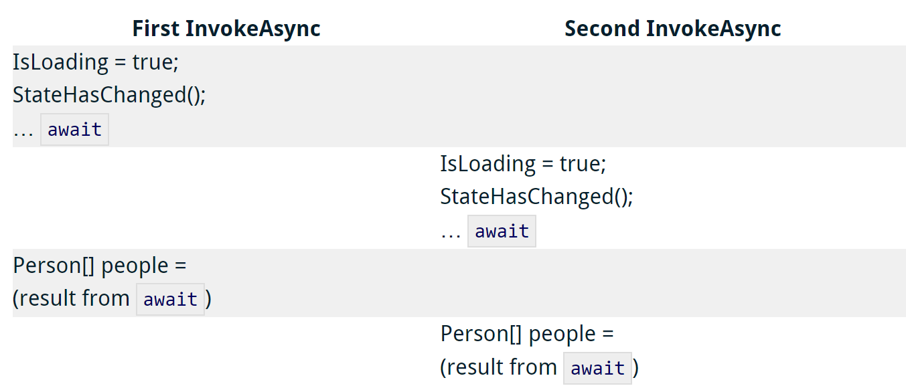

> 原文链接：https://blazor-university.com/components/multi-threaded-rendering/invokeasync/

# 线程安全的使用 InvokeAsync
在我们的代码被非 UI 事件调用的情况下（例如[多线程渲染](https://feiyun0112.github.io/blazor-university.zh-cn/components/multi-threaded-rendering/)中介绍的那些），如果我们打算操纵状态，我们通常需要实现某种类型的线程锁定/同步。

**回顾：** 非 UI 事件包括：

- 来自 System.Threading.Timer 的回调
- 由多个用户共享的 Singleton 实例上的另一个线程触发的事件
- 来自我们通过 Web Socket 连接的另一台服务器的数据推送。

为了避免手动编写线程安全代码，编写 WPF 应用程序的人可能会使用 `Dispatcher.Invoke` 来确保 UI 线程执行代码，而 WinForms 开发人员可能会使用窗体的 `Invoke` 方法。以这种方式调用的任何代码始终由特定线程（UI 线程）执行，这避免了使用线程同步代码。

[StateHasChanged](https://feiyun0112.github.io/blazor-university.zh-cn/components/component-events/) 框架方法，用于告诉 Blazor 重新渲染我们的组件，不允许多个线程同时访问渲染进程。如果辅助线程调用 `StateHasChanged`，则会引发异常。

```
System.InvalidOperationException：当前线程未与 Dispatcher 关联。
```

在 Blazor Server 应用程序中，有一个与每个连接（每个浏览器选项卡）关联的调度程序。当我们使用 `InvokeAsync` 时，我们正在通过此调度程序执行操作（就像 WPF `Dispatcher.Invoke` 或 WinForms `Control.Invoke`）。

在前面介绍的场景之一中调用 `StateHasChanged` 时（从线程执行代码等），有必要通过 `InvokeAsync()` 方法调用它。 `InvokeAsync` 将串行化操作，因此将避免 `StateHasChanged` 引发异常。

尽管方法将由任意数量的不同线程执行，但在任何给定时刻只有一个线程将访问组件，从而无需围绕共享状态编写线程锁定/同步代码。

## InvokeAsync 示例
[源代码](https://github.com/mrpmorris/blazor-university/tree/master/src/Components/UsingInvokeAsync)

为了演示直接从线程执行组件方法与通过 `InvokeAsync` 执行之间的行为差​​异，我们将创建一个服务器端应用程序，该应用程序将展示多个并发线程如何破坏共享状态。

创建新的 Blazor 服务器端应用程序后，添加一个静态类，该类将存储一个整数值，多个组件/线程可以访问该值。

```
public static class CounterState
{
  public static int Value { get; set; }
}
```
### 显示状态
我们将在组件中显示此状态的值，并每秒检查两次该值。为此，我们将在 **/Shared** 文件夹中创建一个名为 **ShowCounterValue.razor** 的组件。

```
@implements IDisposable
<div>
  Counter value is: @CounterState.Value at @DateTime.UtcNow.ToString("HH:mm:ss")
</div>

@code
{
  private System.Threading.Timer Timer;

  protected override void OnInitialized()
  {
    base.OnInitialized();
    Timer = new System.Threading.Timer(_ =>
    {
      InvokeAsync(StateHasChanged);
    }, null, 500, 500);
  }

  void IDisposable.Dispose()
  {
    Timer?.Dispose();
    Timer = null;
  }
}
```

- 第 1 行

  声明我们的组件实现了 `IDisposable`

- 第 3 行

  显示 `CounterState.Value` 的当前值以及当前时间。

- 第 13 行

  当组件初始化时，会创建一个 `System.Threading.Timer`，它将每 500 毫秒执行一次 `StateHasChanged`。它通过 `InvokeAsync` 调用，以防止 Blazor 抛出异常，告诉我们我们正在从线程调用 `StateHasChanged`。

- 第 21 行

  当组件被释放时释放定时器。

**注意：**如果计时器没有被释放，那么它将在用户会话的整个生命周期内保持活动状态。如果计时器保持活动状态，则不会对组件进行垃圾回收，因为计时器回调通过其 `InvokeAsync` 和 `StateHasChanged` 方法持有对组件的隐式引用。

### 修改状态
我们现在将创建一个组件，它将递增 `CounterState.Value` 字段。每个组件将在一个线程中执行一个循环并更新 `Value` 1000 次。然后我们可以在我们的主页上拥有这个组件的多个实例，以确保多个线程正在更新状态。

注意：这个组件将被传递一个 `System.Threading.WaitHandle`。组件的线程会被挂起，直到主页面触发这个 `WaitHandle`，触发所有线程同时开始循环。

在 **/Shared** 文件夹中，创建一个名为 **IncrementCounter.razor** 的新文件。我们将从一些文本开始，以显示该组件存在于页面上，一个接受所需 `WaitHandle` 的参数，以及一个指示我们是否要使用 `InvokeAsync` 来增加值的参数。

```
<div>
  Incrementing...
</div>
@code
{
  [Parameter]
  public bool ShouldUseInvokeAsync { get; set; }

  [Parameter]
  public System.Threading.WaitHandle Trigger { get; set; }

   // More to come
}
```

为了增加 `CounterState.Value`，我们将在 `OnInitialized` 生命周期方法中创建一个线程。我们将立即启动线程，但线程中的第一条指令将暂停自身，直到触发 `WaitHandle`。

```
protected override void OnInitialized()
{
  var thread = new System.Threading.Thread(_ =>
  {
    Trigger.WaitOne();
    for (int i = 0; i < 1000; i++)
    {
      if (!ShouldUseInvokeAsync)
      {
        CounterState.Value++;
      }
      else
      {
        InvokeAsync(() => CounterState.Value++);
      }
    }
  });

  thread.Start();
}
```

- 第 1 行
  
  重写 `OnInitialized`。

- 第 3 行

  创建一个线程来修改共享状态。

- 第 5 行

  线程应该做的第一件事是等待父页面的 `WaitHandle` 被触发。

- 第 6 行

  对共享状态执行 1000 次更改。

- 第 8 行

  检查我们是否应该使用 `InvokeAsync`。

- 第 10 行

  直接在当前线程更改共享状态。

- 第 14 行

  在更改共享状态时使用 `InvokeAsync` 确保顺序访问。

- 第 19 行

  启动线程，以便它可以等待被触发。

### 使用组件演示状态冲突
最后一步是在我们的 `Index` 页面中创建一些标记，这将创建其中的 5 个组件。

为了使应用程序更有趣，我们还将

1. 有一个复选框，允许用户指定是否希望通过 `InvokeAsync` 执行状态更改。

2. 允许用户重置应用程序的状态并通过单击按钮重试。

如果用户想要使用 `InvokeAsync`，我们需要在 `Index` 页面中显示一些组件状态来指示我们当前正在运行测试，以及一个 `System.Threading.ManualReset` 对象，我们可以将其传递给我们的 `IncrementCounter` 以触发对其的处理线程。

```
private bool IsWorking;
private bool UseInvokeAsync;
private System.Threading.ManualResetEvent Trigger = new System.Threading.ManualResetEvent(false);
```

对于标记，我们需要使用[双向绑定](https://feiyun0112.github.io/blazor-university.zh-cn/components/two-way-binding/)将 `IsWorking` 字段绑定到 HTML `<input>` 元素。

```
<div>
  <input type="checkbox" @bind=UseInvokeAsync id="UseInvokeAsyncCheckbox" />
  <label for="UseInvokeAsyncCheckbox">Use InvokeAsync</label>
</div>
```

随后是一个按钮，用户可以单击以开始测试运行。在测试运行期间应禁用该按钮。

```
<div>
  <button @onclick=Start disabled=@IsWorking>Start</button>
</div>
```

我们还想使用 `ShowCounterValue` 让我们的用户了解 `CounterState.Value` 的当前值。

```
<ShowCounterValue />
```

最后，对于标记，我们将要创建 5 个 `IncrementCounter` 组件实例。这些组件只会在测试运行开始后创建，并在运行完成后被丢弃。为此，我们仅在 `IsWorking` 为 `true` 时才渲染它们。

```
@if (IsWorking)
{
  for (int i = 0; i < 5; i++)
  {
    <IncrementCounter Trigger=@Trigger ShouldUseInvokeAsync=@UseInvokeAsync />
  }
}
```

- 第 1 行

  仅当 `IsWorking` 为 `true` 时才渲染组件，表示正在进行测试运行。

- 第 3 行

  用一个循环来创建我们的 `IncrementCounter` 组件的 5 个实例。

- 第 5 行

  创建一个 `IncrementCounter` 实例，传入我们的 `ManualResetEvent (Trigger)` 和一个布尔值，指示用户是否在 UI 中单击了 `Use InvokeAsync`。

我们现在必须编写的唯一代码是 `Start` 方法。这将简单地重置状态，将 `IsWorking` 设置为 `true`，触发我们的组件开始递增，然后将 `IsWorking` 设置为 `false`。

`Index` 页面现在应该如下所示：

```
@page "/"
<div>
  <input type="checkbox" @bind=UseInvokeAsync id="UseInvokeAsyncCheckbox" />
  <label for="UseInvokeAsyncCheckbox">Use InvokeAsync</label>
</div>
<div>
  <button @onclick=Start disabled=@IsWorking>Start</button>
</div>
<ShowCounterValue />
@if (IsWorking)
{
  for (int i = 0; i < 5; i++)
  {
    <IncrementCounter Trigger=@Trigger ShouldUseInvokeAsync=@UseInvokeAsync />
  }
}

@code
{
  private bool IsWorking;
  private bool UseInvokeAsync;
  private System.Threading.ManualResetEvent Trigger = new System.Threading.ManualResetEvent(false);

  private async Task Start()
  {
    CounterState.Value = 0;
    IsWorking = true;
    StateHasChanged();

    await Task.Delay(500);
    Trigger.Set();

    await Task.Delay(1000);
    IsWorking = false;
    Trigger.Reset();
  }
}
```

- 第 3 行

  将 HTML `<input>` 绑定到 `UseInvokeAsync`。

- 第 7 行

  单击时执行 `Start` 方法的按钮。如果 `IsWorking` 为真，则该按钮被禁用。

- 第 9 行

  使用 `CounterState.Value` 的当前值更新 UI。

- 第 14 行

  渲染一些 `IncrementCounter` 组件，但前提是 `IsWorking` 为真。

- 第 26-28 行

  将共享状态重置为零。

- 第 30 行

  等待 500 毫秒，让所有组件中的线程有机会启动。

- 第 31 行

  触发我们的 `ManualResetEvent (Trigger)`，以便所有 `IncrementCounter` 组件的线程可以同时恢复并开始修改共享状态。

- 第 33-35 行

  等待 1 秒以使测试完成，然后重置 `IsWorking` 和 `ManualResetEvent`，以便它们准备好进行另一次休息运行。


##  运行示例应用程序
### 在没有 InvokeAsync 的情况下运行

运行应用程序，并在第一个测试中取消选中 `Use InvokeAsync` 复选框。然后单击开始按钮，您将看到类似下图的内容。



1 秒后出现如下图所示的屏幕。请注意，在我的情况下，最终的 `CounterState.Value` 仅为 1202。考虑到有 5 个组件，每个组件在 1000 次迭代循环中将值递增 1，理想情况下，我们应该将 5000 视为最终值。



### 使用 InvokeAsync 运行
接下来，勾选复选框并再次单击“开始”按钮。



一秒钟后，其余运行将完成，我们看到了更理想的结果。



## 总结
在处理 UI 触发事件（按钮点击、导航事件等）时，我们不需要对线程安全做任何特殊考虑。 Blazor 将为我们管理这一点，并确保任何时候只有一个线程在执行组件代码。

当非 UI 事件触发我们的代码时，然后在服务器端 Blazor 应用程序中，此代码将在非同步线程中触发。无法调用 `StateHasChanged`，并且由于[线程竞争条件](https://en.wikipedia.org/wiki/Race_condition)，对任何共享状态的访问都容易损坏。

**注意：** Blazor WebAssembly 应用是单线程的，因此不必考虑线程安全。

在 `ComponentBase` 类上引入的 Blazor `InvokeAsync` 将通过同步每个用户连接的线程执行来确保不会发生争用条件。

Blazor 能够通过在用户连接到 Blazor 服务器端应用程序时创建的 `Dispatcher` 执行代码来确保在任何给定时间只有一个线程正在执行代码。

要考虑的一个可能的复杂情况是 Blazor `Dispatcher` 不会确保在执行下一个分派的代码之前运行整个代码段。如果分派的所有动作都是同步代码，那么就是这种情况，但是，如果任何分派的操作是异步的，那么该线程将在对某些异步代码（例如 Task.Delay 或 HTTP 请求）执行 `await` 时放弃其执行时间。

这意味着尽管 Blazor 的 `InvokeAsync` 可以保证线程在执行中同步，但这并不意味着我们在使用异步资源（例如对 Entity Framework Core 的查询）时可以不使用线程安全代码。

以下由两个单独线程执行的代码将导致多个线程同时尝试使用相同的 Entity Framework Core `DbContext`，即使通过 `InvokeAsync` 调用也是如此。

```
IsLoading = true;
StateHasChanged();

Person[] people = await ApplicationDbContext.Person.ToArrayAsync();
IsLoading = false;
```

这是因为 `await` 语句放弃执行并允许 Blazor 让不同的逻辑代码块执行。



在上图中，在步骤 2 中，两个单独的线程已指示 `ApplicationDbContext` 执行异步操作。因为 Entity Framework Core 不支持线程重入，它会抛出一个异常，告诉我们在任何给定时间只有一个线程可以访问 `DbContext`。

因此，尽管在通过 `InvokeAsync` 执行的同步代码中共享状态是安全的，但请记住，一旦您的代码引入了 `await`，它就允许其他线程有机会介入，直到 `await` 完成。

**[下一篇 - 渲染树](https://feiyun0112.github.io/blazor-university.zh-cn/render-trees)**