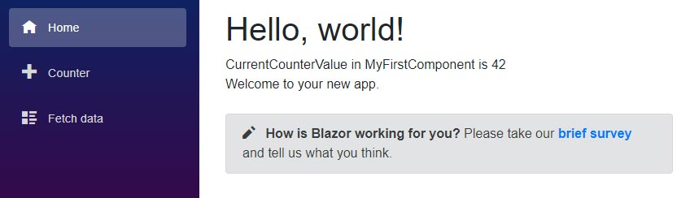
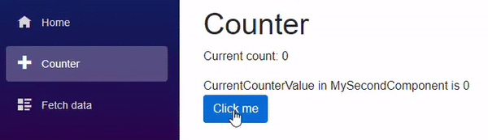

> 原文链接：https://blazor-university.com/components/one-way-binding/

# 单向绑定
[源代码](https://github.com/mrpmorris/blazor-university/tree/master/src/Components/OneWayBinding)

此时我们在页面内显示了一个组件，但内容是静态的。我们真正想要的是能够动态输出内容。

如果我们更改 **/Components/MyFirstComponent.razor** 的内容，我们可以引入一个私有成员并使用 `@` 符号输出该成员的值。

```
<div>
  CurrentCounterValue in MyFirstComponent is @CurrentCounterValue
</div>

@code {
  private int CurrentCounterValue = 42;
}
```


## 通过参数接收值
组件内的 `CurrentCounterValue` 总是显示值“42”，但是如果我们希望父组件告诉我们要显示哪个值呢？为此，创建一个名为 **MySecondComponent** 的新组件并从 **MyFirstComponent** 复制标记，然后将私有成员更改为公共属性。

```
<div>
  CurrentCounterValue in MySecondComponent is @CurrentCounterValue
</div>

@code {
  public int CurrentCounterValue { get; set; }
}
```
编辑 Counter 页面，添加一个 MySecondComponent 组件，并设置其 CurrentCounterValue，如下所示：
```
<MySecondComponent CurrentCounterValue=@currentCount/>
```
运行应用程序并导航到 Counter 页面现在将在浏览器的控制台窗口中显示错误。

```
WASM: System.InvalidOperationException: Object of type ‘OneWayBinding.Client.Components.MySecondComponent’ has a property matching the name ‘CurrentCounterValue’, but it does not have [ParameterAttribute] or [CascadingParameterAttribute] applied.
```

这清楚地告诉我们缺少什么。要向我们的组件添加参数，我们必须使用 `[Parameter]` 属性来装饰我们组件的属性。

```
<div>
  CurrentCounterValue in MySecondComponent is @CurrentCounterValue
</div>

@code {
  [Parameter]
  public int CurrentCounterValue { get; set; }
}
```

这会通知 Blazor 我们希望我们的组件上有一个参数，该参数可以通过看起来像 HTML 的属性进行设置。每当重新呈现父组件时，Blazor 也会重新呈现它提供参数值的任何子组件。这确保子组件被重新渲染以表示通过 `[Parameter]` 修饰属性向下传递给组件的状态的任何可能变化。

如果我们再次运行我们的应用程序并导航到 Counter 页面，我们将看到每当 Counter 页面中的 `currentCount` 发生变化时，它都会通过其 `CurrentCounterValue` 属性将该变化推送到我们的嵌入式组件。



**注意：** 参数必须是公共属性。

在继续学习双向绑定的工作原理之前，我们首先需要了解组件事件和指令。

**[下一篇 - 字面量、表达式和指令](/components/literals-expressions-and-directives)**