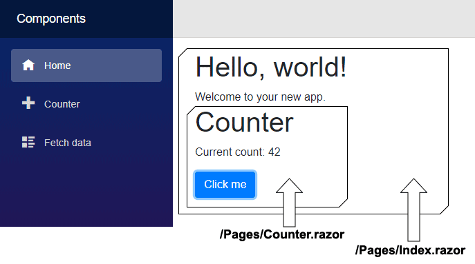

> 原文链接：https://blazor-university.com/components

# 组件
所有呈现的 Blazor 视图都来自 `ComponentBase` 类，这包括布局、页面和组件。

Blazor 页面本质上是一个带有 `@page` 指令的组件，该指令指定浏览器必须导航到的 URL 才能呈现它。事实上，如果我们比较生成的组件代码和页面代码，差别很小。可以在文件夹 **obj\Debug\netcoreapp3.0\Razor\Pages** 中的 **Counter.razor.g.cs** 中找到以下生成的源代码。

```
namespace MyFirstBlazorApp.Client.Pages
{
    [Microsoft.AspNetCore.Components.LayoutAttribute(typeof(MainLayout))]
    [Microsoft.AspNetCore.Components.RouteAttribute("/counter")]
    public class Counter : Microsoft.AspNetCore.Components.ComponentBase
    {
        protected override void BuildRenderTree(Microsoft.AspNetCore.Components.RenderTree.RenderTreeBuilder builder)
        {
            // Code omitted for brevity
        }

    private int counter = 42;

    private void IncrementCounter()
    {
        counter++;
    }
  }
}
```
[Microsoft.AspNetCore.Components.RouteAttribute("/counter")] 标识页面的 URL。

[Microsoft.AspNetCore.Components.LayoutAttribute(typeof(MainLayout))] 标识要使用的布局。

事实上，由于页面只是装饰有附加属性的组件，因此如果您更改默认 Blazor 应用程序的 **Pages/Index.razor** 文件，则可以将 **Counter** 页面嵌入为组件。

```
@page "/"

<h1>Hello, world!</h1>
Welcome to your new app.
<Counter/>
```



在另一个页面中嵌入页面时，Blazor 将其视为一个组件。嵌入页面上的 `LayoutAttribute` 将被忽略，因为 Blazor 已经有一个显式容器 - 包含它的父组件。


  **[下一篇 - 创建组件](/components/creating-a-component)**