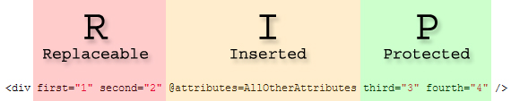

> 原文链接：https://blazor-university.com/components/replacing-attributes-on-child-components/

# 替换子组件的属性
[源代码](https://blazor-university.com/components/replacing-attributes-on-child-components/)

到目前为止，我们已经了解了如何创建[代码生成的属性](https://feiyun0112.github.io/blazor-university.zh-cn/components/code-generated-html-attributes/)，以及如何[捕获意外参数](https://feiyun0112.github.io/blazor-university.zh-cn/components/capturing-unexpected-parameters/)。除了这两种技术之外，Blazor 还允许我们重写/替换子组件中的现有属性。

采取以下页面标记：

```
<ChildComponent first="consumer-value-1" second="consumer-value-2" />
```

它使用以下子组件：

```
<div @attributes=AllOtherAttributes>
  Right-click and inspect the HTML for this element to see the results!
</div>

@code
{
  [Parameter(CaptureUnmatchedValues=true)]
  public Dictionary<string, object> AllOtherAttributes { get; set; }
}
```

正如我们之前在[代码生成的属性](https://feiyun0112.github.io/blazor-university.zh-cn/components/code-generated-html-attributes/)中看到的那样，`ChildComponent` 会将使用者提供的属性（第一个和第二个）捕获到我们的参数 `AllOtherAttributes` 中，并且对 `@attributes=AllOtherAttributes` 的调用将指示 Blazor 在 `Dictionary<string, object>` 中输出名称/值对。前面的代码将输出以下 HTML。

```
<div first="consumer-value-1" second="consumer-value-2">
  Right-click and inspect the HTML for this element to see the results!
</div>
```
## 替换子属性
如果我们想为 `first` 和 `second` 指定默认值以在使用者不提供它们时输出怎么办？如果未设置值，则可能很容易重写 [SetParametersAsync](https://feiyun0112.github.io/blazor-university.zh-cn/components/component-lifecycles/) 并插入值，但有一种更简单的方法！

我们所要做的就是写出我们的默认值作为子组件标记的一部分，`@attributes=` 指令将使用使用者传递的任何值覆盖它们。因此，如果我们更改子组件以指定一些默认属性值，如下所示：

```
<div first="1" second="2" third="3" fourth="4"  @attributes=AllOtherAttributes>
  Right-click and inspect the HTML for this element to see the results!
</div>
```

然后我们可以像这样替换组件的那些默认值：

```
<ChildComponent first="consumer-value-1" second="consumer-value-2" />
```

这将呈现以下 HTML：

```
<div first="consumer-value-1" second="consumer-value-2" third="3" fourth="4">
  Right-click and inspect the HTML for this element to see the results!
</div>
```

我们的子组件将始终呈现其所有四个 HTML 属性，但也将允许使用者替换它们的值。

## 保护属性不被替换
在某些情况下，我们可能希望允许组件的使用者替换某些属性，但我们希望保护其他属性不被更改。例如：

```
<input class="form-control" type="number" @attributes=AllOtherAttributes />
```

在这个假设的 `InputNumber` 控件中，我们希望允许我们的使用者替换默认的 `CSS` 类属性，但不希望他们意外地将 `type` 从 `number` 更改为 `checkbox`。

在 Blazor 中，我们的 `@attributes=` 指令的位置很重要。指令之前的任何属性（在其上方或左侧）都可以由使用者替换其值，但在它之后（在其下方或右侧）的所有属性都受到保护，以免其值被替换。

鉴于以下标记：

```
<ChildComponent
  first="consumer-value-1"
  second="consumer-value-2"
  inserted="consumer-inserted-value" />
```

然后调整 `@attributes=` 在我们的 `ChildComponent` 中的位置将为我们提供以下输出：

```
// Example 1
<div
  @attributes=AllOtherAttributes
  first="1"
  second="2" />

// Generated HTML
<div
  inserted="consumer-inserted-value
  first="1"
  second="2" />
```

```
// Example 2
<div
  first="1"
  @attributes=AllOtherAttributes
  second="2" />

// Generated HTML
<div
  first="consumer-value-1"
  inserted="consumer-inserted-value
  second="2" />
```

```
// Example 3
<div
  first="1"
  second="2"
  @attributes=AllOtherAttributes />

// Generated HTML
<div
  first="consumer-value-1"
  second="consumer-value-2"
  inserted="consumer-inserted-value />
```


## R.I.P. 默认值
记住哪些值优先的一种简单方法是使用“R.I.P.方法”。

`@attributes=` 指令将始终插入来自使用者的附加值，因此将 `I` 视为插入的含义。 `I` 之前的每个属性值都可以替换(`R`)，`I` 之后的每个属性值都受保护(`P`)。

```
<div first="1" second="2" @attributes=AllOtherAttributes third="3" fourth="4" />
```



**[下一篇 - 组件生命周期](https://feiyun0112.github.io/blazor-university.zh-cn/components/component-lifecycles)**