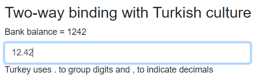

> 原文链接：https://blazor-university.com/components/two-way-binding/binding-directives/

# 绑定指令
[源代码](https://github.com/mrpmorris/blazor-university/tree/master/src/Components/BindingDirectives)

我们之前介绍了[指令](https://feiyun0112.github.io/blazor-university.zh-cn/components/literals-expressions-and-directives/directives/)——如果您不熟悉指令，请在继续之前阅读有关它们的部分。

我们之前介绍了指令和指令属性。在本节中，我们将通过演示如何使用双向绑定来为指令属性分配值。

快速回顾一下，指令是元素中以 `@` 符号开头的标识符。例如

```
<h1 @ref=OurReferenceToThisElement>Hello</h1>
```
指令属性是以 `@directive:attribute` 形式提供给指令的附加信息。例如，应用于 `@onclick` 指令的 `preventDefault` 属性会阻止提交按钮实际提交表单。

```
<input type="submit" @onclick:preventdefault>
```

除此之外，还可以通过以下形式为某些指令属性赋值：

```
<h1 @directive:attribute="someValue">Hello</h1>
```

尽管没有理由特别将这些属性值限制为双向绑定，但碰巧的是，目前 Blazor 框架中唯一使用此功能的地方恰好是双向绑定，这就是本节放在双向绑定部分下方的原因。

## 入门
**注意：** 尽管为了简单起见，我们将在此处使用 HTML `<input>` 元素，但为了获得更丰富的用户体验（添加验证等），我建议在 `<EditForm>` 组件中使用 Blazor `<Input*>` 组件（InputDate 等）。这些在[表单](https://feiyun0112.github.io/blazor-university.zh-cn/forms)一节中介绍。

首先，我们需要一个在 `@code` 部分中定义了以下成员的页面，因此我们需要绑定一些内容：

```
@code
{
  private string Name;
  private DateTime? DateOfBirth;
  private decimal? BankBalance;
}
```

### 标准双向绑定
首先，我们将从标准双向绑定到 Blazor 页面的 `Name` 成员开始。

```
<label>Name = @Name</label>
<input @bind-value=Name/>
```

前面标记的重要部分是 `@bind-value=Name`。这将为 `<input>` 元素上名为 `value` 的 HTML 属性设置双向绑定，并将其绑定到 `Name` 成员。

如果我们现在运行我们的应用程序，我们将看到上方的 `Name = @Name` 文本不会更改以反映我们在 `<input>` 中键入的内容，直到输入元素失去焦点或我们按下 Enter 键。

### 使用指令属性立即检测变化
`@bind` 指令有一个名为 `event` 的指令属性。设置此指令形式的值采用以下格式：

```
<input @bind-value:event="x"/>
```
“x”的有效值是 **onchange** 或 **oninput**。

当没有指定 `:event` 的值时，**onchange** 是假定的默认值。这是我们在运行示例时看到的行为——绑定仅在控件失去焦点或用户按下回车键时发生。

**oninput** 是 `:event` 的唯一其他可能值，它指示 Blazor  hook 到 HTML 元素的 JavaScript `oninput` 事件，并在每次触发事件时更新绑定成员。这会导致每次用户更改输入中的值时立即更新绑定成员。

**注意：** `-value` 是要绑定到的 HTML 属性或 Blazor 组件属性的名称。对于 HTML 元素，前导字母为小写，对于组件属性，前导字母为大写，指令名称和绑定目标名称由 `-` 符号分隔。

将以下标记添加到我们的页面并运行应用程序。

```
<label>Name = @Name</label>
<input @bind-value=Name @bind-value:event="oninput"/>
```

`@bind-value:event="oninput"` 是指示 Blazor 使用即时更改检测的关键。首先我们告诉 Blazor 我们要将输入框的 `value` HTML 属性绑定到我们的 **Name** 成员 (`@bind-value=Name`)，然后我们告诉 Blazor hook 到 HTML 元素的 `oninput` 事件，这样每次绑定都会立即发生元素的值发生变化（`@bind-value:event="oninput"`）。

*** 指定自定义绑定格式
通过为 `@bind` 指令的格式属性指定一个值来指定在用户界面中使用的自定义格式。

将以下标记添加到我们的页面并运行应用程序。

```
<label>Date of birth = @DateOfBirth?.ToString("MMMM d, yyyy")</label>
<input @bind-value=DateOfBirth @bind-value:format="yyyy-MM-dd"/>
```

当应用程序运行时，输入 ISO 格式的日期（例如 **1969-07-21**）。虽然日期在 `<label>` 中显示为 **July 21, 1969**，但 `<input>` 控件以我们在 `@bind-value:format="yyyy-MM-dd"` 中指定的 ISO 显示它。

**注意：** 输入的任何与指定格式不匹配的值都将被丢弃。因此，我们不能设置 `@bind-value:event="oninput"`，因为 Blazor 会尝试在每次按键时解析输入，但输入的值不可能在单次按键后有效，因此输入值将干脆消失。这是我建议在编辑数据时在 [EditForm](https://feiyun0112.github.io/blazor-university.zh-cn/forms) 中使用 Blazor `<Input*>` 组件的原因之一，因为这使我们能够使用诸如 `<InputDate>` 之类的组件。

如 [Descending from InputBase<T>](https://feiyun0112.github.io/blazor-university.zh-cn/forms/descending-from-inputbase/) 部分所述，Blazor 输入组件具有一对互补的受保护方法，用于将绑定值转换为字符串和从字符串转换为字符串。

### 工作原理
`@bind` 指令不会添加代码来直接绑定到我们的成员，而是简单地将其转换为字符串值/从字符串值转换。相反，它通过 `BindConverter` 重定向当前值的表示和输入值的解析。

如果我们查看 Blazor 为单向绑定（例如 `class=@OurCssClass`）生成的 **.cs** 文件，我们会看到 C# 看起来像这样（为简洁起见进行了编辑）。

```
protected override void BuildRenderTree(RenderTreeBuilder __builder)
{
  _builder.AddAttribute(1, "class", OurCssClass);
}
```
现在，如果我们查看生成的双向绑定文件，我们将看到类似于以下（有删减）代码的内容，用于显示该值：

```
protected override void BuildRenderTree(RenderTreeBuilder __builder)
{
  _builder.AddAttribute(1, "value",
    ...BindConverter.FormatValue(Name));
```
以及类似于以下（有删减）代码，用于将用户输入转换回绑定成员。

```
  __builder.AddAttribute(11, "onchange",
    ...EventCallback.Factory.CreateBinder(this, __value => Name = __value, Name));
}
```
代码 hook 到 HTML `onchange` 事件，然后在事件触发时设置我们的成员值。

设置 `@bind-value:format` 指令属性值时的不同之处在于我们提供的格式在生成的代码中传递给了 `BindConverter.Format` 和 `EventCallback.Factory.CreateBinder`。

```
...BindConverter.FormatValue(Name, format: "yyyy-MM-dd");
// and
CreateBinder(...., format: "yyyy-MM-dd");
```
### 指定自定义 culture
世界上的人们有不同的习俗和文化，这是使世界变得如此有趣的原因之一。不幸的是，这也是使编写软件更加困难的原因之一。

将以下标记添加到我们的页面：

```
<label>Bank balance = @BankBalance</label>
<input @bind-value=BankBalance @bind-value:culture=Turkish/>
```

并确保将以下成员添加到 `@code` 部分的页面中：

```
private CultureInfo Turkish = CultureInfo.GetCultureInfo("tr-TR");
```

输入值 **12.42** 可能会期望余额超过 **12** 土耳其里拉，但正如我们所见，我们只是不小心给了某人 **1,242** 土耳其里拉。当然，居住在土耳其的人会知道要输入 12,42，但这凸显了当我们的应用程序打算在其他国家/地区使用时正确指定文化的必要性。


与 **format** 指令属性一样，指定的 `@bind-value:culture` 将作为命名（可选）值传递给 `Binder` 和 `BindConverter`。

如果您还没有听说过**土耳其测试**，那么我建议您阅读[这篇优秀的文章](http://www.moserware.com/2008/02/does-your-code-pass-turkey-test.html)。

**[下一篇 - 级联值](https://feiyun0112.github.io/blazor-university.zh-cn/components/cascading-values)**