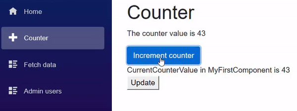

> 原文链接：https://blazor-university.com/components/two-way-binding/

# 双向绑定
[源代码](https://github.com/mrpmorris/blazor-university/tree/master/src/Components/TwoWayBinding)

**注意：** 如果您还没有这样做过，请在继续本节之前先执行[单向绑定](https://feiyun0112.github.io/blazor-university.zh-cn/components/one-way-binding/)中的步骤。

到目前为止，我们有一个包含嵌入组件的页面，并且我们组件的部分状态是从其宿主视图（**Counter** 页面）以名为 `CurrentCounterValue` 的参数的形式传递的。但是，如果我们还希望组件能够更新传递给它的状态呢？

如果您还不熟悉 `EventCallback<T>` 类，请阅读[组件事件](https://feiyun0112.github.io/blazor-university.zh-cn/components/component-events/)。理想情况下，您还应该熟悉使用 [Component 指令](https://feiyun0112.github.io/blazor-university.zh-cn/components/literals-expressions-and-directives/)，并且为了更深入地了解绑定变体，您可能还希望熟悉[浏览器 DOM 事件](https://feiyun0112.github.io/blazor-university.zh-cn/components/component-events/browser-dom-events/)。

就像我们对 **Counter** 页面所做的那样，通过添加一个带有 `onclick` 事件的按钮来更新 `CurrentCounterValue` 的值。

```
<div>
    CurrentCounterValue in MyFirstComponent is @CurrentCounterValue
</div>

<button @onclick=UpdateCurrentCounterValue>Update</button>

@code {
    [Parameter]
    public int CurrentCounterValue { get; set; }

    void UpdateCurrentCounterValue()
    {
        CurrentCounterValue++;
    }
}
```
问题在于默认情况下 `[Parameter]` 绑定是单向的。因此， `Page.counter` 的值将被赋给 `MyFirstComponent.CurrentCounterValue` ，因为父视图明确设置了它：

```
<MyFirstComponent CurrentCounterValue=@currentCount/>
```

但是，当 **MyFirstComponent** 中的属性发生更改时，组件会设置其状态的本地副本，而不是其父视图的状态。不仅如此，下次父状态更新时，它会将该值再次赋给 `MyFirstComponent.CurrentCounterValue` 并替换我们修改的值。


## 当状态改变时通知父组件
要解决此问题，我们需要告诉 Blazor 使用组件页面想要使用双向绑定。我们现在告诉 Blazor 绑定（即双向绑定）到该值，而不是简单地设置 `CurrentCounterValue`。要对参数使用双向绑定，只需在 HTML 属性前面加上文本 `@bind-`。这告诉 Blazor 它不仅应该将更改推送到组件，还应该观察组件的任何更改并相应地更新自己的状态。

```
<MyFirstComponent @bind-CurrentCounterValue=currentCount/>
```

**注意：** 将代码值（而不是常量）分配给参数时需要 `@` 符号。以前我们的标记包含 CurrentCounterValue=@currentCount，但是一旦我们在参数名称前加上 @bind - currentCount 之前的 `@` 符号就变得不必要了。

现在运行应用程序将在浏览器的控制台窗口中显示以下错误。

```
WASM：System.InvalidOperationException：“TwoWayBinding.Client.Components.MyFirstComponent”类型的对象没有与名称“CurrentCounterValueChanged”匹配的属性。
```

Blazor 中的双向绑定使用命名约定。如果我们想绑定一个名为 `SomeProperty` 的属性，那么我们需要一个名为 `SomeProperyChanged` 的​​事件回调。每当组件更新 `SomeProperty` 时，都必须调用此回调。

在 `MyFirstComponent` 中实现这一点

- 添加 `CurrentCounterValueChanged` 事件回调。
- 将 `UpdateCurrentCounterValue` 方法从 `void` 更改为 `async Task`。
- 在增加 `CurrentCounterValue` 后，调用 `CurrentCounterValueChanged` 以通知使用者状态已更改。
```
<div>
    CurrentCounterValue in MyFirstComponent is @CurrentCounterValue
</div>

<button @onclick=@UpdateCurrentCounterValue>Update</button>

@code {
    [Parameter]
    public int CurrentCounterValue { get; set; }

    [Parameter]
    public EventCallback<int> CurrentCounterValueChanged { get; set; }

    async Task UpdateCurrentCounterValue()
    {
        CurrentCounterValue++;
        await CurrentCounterValueChanged.InvokeAsync(CurrentCounterValue);
    }
}
```

## 工作原理
如果我们打开 `obj\Debug\netstandard2.0\Razor\Pages` 中的 `Counter.razor.gs` 文件，我们可以看到 `BuildRenderTree` 方法如下所示：

```
builder.OpenComponent<...MyFirstComponent>(10);

builder.AddAttribute(11, "CurrentCounterValue", 
  ...TypeCheck<System.Int32>(
    ...BindMethods.GetValue(currentCount)
  )
);

builder.AddAttribute(12, "CurrentCounterValueChanged",
  ...TypeCheck<...EventCallback<System.Int32>>(
    ...EventCallback.Factory.Create<System.Int32>(
      this,
      ...EventCallback.Factory.CreateInferred(
        this,
        __value => currentCount = __value,
        currentCount
      )
    )
  )
);
builder.CloseComponent();
```
**注意：** 源代码已重新格式化，为简洁起见，名称空间已替换为 ...。

- **第 5 行** 执行从 `Counter.currentCount` 到 `MyFirstComponent.CurrentCounterValue` 的单向绑定。
- **第 15 行** 每当执行 `MyFirstComponent.CurrentCounterValueChanged` 时，就会更新 `Counter.currentCount`。

**[下一篇 - 绑定指令](https://feiyun0112.github.io/blazor-university.zh-cn/components/two-way-binding/binding-directives)**