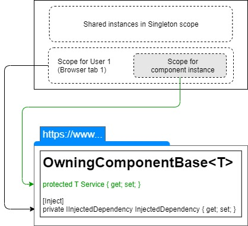

> 原文链接：https://blazor-university.com/dependency-injection/component-scoped-dependencies/owning-multiple-dependencies-the-wrong-way/

# 拥有多个依赖项：错误的方式
[`OwningComponentBase<T>`](https://feiyun0112.github.io/blazor-university.zh-cn/dependency-injection/component-scoped-dependencies/owningcomponentbase-generic/) 类是一个合适的解决方案，当我们需要我们的组件只拥有一个独立的依赖实例（以及它所依赖的任何 Scoped/Transient 依赖）时。但是，有时我们需要我们的组件拥有多个依赖项。

本节将演示实现此目标的错误方法，然后下一节将演示如何正确实现它。

## 概述
[源代码](https://github.com/mrpmorris/blazor-university/tree/master/src/DependencyInjection/OwningMultipleDependenciesTheWrongWay)

使用 `OwningComponentBase<T>` 时要记住的是，只有在组件拥有的注入容器中创建的 `T`（存储在名为 `Service` 的属性中）。

在 `OwningComponentBase<T>` 的派生类上使用 `@inject` 指令将不会从组件自己的注入容器中注入依赖项。

**注意：** 如果您还没有这样做，如果您还不熟悉此类如何创建自己的注入容器，请阅读有关 [OwningComponentBase<T>](https://feiyun0112.github.io/blazor-university.zh-cn/dependency-injection/component-scoped-dependencies/owningcomponentbase-generic/) 的部分。

## 示例
对于本练习，我们将创建一个新的 Blazor 应用程序，该应用程序将演示通过 `OwningComponentBase<T>` 中的 `T` 和 `@inject` 指令为我们的组件提供的服务的不同生命周期。

首先，创建一个新项目，并添加以下服务。

```
public interface IOwnedDependency
{
  public int InstanceNumber { get; }
}

public class OwnedDependency : IDependencyOne
{
  private static volatile int PreviousInstanceNumber;

  public int InstanceNumber { get; }
  public OwnedDependency()
  {
    InstanceNumber =
      System.Threading.Interlocked.Increment(ref PreviousInstanceNumber);
  }
}
```

该类只是根据增加一个静态字段为自己分配一个新的 `InstanceNumber`，为每个实例提供一个序号。

接下来，使用名称 `InjectedDependency` 创建一段相同的代码并注册服务。

```
// Server-side apps, edit Startup.cs
services.AddScoped<IOwnedDependency, OwnedDependency>();
services.AddScoped<IInjectedDependency, InjectedDependency>();

// WebAssembly apps, edit Program.cs
builder.Services.AddScoped<IOwnedDependency, OwnedDependency>();
builder.Services.AddScoped<IInjectedDependency, InjectedDependency>();
```

## 使用依赖
现在在 **/Shared** 文件夹中创建一个名为 **MyOwningComponent** 的组件，如下所示：

```
@inherits OwningComponentBase<IOwnedDependency>
@inject IInjectedDependency InjectedDependency

<div>
  Service.InstanceNumber = @Service.InstanceNumber
</div>
<div>
  InjectedDependency.InstanceNumber = @InjectedDependency.InstanceNumber
</div>
```

- 第 1 行

  从 `OwningComponentBase<IOwnedDependency>` 继承我们的组件，因此我们的组件将创建自己的注入容器并从中解析 `IOwnedComponent` 的实例。

- 第 2 行

  使用标准 `@inject` 指令让 Blazor 将 `IInjectedDependency` 的实例注入我们的组件。

## 显示结果
最后，我们将编辑 **Index.razor** 文件。我们将创建一个布尔字段，并且仅在该字段为 `true` 时才渲染 `MyOwnedComponent`。这将告诉 Blazor 在需要时创建组件的实例，并在不需要时释放它。我们将 `@bind` 一个 HTML 复选框以允许用户切换组件。

```
@page "/"

<input id="show-component" type=checkbox @bind=ShowComponent/>
<label for="show-component">Show component</label>

@if (ShowComponent)
{
  <MyOwningComponent/>
}

@code
{
  bool ShowComponent = false;
}
```

运行应用程序并切换复选框的状态将显示以下内容。

步骤 |  拥有的服务 | 注入的服务
--- | --- | ----
1   | 实例编号 = 1  | 实例编号 = 1
2  |  实例编号 = 2  | 实例编号 = 1
3 | 实例编号 = 3  | 实例编号 = 1

## 结论
使用 `@inject` 指令时，Blazor 将从与当前用户会话（当前浏览器选项卡）关联的依赖项容器中注入 `Scoped` 依赖项。只有 `OwnedComponentBase<T>` 中的 `T` 会从与我们的 `OwningComponentBase<T>` 派生组件的实例一起创建和销毁的注入容器中解析。



组件拥有多个依赖项的正确方法将在有关非泛型 [OwningComponentBase](https://feiyun0112.github.io/blazor-university.zh-cn/dependency-injection/component-scoped-dependencies/owning-multiple-dependencies-the-right-way/) 类的部分中介绍。

**[下一篇 - 拥有多个依赖项：正确的方式](https://feiyun0112.github.io/blazor-university.zh-cn/dependency-injection/component-scoped-dependencies/owning-multiple-dependencies-the-right-way/)**