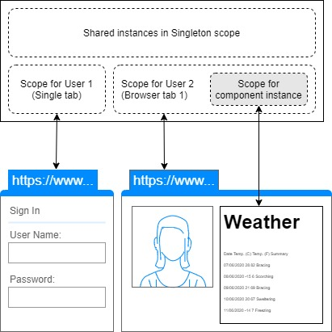
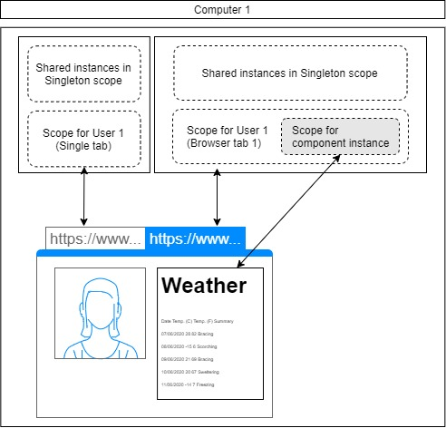

> 原文链接：https://blazor-university.com/dependency-injection/component-scoped-dependencies/owningcomponentbase-generic/

# OwningComponentBase<T>
正如在 [Singleton  依赖](/dependency-injection/dependency-lifetimes-and-scopes/scoped-dependencies/)部分中提到的，Singleton 注册的依赖必须要么没有状态，要么只包含可以在同一服务器上的所有用户之间共享的状态。

而且，正如在 [Scoped 依赖](/dependency-injection/component-scoped-dependencies/)中提到的那样，Scoped 注册依赖项将单个用户的状态与其他所有人（甚至是在不同浏览器选项卡中访问同一网站的同一用户）隔离开来。

但是线程安全呢？在运行服务器端应用程序时，很可能一次注册的 Singleton 依赖项会被多个线程使用。即使我们将我们的依赖注册为 Scoped，完全有可能不同的组件会被不同的线程渲染，这在[多线程](/components/multi-threaded-rendering/)渲染一节中有详细描述。

因此，我们在编写服务时必须考虑线程安全。但是，有时我们不拥有我们使用的服务的源代码，它们可能不是线程安全的（一个例子是 EntityFrameworkCore 的 `DbContext` 类）。

## 问题演示
[源代码](https://github.com/mrpmorris/blazor-university/tree/master/src/DependencyInjection/UsingGenericOwningComponentBase)

首先，我们将修改标准服务器端 Blazor 项目，使 `WeatherForecastService` 不再是线程安全的。我们将检测是否有多个线程同时使用该服务并抛出 `InvalidOperationException`，就像 `DbContext` 类所做的那样。

我们将通过保留一个线程安全的 Int32 字段来实现这一点，我们可以在方法开始时递增，在方法结束时递减。如果当我们尝试增加它时该值已经 > 0，那么我们可以推断出另一个线程已经在执行该方法，然后抛出异常。

创建项目后，编辑 **/Data/WeatherForecastService.cs** 文件并添加一个新的 `volatile int` 字段：

```
private volatile int Locked;
```

在方法开始时，我们将使用 `Interlocked.CompareExchange` 框架方法来确保 `Locked` 值当前为 0，然后将其从 0 更改为 1。在方法结束时，我们将使用 `Interlocked.Decrement` `更改Locked` 的值回落到 0。

我们还需要延迟该方法，否则我们几乎没有机会让两个线程同时执行它。 `GetForecastAsyc` 应更改为以下代码。

```
public class WeatherForecastService
{
  private volatile int Locked;

  private static readonly string[] Summaries = new[]
  {
    "Freezing", "Bracing", "Chilly", "Cool", "Mild", "Warm", "Balmy", "Hot", "Sweltering", "Scorching"
  };

  public async Task<WeatherForecast[]> GetForecastAsync(DateTime startDate)
  {
    if (Interlocked.CompareExchange(ref Locked, 1, 0) > 0)
      throw new InvalidOperationException(
        "A second operation started on this context before a previous operation completed. Any "
        + "instance members are not guaranteed to be thread-safe.");

    try
    {
      await Task.Delay(3000);
      var rng = new Random();
      return Enumerable.Range(1, 5).Select(index => new WeatherForecast
      {
        Date = startDate.AddDays(index),
        TemperatureC = rng.Next(-20, 55),
        Summary = Summaries[rng.Next(Summaries.Length)]
      }).ToArray();
    }
    finally
    {
      Interlocked.Decrement(ref Locked);
    }
  }
}
```

- 第 3 行

    添加了一个私有 · 字段以跟踪当前正在执行相同方法的线程数。

- 第 12 行

    `Interlocked.CompareExchange` 用于将 `Locked` 的值设置为 1，但前提是它当前为 0。`Locked` 的原始值从方法返回，如果大于 0 则抛出 `InvalidOperationException`。

- 第 19 行

    我们引入 3 秒的 `await Task.Delay` 来模拟长时间运行的进程。这将增加两个线程冲突的风险，并确保我们的代码实际上是异步运行的。 （请参阅[多线程渲染](/components/render-trees/multi-threaded-rendering/)）。


- 第 30 行

    方法完成后，将 `Locked` 计数从 1 递减到 0，以便另一个线程可以执行该方法而不会收到异常。

现在运行应用程序，并尝试同时在两个浏览器选项卡中打开 **/fetchdata** 页面，应该会抛出我们的 `InvalidOperationException`。

### 修复 1：使用 Scoped 依赖项
将 `WeatherForecastService` 从 `Singleton` 依赖更改为 `Scoped` 依赖（在 `Startup.cs` 中）将防止线程重入问题在我们的用户中发生。

```
public void ConfigureServices(IServiceCollection services)
{
  services.AddRazorPages();
  services.AddServerSideBlazor();
  services.AddScoped<WeatherForecastService>();
}
```

再次运行应用程序，我们将看到我们能够打开许多选项卡而不会导致线程冲突。如果你已经阅读了 [Scoped 依赖](/dependency-injection/dependency-lifetimes-and-scopes/scoped-dependencies/)的部分，那么原因就很明显了。每个选项卡都接收到它自己唯一的 `WeatherForecastService` 实例，因此在任何时候只有一个线程在使用每个服务。

但是，我们只保证我们的服务不会被我们应用程序的其他用户的线程使用。它不保证我们的组件根本不会被多个线程使用。[多线程渲染](/components/render-trees/multi-threaded-rendering/)部分解释了服务器端 Blazor 应用程序如何利用多个线程来渲染用户界面

潜在地为单个用户呈现多个线程意味着我们仍然有可能在跨多个组件共享的服务实例上进行线程重入。

如果使服务线程安全是不可能的，那么这种情况下的一个选择是确保每个组件都有自己唯一的注入服务实例。

### 演示 Scoped 依赖的问题
创建一个名为 **Conflict.Razor** 的新页面，并为其提供以下简单标记。

```
@page "/conflict"

<FetchData />
<FetchData />
```

在我们的页面中呈现两次 **FetchData** 将需要两个组件来访问 `WeatherForecastService`，并且因为 `GetForecastAsync` 方法中有一个 `await`。这意味着渲染第一个 `<FetchData/>` 的线程将能够在第一个 `<FetchData/>` 完成之前继续渲染第二个 `<FetchData/>`。

再次运行应用程序并导航到 **/conflict** 页面，我们将再次看到 `InvalidOperationException` 再次被抛出。

### 修复 2：从 OwningComponentBase<T> 派生
Blazor 有一个名为 `OwningComponentBase<T>` 的通用组件类。创建此类的实例时，它将首先创建自己的 `IServiceProvider`（用于解决依赖关系），然后使用该服务提供者创建 `T` 的新实例（然后将其存储在名为 `Service`）。

因为 `OwningComponentBase<T>` 拥有自己唯一的 `IServiceProvider`（因此命名为 `OwningComponentBase`），这意味着从服务提供者解析的 `T` 对于我们的组件来说是唯一的。

当我们的 `OwningComponentBase<T>` 组件被释放时，它的 `IServiceProvider`（服务属性）也被释放，这反过来将释放它创建的每个实例——在本示例中，就是我们的 `WeatherForecastService`。







在 **/Pages** 中创建一个名为 **OwnedFetchDataPage.razor** 的新组件并输入以下标记。

```
@page "/owned-fetchdata"
<OwnedFetchData/>
<OwnedFetchData />
```

在 **/Shared** 文件夹中创建一个名为 **OwnedFetchData.razor** 的新组件，并复制 **FetchData.razor** 文件中的标记。

目前，`OwnedFetchData` 组件也存在同样的缺陷，它被注入了与当前浏览器选项卡中的其他组件共享的相同 `WeatherForecastService` 实例。要解决此问题，请按照以下步骤操作。

1. 在页面顶部删除
`@inject WeatherForecastService ForecastService`
2. 将删除的行替换为
`@inherits OwningComponentBase<WeatherForecastService>`
3. 删除代码行
`forecasts = await ForecastService.GetForecastAsync(DateTime.Now);`
4. 将其替换为
`forecasts = await Service.GetForecastAsync(DateTime.Now);`

再次运行应用程序并导航到 **/owned-fetchdata** 页面。因为 `OwnedFetchData` 组件的每个实例都拥有自己的 `WeatherForecastService` 实例，所以它们能够彼此独立地与服务交互，而不会导致线程重入问题。

如果我们的服务器端应用程序正在访问数据库，我们可能会从 `OwningComponentBase<MyDbContext>` 派生我们的组件并从数据库中获取数据到一个数组中进行渲染。

**[下一篇 - 拥有多个依赖项：错误的方式](/dependency-injection/component-scoped-dependencies/owning-multiple-dependencies-the-wrong-way/)**