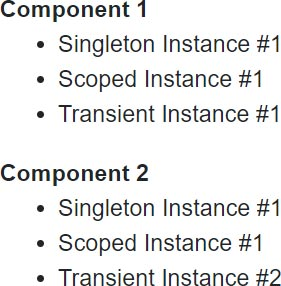
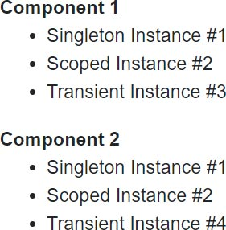

> 原文链接：https://blazor-university.com/dependency-injection/dependency-lifetimes-and-scopes/comparing-dependency-scopes/

# 比较依赖范围
[源代码](https://github.com/mrpmorris/blazor-university/tree/master/src/DependencyInjection/ServerDependencyScopes)

在本节中，我们将创建一个 Blazor 应用程序来演示各种依赖注入作用域的不同生命周期。

为此，我们将创建三个不同的服务（每个范围一个）。每个服务都将跟踪它的创建时间，以及一个递增的 `InstanceNumber`，以便我们可以跟踪已经创建了多少个该类型的实例。

首先，创建一个新的 Blazor 服务器端应用程序并添加一个静态类来跟踪应用程序启动的 `DateTime`，并计算自启动以来经过了多少时间。

```
public static class AppLifetime
{
  public static DateTime StartTimeUtc { get; } = DateTime.UtcNow;
  public static TimeSpan ElapsedTime => DateTime.UtcNow - StartTimeUtc;
}
```

## 服务接口
接下来，创建三个接口：`IMyTransientService``、IMyScopedService` 和 `IMySingletonService`。每个接口都是相同的。

注意：有一些方法可以编写不需要重复的代码，但为了简单起见，此示例将重复代码。

```
public interface IMyTransientService
{
  public TimeSpan DeltaCreationTime { get; }
  public int InstanceNumber { get; }
}

public interface IMyScopedService
{
  // As above
}

public interface IMySingletonService
{
  // As above
}
```

## 服务实现
同样，这些服务的代码将被复制以避免复杂性。创建后，我们的服务将从 `AppLifetime` 类中获取 `ElapsedTime`，因此我们可以判断该实例是否是最近创建的。它还将从静态字段中为自己分配一个 `InstanceId`。

```
public class MyTransientService : IMyTransientService
{
  public TimeSpan DeltaCreationTime { get; }
  public int InstanceNumber { get; }

  private static volatile int PreviousInstanceNumber;

  public MyTransientService()
  {
    DeltaCreationTime = DateTime.UtcNow - AppLifetime.StartTimeUtc;
    InstanceNumber = System.Threading.Interlocked.Increment(ref PreviousInstanceNumber);
  }
}

public class MyScopedService : IMyScopedService
{
  //As above
}

public class MySingletonService : IMySingletonService
{
  // As above
}
```

## 注册我们的服务
编辑 `Startup.cs` 文件，并在 `ConfigureServices` 方法中注册我们的服务，如下所示。

```
services.AddSingleton<IMySingletonService, MySingletonService>();
services.AddScoped<IMyScopedService, MyScopedService>();
services.AddTransient<IMyTransientService, MyTransientService>();
```

## 用户界面
在我们的页面中，我们想要展示实例是如何被多个组件共享的。我们将通过创建一个使用我们所有三个服务的组件来简化这一点，然后让我们的组件的两个实例同时显示在我们的页面中。



## 创建我们的服务消费组件
首先我们需要注入我们的服务，然后我们将显示每个实例的 `InstanceNumber` 以及注入的服务是否是最近创建的。为此，如果服务是在最后 500 毫秒内创建的，我们将在 UI 中包含一个 CSS 类。

```
@inject IMySingletonService MySingletonService
@inject IMyScopedService MyScopedService
@inject IMyTransientService MyTransientService
<dl>
  <dt>@Caption</dt>
  <dd>
    <ul>
      <li>
        <span class="scope-name">Singleton</span>
        <span class="@GetNewIndicatorCss(MySingletonService.DeltaCreationTime)">Instance #@MySingletonService.InstanceNumber</span>
      </li>
      <li>
        <span class="scope-name">Scoped</span>
        <span class="@GetNewIndicatorCss(MyScopedService.DeltaCreationTime)">Instance #@MyScopedService.InstanceNumber</span>
      </li>
      <li>
        <span class="scope-name">Transient</span>
        <span class="@GetNewIndicatorCss(MyTransientService.DeltaCreationTime)">Instance #@MyTransientService.InstanceNumber</span>
      </li>
    </ul>
  </dd>
</dl>

@code
{
  [Parameter]
  public string Caption { get; set; }

  private string GetNewIndicatorCss(TimeSpan time)
  {
    if (AppLifetime.ElapsedTime - time < TimeSpan.FromMilliseconds(500))
    {
      return "instance-info new-instance";
    }
    return "instance-info";
  }
}
```

- 第 1-3 行

    指示 Blazor 将我们的服务实例注入此组件。

- 第 10、14 和 18 行

    显示每个注入依赖项的 `InstanceNumber`，并通过调用 `GetNewIndicatorCss` 设置 HTML 元素的类属性。

- 第 31 行

    如果服务的 `DeltaCreationTime`（应用程序启动和实例创建之间的时间）在 `AppLifetime.ElapsedTime`（应用程序启动和当前时间之间的时间）的 500 毫秒内，则组件将使用 CSS 类 `instance-info new-instance` 呈现，否则它只有 CSS 类实例信息。这将让我们以不同的方式显示新实例的 UI。

## 在页面上显示我们的组件
编辑 **Pages/Index.razor** 并更改标记如下

```
@page "/"
<MyStandardComponent Caption="Component 1" />
<MyStandardComponent Caption="Component 2" />
```

运行应用程序，您将看到以下输出。



当我们的 `Scoped Instance` 应该是第一个实例时，它却是 #2，这可能会让人感到惊讶。这是因为在浏览器和服务器之间建立 SignalR 连接以实际启动用户会话之前，服务器端 Blazor 应用程序会预渲染我们的页面以发回完整的 HTML 响应。我们现在可以通过执行以下操作来禁用它。

- 编辑 /Pages/_Host.cshtml
- 找到文本 `render-mode="ServerPrerendered"`
- 将 `ServerPrerendered` 更改为 `Server`

现在重新运行应用程序会给我们预期的结果。


`Singleton Instance` 将始终为 `#1`，因为它由所有用户共享。 `Scoped Instance` 将是应用程序的第一个用户的 `#1`，第二个用户的 `#2`，依此类推。 `Transient Instance` 对于第一个组件将是 `#1`，对于第二个组件将是 `#2`，因为它们是为每个组件创建的。如果用户离开页面然后返回，唯一会改变的实例编号是 Transient 实例，它将递增到 `#3` 和 `#4`，并且在下次访问页面时将递增到 `#5` 和 `#6`。

## 交互式示例
为了使生命周期更加明显，我们将修改我们的 **Index.razor** 页面，以便它有条件地呈现我们的组件。我们还将展示实际的页面刷新如何影响我们的范围服务。

我们将通过以下步骤创建一个简单的向导式 UI

1. 网站启动
2. 更新的 UI – 重新创建了组件
3. 在浏览器中重新加载页面
4. 更新的 UI – 重新创建了组件


## 确保在每一步都重新创建组件
为了确保我们的组件在每个导航中创建，我们将有一个 `CurrentStep` 字段并根据 `CurrentStep` 是奇数还是偶数来显示一个或另一组组件。

```
@if (CurrentStep % 2 == 1)
{
  <MyStandardComponent Caption="Component 1" />
  <MyStandardComponent Caption="Component 2" />
}
else
{
  <MyStandardComponent Caption="Component 1" />
  <MyStandardComponent Caption="Component 2" />
}
```

## 强制在浏览器中刷新页面
要强制刷新页面，我们将使用 `NavigationManager` 进行导航，并将 `true` 传递给 `forceLoad` 参数。为了让我们知道在页面刷新后我们正在继续，我们将导航到 `/continue`。此请求将由同一页面提供服务，但我们知道我们应该从第 3 步而不是第 1 步开始。

```
@page "/"
@page "/{Continue}"
@inject NavigationManager NavigationManager

@code
{
  [Parameter]
  public string Continue { get; set; }

  private void GoToNextStep()
  {
    CurrentStep++;
    if (CurrentStep == 3)
      NavigationManager.NavigateTo("/continue", forceLoad: true);
  }

  protected override void OnInitialized()
  {
    base.OnInitialized();
    if (!string.IsNullOrWhiteSpace(Continue))
      CurrentStep = 3;
  }
}
```

## 完成示例
以下（已完成）代码基本上是到目前为止所概述的内容，并添加了以下内容。

1. 添加了显示当前步骤名称的文本。
2. 添加了一个按钮以单击以进行下一步。
3. 添加了在没有下一步时禁用按钮的代码。
4. 添加了一些 CSS 样式，以使新实例通过脉冲来吸引我们的注意力。
```
@page "/"
@page "/{Continue}"
@inject NavigationManager NavigationManager

<h1>Step @CurrentStep: @CurrentStepName</h1>
@if (CurrentStep % 2 == 1)
{
  <MyStandardComponent Caption="Component 1" />
  <MyStandardComponent Caption="Component 2" />
}
else
{
  <MyStandardComponent Caption="Component 1" />
  <MyStandardComponent Caption="Component 2" />
}
<button @onclick=GoToNextStep disabled=@IsButtonDisabled>Next step</button>

<style>
  .scope-name {
    width: 5rem;
    display: inline-block;
    font-weight: bold;
  }

  .instance-info {
    color: white;
    background-color: #888;
    padding: 0 4px;
    margin: 2px;
    display: inline-block;
  }

    .instance-info.new-instance {
      background-color: #3f8f42;
      animation: flash-green 2s;
    }

  @@keyframes flash-green {
    from {
      background-color: #4cff00;
    }

    to {
      background-color: #3f8f42;
    }
  }
</style>

@code
{
  [Parameter]
  public string Continue { get; set; }

  private int CurrentStep = 1;
  private string CurrentStepName => StepNames[CurrentStep - 1];
  private bool IsButtonDisabled => CurrentStep >= StepNames.Length;

  private string[] StepNames = new string[]
  {
    "Website started",
    "Updated UI - Components recreated",
    "Reloaded page in browser",
    "Updated UI - Components recreated"
  };

  protected override void OnInitialized()
  {
    base.OnInitialized();
    if (!string.IsNullOrWhiteSpace(Continue))
      CurrentStep = 3;
  }

  private void GoToNextStep()
  {
    CurrentStep++;
    if (CurrentStep == 3)
      NavigationManager.NavigateTo("/continue", forceLoad: true);
  }
}
```

- 第 6 行

    根据 `CurrentStep` 是奇数还是偶数，渲染一组或另一组组件实例。这可确保为向导的每个步骤重新创建生成 UI 的组件。

- 第 16 行

    转到向导的下一步（如果有）。

- 第 69 行

    如果 `Continue route` 参数不为 null，则从步骤 3 继续。

- 第 76 行

    如果单击下一步按钮并在第 3 步结束，则强制重新加载页面。

## 运行应用程序

当我们的网站第一次运行时，我们获得了所有注入依赖项的第一个实例。除了 Transient 依赖，因为它们是按需创建的，而不是缓存起来以供重用，所以我们得到了实例 `#1` 和 `#2`。


当用户单击 `Next step` 按钮时，`CurrentStep` 增加到 2，我们的第一对组件被丢弃，而第二对组件被创建用于渲染。因为这些是在同一个用户会话中运行的新实例，所以它们将收到相同的 `Scoped` 依赖项以及两个新的 `Transient` 依赖项。


当用户再次单击 `Next step` 按钮时，应用程序将强制在新路径 `/continue` 处重新加载应用程序。由于在重新加载页面时忘记了 SignalR 连接的 ID，因此将为用户设置一个新连接，从而设置一个新范围。所以现在当前几个组件被渲染时，它们是 `Scoped` 实例 #2。


最后，当用户最后一次单击 `Next step` 按钮时，将创建第二对组件以进行渲染，并将注入由共享 `Singleton` 容器（实例＃1）中缓存的实例缓存的 `IMySingletonService`，与当前用户的注入容器（实例 #2）缓存的 `IMyScopedService`，以及 `IMyTransientService` 的两个新实例。


## WebAssembly 依赖范围
[源代码](https://github.com/mrpmorris/blazor-university/tree/master/src/DependencyInjection/WebAssemblyDependencyScopes)

因为 WebAssembly 在用户的浏览器中运行，并且每个选项卡都是一个完全独立的进程，所以我们的输出将与服务器端 Blazor 应用程序产生的略有不同。

首先，应用程序在浏览器选项卡中启动，我们得到了我们期望在服务器端 Blazor 应用程序上看到的相同输出。


第一次单击 `Next step` 也向我们展示了一个与我们的服务器端 Blazor 应用程序相同的屏幕，其中 `Singleton` 和 `Scoped` 实例保持不变，因为它们都是缓存实例，并且按需创建了两个 `Transient` 实例。


当我们的应用程序执行强制重新加载时，情况就不同了。在服务器端应用程序中，用户获得一个新的 SignalR 连接 ID，因此在与该 ID 绑定的服务器上获得一个新的依赖注入容器。在 WebAssembly 中，页面没有可重新连接的应用程序状态。一旦页面重新加载，整个应用程序状态就会被销毁，然后重新创建。结果，我们的实例数从头开始。


然后最后。


## 结论
由于用户界面和 UI 逻辑在 Blazor 应用程序中绑定在一起，因此没有每个请求的依赖注入范围。

`Singleton` 注册的依赖项在服务器端应用程序中的用户之间共享，但在 WebAssembly 应用程序中每个浏览器选项卡都是唯一的。

`Scoped` 依赖的行为与 `Singleton` 注册的依赖几乎相同，除了它们与其他用户/其他浏览器选项卡隔离。

`Transient` 依赖在服务器端和 WebAssembly 上的工作方式相同，并且与 ASP.NET MVC 中的工作方式相同——除了依赖注入容器在 ASP.NET MVC 中的页面请求之后被释放。请参阅 `Transient` 依赖项的[避免内存泄漏](https://feiyun0112.github.io/blazor-university.zh-cn/dependency-injection/dependency-lifetimes-and-scopes/transient-dependencies/#avoiding-memory-leaks)部分。

有一些方法可以为每个用户引入额外的范围。这种技术将在后面的部分中介绍。


**[下一篇 - 组件范围依赖](https://feiyun0112.github.io/blazor-university.zh-cn/dependency-injection/component-scoped-dependencies/)**