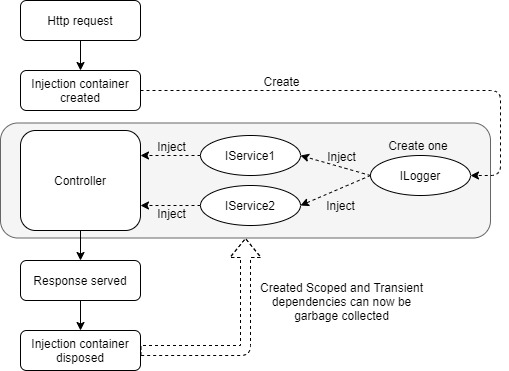
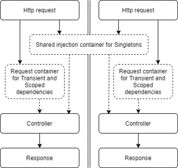
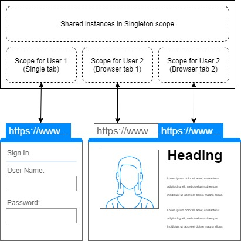
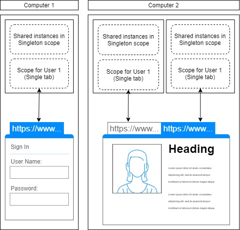

> 原文链接：https://blazor-university.com/dependency-injection/dependency-lifetimes-and-scopes/scoped-dependencies/

# Scoped 依赖
Scoped 依赖项类似于 Singleton 依赖项，因为 Blazor 会将相同的实例注入到依赖它的每个对象中，但不同之处在于 Scoped 实例并非由所有用户共享。

在经典的 ASP.NET MVC 应用程序中，每个请求都会创建一个新的依赖注入容器。依赖于 `Scope` 注册依赖的第一个对象将接收该依赖的新实例，并且该新实例将被缓存在注入容器中。

从那时起，任何请求相同依赖类型的对象（例如前面示例中的 `ILogger`）都将收到相同的缓存实例。然后，在请求结束时，不再需要容器，并且可能会连同它创建的所有 `Scoped` 和 `Transient` 注册实例一起被垃圾收集。

作用域实例使我们能够将依赖项注册为每个用户的单个实例，而不是每个应用程序的单个实例。

## Blazor 服务器端 Scoped 依赖项
与 ASP.NET MVC 应用程序不同，Blazor 中没有每个请求的范围。作为单页应用程序 (SPA)，Blazor 应用程序只创建一次，然后在整个会话期间保留在用户的屏幕上。

注意：与 ASP.NET 站点不同，Blazor 服务器端应用程序不会在页面刷新时保持不变。 Blazor 服务器端应用的范围是客户端和服务器之间的 SignalR 连接。

在用户会话期间，URL 可能会发生变化，但浏览器实际上并没有在任何地方导航。相反，它只是根据当前 URL 重建显示。如果您需要熟悉这是如何完成的，请阅读路由部分。

在 Blazor 中没有“每页”范围的概念，在 Blazor 中将依赖项注册为 `Scoped` 将导致依赖项在用户会话期间存在。 `Scoped` 依赖项的实例将在单个用户的页面和组件之间共享，但不会在不同用户之间共享，也不会在同一浏览器中的不同选项卡之间共享。

## WebAssembly Scoped 服务
WebAssembly 应用程序中的作用域略有不同。在服务器端应用程序中，有一个进程使我们能够在同一服务器的所有用户之间共享单例范围的依赖项。在 WebAssembly 中，每个选项卡都是一个独特的过程。这意味着即使在同一个浏览器中，Singleton 依赖项也不会跨选项卡共享，更不用说跨计算机了。

**[下一篇 - 比较依赖范围](/dependency-injection/dependency-lifetimes-and-scopes/comparing-dependency-scopes/)**