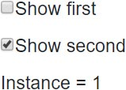
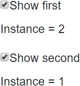
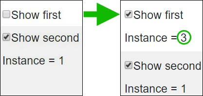

> 原文链接：https://blazor-university.com/dependency-injection/dependency-lifetimes-and-scopes/transient-dependencies/

# Transient 依赖
Transient 依赖是最容易理解的。在构建注册为 Transient 的可注入依赖项时，依赖项容器只是充当工厂。一旦实例被创建并注入到依赖组件中，容器就不再对它感兴趣了。

**警告：这仅适用于未实现 `IDisposable` 的实例。为避免潜在的内存泄漏，请阅读本节底部的避免内存泄漏部分。**

为了说明 Transient 依赖的生命周期，我们将创建一个简单的应用程序，以便我们可以查看对象实例的创建时间。

## Transient 依赖示例

[源代码](https://github.com/mrpmorris/blazor-university/tree/master/src/DependencyInjection/TransientLifetimes)

首先，创建一个新的 Blazor 服务器应用。然后新建一个名为 **Services** 的文件夹，添加如下界面。这是我们的 UI 将用来显示由依赖容器创建并注入到我们的组件中的对象的实例编号的服务。每个实例将其 **InstanceNumber** 设置为下一个可用的序列号。

```
public interface IMyTransientService
{
  public int InstanceNumber { get; }
}
```


为了实现这个接口，我们将编写一个带有静态整数字段的类，我们可以使用它来确定下一个可用的序列号。该字段将被标记为 `volatile` 并使用 `System.Threading.Interlocked.Increment` 进行更改，因此我们可以跨多个线程修改该字段，而无需进行任何线程锁定。

```
public sealed class MyTransientService : IMyTransientService
{
  public int InstanceNumber { get; }

  private static volatile int PreviousInstanceNumber;

  public MyTransientService()
  {
    InstanceNumber = System.Threading.Interlocked.Increment(ref PreviousInstanceNumber);
  }
}
````

## 注册我们的依赖
在服务器端应用程序中编辑 `Startup.ConfigureServices` 并添加以下代码：

```
services.AddTransient<IMyTransientService, MyTransientService>();
```

在 WebAssembly 应用程序中编辑 `Program.Main` 并在调用 `builder.Build()` 之前添加以下代码。

```
builder.Services.AddTransient<IMyTransientService, MyTransientService>();
```

## 使用 Transient 依赖
为了使用这种 Transient 依赖，我们将创建一个组件，以便我们可以在主页上显示使用组件的多个实例。该组件将简单地声明一个注入的依赖项，然后显示它的 `InstanceNumber`。

在 **Shared** 文件夹中，创建一个名为 **MyStandardComponent.razor** 的新组件，并为其添加以下标记。

```
@inject IMyTransientService TransientService

<p>Instance = @TransientService.InstanceNumber</p>
```

## 演示 Transient 生命周期
接下来，我们将编辑 **Index.razor**，以便我们可以通过选中或取消选中复选框来显示/隐藏该组件的实例。除非选中相关复选框，否则我们的标记不会呈现组件的实例。因为 Blazor 仅在需要时创建组件实例，所以切换复选框将在它显示时重新创建我们的组件，并允许它在不显示时被垃圾回收。

```
<div>
  <input id="show-first" type="checkbox" @bind=ShowFirst /><label for="show-first">Show first</label>
  @if (ShowFirst)
  {
    <MyStandardComponent />
  }
</div>

<div>
  <input id="show-second" type="checkbox" @bind=ShowSecond /><label for="show-second">Show second</label>
  @if (ShowSecond)
  {
    <MyStandardComponent />
  }
</div>

@code
{
  bool ShowFirst;
  bool ShowSecond;
}
```

- 第 19-20 行

    声明布尔字段以确定是否应创建和呈现两个组件中的每一个。

- 第 2 行

    在复选框上使用双向绑定，因此我们可以在 `false` 和 `true` 之间切换布尔字段。

- 第 5 行

    如果相关字段为 `true`，则显示 `MyStandardComponent` 的一个实例。

## 运行应用程序

当应用程序第一次运行时，两个布尔字段都将为 `false`，因此两个 `MyStandardComponent` 标记都不会被呈现。


当我们选中其中一个复选框时，它将双向绑定到其相关的布尔字段，将其设置为 `true`。然后，用户交互将导致组件的重新渲染，从而导致我们的 `MyStandardComponent` 实例之一被渲染 - 因此 Blazor 将创建它的一个实例并注入一个新创建的 `MyTransientService`，其 `InstanceNumber` 为 1。

下图显示了当“Show second”是第一个要选中的复选框时的预期输出。



选中另一个复选框将再次导致重新渲染，另一个 `MyStandardComponent` 将被创建并使用 `InstanceNumber` 为 2 的依赖项进行渲染，因为注入其中的 Transient 依赖项是按需创建的。



每当我们取消选中一个复选框时，我们的页面标记将不再呈现相关的 `MyStandardComponent`，因为它只是基于 `@if` 语句有条件地呈现。当它被取消选中并且页面重新渲染时，现有组件不再被引用并且允许被垃圾收集。

当我们选中同一个复选框时，我们的条件将得到满足，我们的页面将呈现相关的 `MyStandardComponent`，将创建一个新实例，将创建一个 `MyTransientService` 的新实例以注入其中，我们将看到一个显示 3 的组件为其 `InstanceNumber`。



1. 该页面在没有创建任何组件的情况下呈现。
2. 选中第 2 个复选框，将 ShowSecond 设置为 true。
    - 页面重新渲染，第 2 个组件可见。
    - 我们组件的一个新实例被创建。
    - 我们的 transient 服务的一个新实例（实例 1）被创建并注入到组件中。
3. 选中第 1 个复选框，将 ShowFirst 设置为 true。
    - 页面重新渲染，第  1 个组件可见。
    - 我们组件的一个新实例被创建。
    - 我们的 transient 服务的一个新实例被创建（实例 2）并注入其中。
4. 第 1 个复选框未选中，将 ShowFirst 设置为 false。
    - 第一个组件不再呈现，因此它会被垃圾回收。
    - 再次选中第 1 个复选框，将 ShowFirst 设置为 true。
    - 页面被重新渲染。
    - 我们组件的一个新实例被创建。
    - 我们的 transient 服务（实例 3）的一个新实例被创建并注入其中。

## 避免内存泄漏

如果类不实现 `IDisposable`，则仅将其注册为 Transient 依赖项，否则，您的应用程序将泄漏内存。


默认情况下，Microsoft 依赖注入容器将简单地创建注册为 `Transient` 的依赖项实例，然后忘记它们。当这些实例被注入的组件被收集后，这些实例就会被垃圾收集。

从历史上看，Microsoft 依赖注入框架在 ASP.NET 应用程序中被广泛使用，其中为传入的 Web 请求创建一个容器，然后在请求结束时将其处理掉。

为了避免开发人员不得不释放任何注入的依赖项的不便，Microsoft 依赖项注入容器将在释放时自动对任何实现 `IDisposable` 的对象调用 `Dispose`。

为此，每当它创建一个实现 `IDisposable` 的实例时，容器必须存储对所创建实例的引用，以便调用它的 `Dispose` 方法。这意味着当创建 Transient 依赖项时，行为会根据实例是否是一次性的而有所不同。

Transient 对象通常在它们被注入的对象符合垃圾回收条件后才符合垃圾回收条件——除非它们实现了 `IDisposable`，在这种情况下，注入容器还将持有对创建的瞬态 `IDisposable` 的引用，然后它才符合垃圾回收条件，一旦创建它的容器有资格进行垃圾回收，就进行回收。

Blazor 中的依赖注入容器一直存在，直到用户关闭浏览器中包含 Blazor 应用程序的选项卡。这意味着除了在需要时创建 Transient 依赖项的新实例外，容器还将永远保留它们——导致内存泄漏。

有一种方法可以为每个组件创建一个依赖范围（因此它会在组件被释放时被释放），这将在后面的部分中介绍。

如果您想将依赖项注册为 `Transient`，最好避免对完全实现 `IDisposable` 的类这样做。

## 总结
将可注入依赖项注册为 Transient 使我们的依赖项容器充当该类型实例的工厂。同一个实例不能自动注入多个消费类，每个注入的实例总是唯一的。

实现 `IDisposable` 的类不应注册为 `Transient`，除非使用拥有自己 `Scope` 的组件，并且您确切地知道自己在做什么（您已阅读 Scoped 依赖项部分）。

**[下一篇 - Singleton 依赖](/dependency-injection/dependency-lifetimes-and-scopes/singleton-dependencies/)**