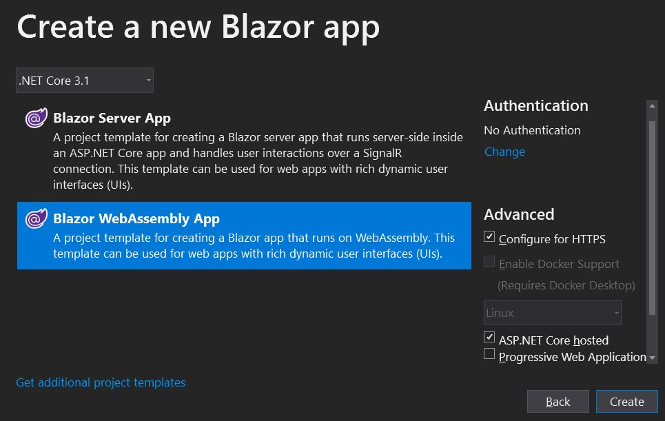
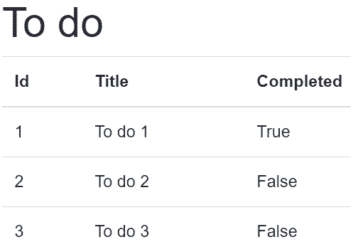

> 原文链接：https://blazor-university.com/dependency-injection/injecting-dependencies-into-blazor-components/

# 将依赖项注入 Blazor 组件
[源代码](https://github.com/mrpmorris/blazor-university/tree/master/src/DependencyInjection/BasicDependencyInjection)

## 定义我们的依赖
在注入依赖之前，我们需要创建一个。我们将使用古老的 ToDo 示例，但请放心，我们不会创建 ToDo 应用程序。

首先创建一个基本的 ToDo 类。

```
public class ToDo
{
  public int Id { get; set; }
  public string Title { get; set; }
  public bool Completed { get; set; }
}
```

接下来，我们将创建 Blazor 页面或组件可能需要的类。在这种情况下，它将是一个从服务中检索 `ToDo` 条目的 API。我们实际上不会调用服务器，我们只会返回一些模拟数据。

```
using System.Collections.Generic;
using System.Threading.Tasks;

namespace BasicDependencyInjection
{
  public interface IToDoApi
  {
    Task<IEnumerable<ToDo>> GetToDosAsync();
  }

  public class ToDoApi : IToDoApi
  {
    private readonly IEnumerable<ToDo> Data;

    public ToDoApi()
    {
      Data = new ToDo[]
      {
        new ToDo { Id = 1, Title = "To do 1", Completed = true},
        new ToDo { Id = 2, Title = "To do 2", Completed = false},
        new ToDo { Id = 3, Title = "To do 3", Completed = false},
      };
    }

    public Task<IEnumerable<ToDo>> GetToDosAsync() => Task.FromResult(Data);
  }
}
```

我们通过实现接口抽象了服务。如果我们希望在对我们的类进行单元测试时通过模拟，这是一个很好的做法。

## 注册可注入依赖项
当 Blazor 应用程序运行其启动代码时，它为我们做的一件事就是配置一个依赖注入容器。依赖注入容器负责构建类的实例（及其依赖项的实例等）。

在这个引导过程中，我们需要注册我们希望将哪些类作为自动注入依赖项可用。我们可以将一个类本身注册为可注入的，如下所示：

```
services.AddSingleton<ToDoApi>();
```

或者我们可以将接口注册为可注入的，只要我们另外指定实现该接口的类即可。

```
service.AddSingeton<IToDoApi, ToDoApi>();
```

**注意：** 同样，为了使单元测试更简单，推荐使用后一种方法。它还允许在配置文件中指定实现类——例如，我们可以根据部署的平台是开发/测试/生产来指定不同的 `IEmailService。`

其他注册依赖的模式是：

```
// Register an existing object instance
services.AddSingleton(existingObject);

// Register an existing object instance, injected via an interface
services.AddSingleton<ISomeInterface>(implementingInstance);

// Lazy created instance, with manual build process and access to the current IServiceProvider
services.AddSingleton<ISomeInterface>(serviceProvider => new ImplementingType(.......));
```

Blazor Server 和 Blazor WASM 应用程序中的引导代码并不相同，因此，尽管服务注册相同，但我们必须去注册可注入依赖项的位置略有不同。

## 在 Blazor Server 应用程序中注册注入
在 Blazor Server 应用中，有一个带有 `ConfigureServices` 方法的 `Startup` 类。这是我们应该执行注册的地方。

```
public void ConfigureServices(IServiceCollection services)
{
  ... default Blazor registrations omitted ...
  // Register our own injectables
  services.AddSingleton<IToDoApi, ToDoApi>();
}
```

当我们在创建应用程序时选中 ASP.NET Core 托管复选框时，WASM 应用程序也是如此。这是因为服务器负责引导整个应用程序。



## 在 Blazor WASM 应用程序中注册注入
当我们的 Blazor 项目是独立的 WASM 应用程序（不是 ASP.NET Core 托管）时，该应用程序必须有自己的引导程序类。在这种类型的应用程序中，类名为 `Program`，引导方法名为 `Main`——就像在控制台应用程序中一样。

```
public static async Task Main(string[] args)
{
  var builder = WebAssemblyHostBuilder.CreateDefault(args);
  builder.RootComponents.Add<App>("app");

  builder.Services.AddTransient(sp => new HttpClient { BaseAddress = new Uri(builder.HostEnvironment.BaseAddress) });

  // Register our own injectables
  builder.Services.AddSingleton<IToDoApi, ToDoApi>();

  await builder.Build().RunAsync();
}
```

## 注入依赖
对于非 Blazor 类，例如其他可注入服务，可以通过类的构造函数注入依赖项。

```
public class NewsletterService : INewsletterService
{
  private readonly IEmailService EmailService;

  public NewsletterService(IEmailService emailService)
  {
    EmailService = emailService;
  }
}
```
但是，Blazor 组件并非如此。目前不支持构造函数注入。有两种方法可以指示我们的组件使用哪些依赖项；一个在 Razor 标记中，一个在 C# 代码中。

```
@inject IToDoApi ToDoApi
@inject ISomeServiceType AnotherService

@code
{
  [Inject]
  private IYetAnotherServiceType PropertyInjectedDependency { get; set; }
}
```
`InjectAttribute` 只能应用于具有属性设置器的属性，属性的封装级别无关紧要。

**注意：** 这两种方法是相同的。事实上，`@inject` 语法只是 `[Inject]` 语法的简写。在构建我们的应用程序时，Blazor 将首先将 Razor 标记转换为 C# 源代码。要查看 `@inject` 语法是如何转换的，请打开文件夹 **\obj\Debug\netcoreapp3.1\Razor ** 并查找与 razor 文件对应的 .cs 文件。

## 使用注入的依赖项
在创建 Blazor 组件实例之后和执行 `OnInitialized` 或 `OnInitializedAsync` 生命周期事件之前注入依赖项。这意味着我们不能覆盖组件的构造函数并从那里使用这些依赖项，但我们可以在 `OnInitialized*` 方法中使用它们。

要使用我们的 `IToDoApi` 服务，我们只需使用 `@inject` 语法将其注入 Index 页面，然后在页面初始化时调用它。

```
@page "/"
@inject IToDoApi ToDoApi

<h1>To do</h1>
@if (Data.Any())
{
  <table class="table">
    <thead>
      <tr>
        <th>Id</th>
        <th>Title</th>
        <th>Completed</th>
      </tr>
    </thead>
    <tbody>
      @foreach (ToDo item in Data)
      {
        <tr>
          <td>@item.Id</td>
          <td>@item.Title</td>
          <td>@item.Completed</td>
        </tr>
      }
    </tbody>
  </table>
}

@code
{
  private IEnumerable<ToDo> Data = Array.Empty<ToDo>();

  protected override async Task OnInitializedAsync()
  {
    await base.OnInitializedAsync();
    Data = await ToDoApi.GetToDosAsync();
  }
}
```

- 第 2 行

  `IToDoApp` 的实例被注入到我们的页面中，我们使用名称 `ToDoApi` 来引用注入的依赖项。

- 第 35 行

  在注入的服务上调用 `GetDoToAsync` 方法。等待该方法并将结果存储在 `Data` 中。

- 第 16-23 行

  `Data` 中的项目使用 `@foreach` 循环进行迭代，并将输出呈现为我们视图的一部分。

  

**[下一篇 - 依赖生命周期和范围](/dependency-injection/dependency-lifetimes-and-scopes/)**