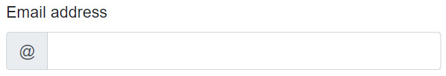
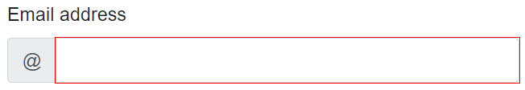
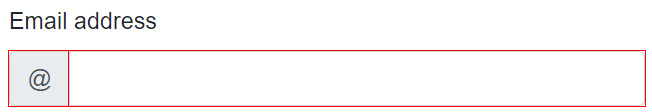
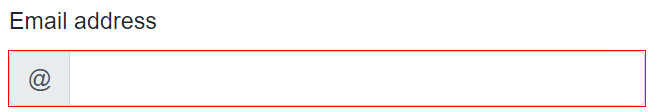

> 原文链接：https://blazor-university.com/forms/accessing-form-state/

# 获得表单状态
[源代码](https://github.com/mrpmorris/blazor-university/tree/master/src/Forms/AccessingFormState)

有时，我们需要获得 `<EditForm>` 子内容中的表单状态。最常见的用途是当我们需要访问输入的 `CSS` 类时，指示输入是否被修改或有效/无效。

例如，如果我们使用 Bootstrap 创建一个带有 `@` 符号的电子邮件输入控件，我们最终可能会得到如下所示的标记。

```
<div class="form-group">
  <label for="EmailAddress">Email address</label>
  <div class="input-group">
    <div class="input-group-prepend">
      <span class="input-group-text">@@</span>
    </div>
    <InputText @bind-Value=MyContact.EmailAddress id="EmailAddress" class="form-control" type="email" />
  </div>
</div>
```



然而，问题在于，当用户输入无效值时，CSS 无效类仅应用于 `<InputText>` 控件。




如果我们想将 CSS 无效类应用到输入组本身，我们可以使用从 `<EditForm>` 组件传递给我们的 `EditContext`。

`<EditForm>` 的 `ChildContent` 参数是 `RenderFragment<EditContext>`，这意味着 `EditContext` 实例通过名为 `context` 的变量（或我们告诉 Blazor 使用的任何别名）传递到其内部内容。有关更多信息，请参阅[使用 RenderFragments 模板化组件](/templating-components-with-renderfragements/)。

```
<EditForm Model=@MyContact Context="CurrentEditContext">
  <DataAnnotationsValidator />

  <div class="form-group">
    <label for="EmailAddress">Email address</label>
    <div class="input-group @CurrentEditContext.FieldCssClass( () => MyContact.EmailAddress)">
      <div class="input-group-prepend">
        <span class="input-group-text">@@</span>
      </div>
      <InputText @bind-Value=MyContact.EmailAddress id="EmailAddress" class="form-control" type="email" />
    </div>
  </div>

</EditForm>
```

- 第 1 行

  使用 `Context=` 语法，我们告诉 Blazor 在传入其 `EditContext` 时使用变量名称 `CurrentEditContext`。


- 第 6 行

  使用 `EditContext.FieldCssClass` 方法根据输入的状态（修改/有效/无效）获取正确的 CSS 类名称。



如果我们愿意，我们可以用一些简单的 CSS 隐藏生成的 `<input>` HTML 元素上的红色轮廓。

```
.input-group > input.invalid
{
  outline: none;
}
```
该 CSS 告诉浏览器，如果应用了无效类的 `<input>` HTML 元素直接由应用了 `input-group` CSS 类的 HTML 元素作为父元素，则该元素不应具有红色轮廓。




**[下一篇 - 编写自定义验证](/forms/writing-custom-validation/)**