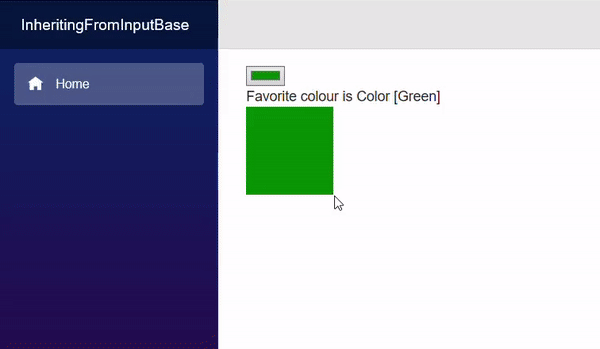

> 原文链接：https://blazor-university.com/forms/descending-from-inputbase/

# 从 InputBase<T> 派生
[源代码](https://github.com/mrpmorris/blazor-university/tree/master/src/Forms/InheritingFromInputBase)

`InputBase<T>` 组件是各种 Blazor 输入控件所继承的抽象类。这个类在标准 HTML `<input>` 元素的基础上增加了额外的功能，比如验证——我们稍后会介绍。因此，如果我们打算将它们用作用户输入，建议我们从这个基类中继承组件。

实现 `InputBase<T>` 仅需要实现一个抽象方法和一个可选的虚拟方法。

`InputBase<T>` 是一个泛型类，它具有名为 `Value` 的 `T` 类型属性。由于 Web 浏览器使用字符串值，因此该组件需要一种将 `T` 类型的值与字符串相互转换的方法。

```
protected abstract bool TryParseValueFromString(string value, out T result, out string validationErrorMessage);
```

`TryParseValueFromString` 是一个抽象方法，为了将字符串值从 HTML `<input>` 元素（或其他使用字符串的源）转换为目标类型 `T`，应重写该方法。如果无法转换，则应设置 `validationErrorMessage` 为合适的消息以指示转换失败。这用于提供验证错误消息以及视觉无效状态，以便用户知道设置值的尝试失败。

```
protected virtual string FormatValueAsString(T value)
```

`FormatValueAsString` 是与 `TryParseValueFromString` 相对的。如果简单的 `Value.ToString()` 不足以将 `T` 的值转换回浏览器 UI 层，则应重写此方法以正确执行任务。

## 创建 InputColor 组件
首先我们需要创建一个 `InputColor.razor` 文件。在该文件中，我们需要将 `InputBase<Color>` 指定为基类，并添加我们希望在 HTML 中呈现的标记。

```
@using System.Drawing
@using System.Text.RegularExpressions
@inherits InputBase<Color>

<input type="color" @attributes=AdditionalAttributes class=@CssClass @bind=CurrentValueAsString/>
```

为 `Color` 类添加了 `System.Drawing`，并添加了 `System.Text.RegularExpressions` 用于将十六进制代码的输入解析为 `Color` 值。

我们要做的第一件事是实现 `FormatValueAsString`。为此，我们只需将 R、G 和 B 值格式化为 2 位十六进制值。

```
protected override string FormatValueAsString(Color value)
  => $"#{value.R:x2}{value.G:x2}{value.B:x2}";
```

要将十六进制字符串转换回颜色，我们首先需要将 2 个字符的十六进制值转换为字节。

```
byte HexStringToByte(string hex)
{
  const string HexChars = "0123456789abcdef";

  hex = hex.ToLowerInvariant();
  int result = (HexChars.IndexOf(hex[0]) * 16) + HexChars.IndexOf(hex[1]);
  return (byte)result;
}
```

接下来我们需要实现 `TryParseValueAsString`。

```
static Regex Regex = new Regex("^#([0-9a-f]{2}){3}$", RegexOptions.Compiled | RegexOptions.IgnoreCase);

protected override bool TryParseValueFromString(string value, out Color result, out string validationErrorMessage)
{
  Match match = Regex.Match(value);
  if (!match.Success)
  {
    validationErrorMessage = "Not a valid color code";
    result = Color.Red;
    return false;
  }

  byte r = HexStringToByte(match.Groups[1].Captures[0].Value);
  byte g = HexStringToByte(match.Groups[1].Captures[1].Value);
  byte b = HexStringToByte(match.Groups[1].Captures[2].Value);

  validationErrorMessage = null;
  result = Color.FromArgb(r, g, b);
  return true;
}
```

该代码使用正则表达式来确保该值是 6 个十六进制字符格式的字符串，前面有一个 `#` 字符。它捕获三组 2 位十六进制字符，并使用我们的 `HexStringToByte` 方法将它们转换为字节。最后，使用这些 RGB 值创建颜色。

我们应该给组件添加一个参数，允许它的使用者指定一个自定义错误消息，以便在传递的值无效时使用。添加 `[Parameter]` 属性。我们可以随意调用它，但 `ParsingErrorMessage` 是 Blazor 中使用的标准名称。

```
[Parameter]
public string ParsingErrorMessage { get; set; }
```

然后更改在 `TryParseValueFromString` 方法中设置 `validationErrorMessage` 的代码，以使用该参数而不是硬编码的错误消息。

```
if (!match.Success)
{
  validationErrorMessage = ParsingErrorMessage;
  result = Color.Red;
  return false;
}
```

为了便于将颜色显示为文本，让我们重构 `FormatValueAsString` 方法以使用静态方法，这样我们就可以独立于 `InputColor` 的任何实例使用该静态方法。

```
public static string ColorToString(Color value)
  => $"#{value.R:x2}{value.G:x2}{value.B:x2}";

protected override string FormatValueAsString(Color value)
  => ColorToString(value);
```

我们的整个组件现在应该如下所示：

```
@using System.Drawing
@using System.Text.RegularExpressions
@inherits InputBase<Color>

<input type="color" @attributes=AdditionalAttributes class=@CssClass @bind=CurrentValueAsString/>

@code {
  [Parameter] public string ParsingErrorMessage { get; set; }

  public static string ColorToString(Color value)
    => $"#{value.R:x2}{value.G:x2}{value.B:x2}";

  protected override string FormatValueAsString(Color value)
    => ColorToString(value);

  static Regex Regex = new Regex("^#([0-9a-f]{2}){3}$", RegexOptions.Compiled | RegexOptions.IgnoreCase);
  protected override bool TryParseValueFromString(string value, out Color result, out string validationErrorMessage)
  {
    Match match = Regex.Match(value);
    if (!match.Success)
    {
      validationErrorMessage = ParsingErrorMessage;
      result = Color.Red;
      return false;
    }

    byte r = HexStringToByte(match.Groups[1].Captures[0].Value);
    byte g = HexStringToByte(match.Groups[1].Captures[1].Value);
    byte b = HexStringToByte(match.Groups[1].Captures[2].Value);

    validationErrorMessage = null;
    result = Color.FromArgb(r, g, b);
    return true;
  }

  byte HexStringToByte(string hex)
  {
    const string HexChars = "0123456789abcdef";

    hex = hex.ToLowerInvariant();
    int result = (HexChars.IndexOf(hex[0]) * 16) + HexChars.IndexOf(hex[1]);
    return (byte)result;
  }
}
```

## InputColor 示例
我们将制作一个简单的页面，让用户选择个人最喜欢的颜色。

```
@page "/"
@using System.Drawing

<EditForm Model=CurrentPerson>
  <InputColor @bind-Value=CurrentPerson.FavoriteColor/>
</EditForm>

Favorite colour is @CurrentPerson.FavoriteColor
<div style="width:100px;height:100px;background-color:@ColorAsHex"/>

@code {
  Person CurrentPerson = new Person
  {
    FavoriteColor = Color.Green
  };

  string ColorAsHex => InputColor.ColorToString(CurrentPerson.FavoriteColor);

  class Person
  {
    public Color FavoriteColor { get; set; }
  }
}
```

- 第 19-22 行

    创建一个我们的 `EditForm` 将绑定到的类。

- 第 12-15 行

    创建此类的一个实例。

- 第 17 行

    使用我们的静态 `InputColor.ColorToString` 将所选颜色转换为 Web 十六进制颜色字符串。

- 第 9 行

    创建具有内联样式的 `<div>` 元素，该元素将所选颜色显示为实心框。
    
- 第 4 行

    创建 `EditForm`，其模型绑定到我们页面的 `Person`。

- 第 5 行

    使用我们的 `InputColor` 组件，该组件将呈现一个带有 `type=color` 的 `HTML <input>` 元素，供用户交互。



**[下一篇 - 验证](https://feiyun0112.github.io/blazor-university.zh-cn/forms/validation/)**