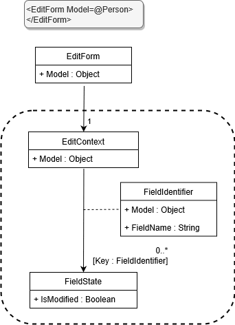
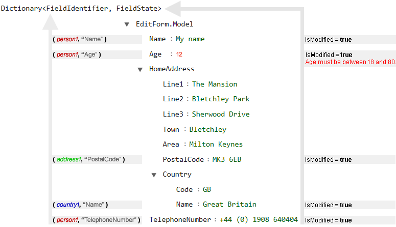

> 原文链接：https://blazor-university.com/forms/editcontext-fieldidentifiers-and-fieldstate/

# EditContext、FieldIdentifiers 和 FieldState
请注意，对于那些希望了解 Blazor 如何“在后台”工作的人来说，这是一个高级主题。无需了解此信息即可正常使用 Blazor - 但我觉得了解内部信息可能是有益的。

让我们从描述 Blazor 如何维护表单数据的元状态的 UML 图开始。



## EditContext
每当 `EditForm.Model` 更改（表单中正在修改的对象）时，都会执行 `EditForm.OnParametersSet` 并创建一个新的 `EditContext` 实例。 `EditForm` 组件将此 `EditContext` 声明为[级联值](/components/cascading-values/cascading-values-by-type/)，以便表单中的任何组件都可以访问它。

`EditContext` 是当前正在编辑的对象的表单元数据持有者。在表单中编辑对象（例如 `Person`）时，Blazor 需要了解有关该对象的其他信息，以便提供更丰富的用户体验。 Blazor 持有的其他信息告诉我们：

- 如果模型的特定属性已被手动更改。
- 哪些模型属性有验证错误，这些错误是什么。

显然，正在编辑的模型类应该只代表我们特定的业务需求，因此让我们的模型类实现这些额外的用户界面状态信息将是一个关注点冲突——因此 Blazor 将这些额外信息本身存储在 `EditContext` 中。这就是 `EditForm` 在其 `Model` 更改时创建一个新的 `EditContext` 的原因，因为如果 `Model` 更改，则 `EditContext` 中保存的信息不再相关。

## FieldIdentifier
`FieldIdentifier` 的目的是为对象的特定属性提供标识。它与 `System.Reflection.PropertyInfo` 不同，因为它标识特定对象实例的属性，而反射标识类的属性。

给定一个具有名为 `PostalCode` 的属性的 `Address` 类，我们可以预期以下相等规则：

值 | 是否相等？
--- | ---
// 反射：不同实例上的相同属性
address1.GetProperty(“邮政编码”); <br> address2.GetProperty(“邮政编码”); | 是
// FieldIdentifier：同一个实例的同一个属性
new FieldIdentifier(address1, “PostalCode”); <br> new FieldIdentifier(address1, “PostalCode”); | 是
// FieldIdentifier：不同实例上的相同属性
new FieldIdentifier(address1, “PostalCode”);<br> 
new FieldIdentifier(address2, “PostalCode”);| 否

当 UI 状态（例如验证错误）需要与输入值相关联时，我们需要某种方式来识别该状态与哪些输入数据相关。在以前的 Web 技术中，通常使用字符串来标识单个输入，以下是一些示例：

- EmailAddress
- HomeAddress.PostalCode
- WorkAddress.PostalCode

一旦用户界面变得复杂，这些路径可能会非常复杂。

- Contacts[0].Name
- Contacts[0].ContactDetails[0].TelephoneNumber
- Contacts[0].ContactDetails[0].EmailAddress
- Contacts[9].ContactDetails[3].TelephoneNumber


Blazor 简化了此过程，因为它的设计方式允许它始终在同一进程中处理对象和属性标识。这使我们能够通过存储两条简单的信息来识别任何对象的任何属性。

1.直接引用对象本身。
2.该对象的属性名称。

标识现在很简单，并且（与字符串路径不同）永远不必更改以考虑数据的更改，例如从数组中删除项目。例如，在字符串路径方法中，如果要删除列表中的第一个联系人，则需要将 `Contacts[9].ContactDetails[3].TelephoneNumber` 更改为 `Contacts[8].ContactDetails[3].TelephoneNumber`。 Blazor 的 `ObjectReference/PropertyName` 方法避免了这种复杂性。

即使我们编写自己的自定义验证器与服务器对话以确定有效性（例如唯一值的可用性，例如 `EmailAddress`），我们的 Blazor 验证器也会获得一个 `FieldIdentifier` 的实例，然后可以关联来自服务器调用的结果直接使用正确对象实例的正确属性。

## FieldState
FieldState 类包含有关任何对象属性的附加信息。 `EditContext` 类具有 `Dictionary<FieldIdentifier, FieldState>` 类型的私有属性 - 这使 Blazor 可以将其附加状态存储在扁平列表中以便快速访问。

给定以下模型

```
protected override OnInitialized()
{
  var country1 = new Country
  {
    Code = "GB",
    Name = "Great Britain"
  };
  
  var address1 = new Address
  {
    Line1 = "The Mansion",
    Line2 = "Bletchley Park",
    Line3 = "Sherwood Drive",
    Town = "Bletchley",
    Area = "Milton Keynes",
    PostalCode = "MK3 6EB",
    Country = country1
  };
  
  var person1 = new Person
  {
    Name = "My name",
    Age = 12,
    HomeAddress = address1,
    TelephoneNumber = "+44 (0) 1908 64004"
  };
}
```

我们希望看到如下的字段标识符：



**注意：** 条目仅在需要时添加到字典中。

**[下一篇 - 获得表单状态](/forms/accessing-form-state/)**