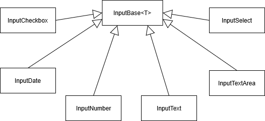

> 原文链接：https://blazor-university.com/forms/editing-form-data/

# 编辑表单数据
[源代码](https://github.com/mrpmorris/blazor-university/tree/master/src/Forms/FormInputs)

因为 `EditForm` 组件呈现标准的 `<form>` HTML 元素，实际上可以在我们的标记中使用标准的 HTML 表单元素，例如 `<input>` 和 `<select>`，但与 `EditForm` 组件一样，我建议使用各种 Blazor 输入控件，因为它们带有附加功能，例如验证。

Blazor 中有一个标准的输入组件集合，所有这些都来自基类 `InputBase<T>`。



以下部分都将使用以下类进行绑定：

```
@code
{
  SomeModel FormData = new SomeModel();

  class SomeModel
  {
    public bool SomeBooleanProperty { get; set; }
    public DateTime? SomeDateTimeProperty { get; set; }
    public int SomeIntegerProperty { get; set; }
    public decimal SomeDecimalProperty { get; set; }
    public string SomeStringProperty { get; set; }
    public string SomeMultiLineStringProperty { get; set; }
    public SomeStateEnum SomeSelectProperty { get; set; } = SomeStateEnum.Active;
  }

  public enum SomeStateEnum
  {
    Pending,
    Active,
    Suspended
  }
}
```
**注意：** 可以为以下任何组件指定附加属性。 Blazor 未明确识别的任何内容都将直接呈现到目标 HTML 元素上。

## InputCheckbox
`InputCheckbox` 组件将布尔属性绑定到 `type="checkbox"` 的 HTML `<input>` 元素。此组件不允许绑定到可为空的属性。

```
<InputCheckbox @bind-Value=FormData.SomeBooleanProperty />
```

## InputDate
`InputDate` 组件将 `DateTime` 属性绑定到 `type="date"` 的 HTML `<input>` 元素。该组件将绑定到一个可为空的属性，但是，并非所有浏览器都提供在这种类型的输入元素上指定空值的能力。

```
<InputDate @bind-Value=FormData.SomeDateTimeProperty ParsingErrorMessage="Must be a date" />
```

## InputNumber
`InputNumber` 组件将任何类型的 C# 数字属性绑定到 `type="number"` 的 HTML `<input>` 元素。

如果输入的值无法解析为目标属性类型，则输入将被视为无效（请参阅表单验证）并且不会使用该值更新模型。

当目标属性可以为空时，无效的输入将被视为空，输入中的文本将被清除。

```
<InputNumber @bind-Value=FormData.SomeIntegerProperty ParsingErrorMessage="Must be an integer value" />

<InputNumber @bind-Value=FormData.SomeDecimalProperty ParsingErrorMessage="Must be a decimal value" />
```

## InputText
`InputText` 组件将一个字符串属性绑定到一个没有指定类型的 HTML `<input>` 元素。这使我们能够指定任何可用的输入类型，例如密码、颜色或 [W3 标准](https://www.w3schools.com/tags/att_input_type.asp)中指定的其他选项之一。

```
<InputText @bind-Value=FormData.SomeStringProperty />
```


## InputTextArea
`InputTextArea` 组件将字符串属性绑定到 HTML `<textarea>` 元素。

```
<InputTextArea @bind-Value=FormData.SomeMultiLineStringProperty />
```


## InputSelect
`InputSelect` 组件将任何类型的属性绑定到 HTML `<select>` 元素。 Blazor 将根据属性的值自动选择正确的 `<option>`。

```
<InputSelect @bind-Value=FormData.SomeSelectProperty>
  <option value="Pending">Pending</option>
  <option value="Active">Active</option>
  <option value="Suspended">Suspended</option>
</InputSelect>
```

由于 razor 视图将 `FormData.SomeSelectProperty` 设置为 `SomeStateEnum.Active`，因此 `<select>` HTML 元素会将其选择默认为该值，即使它不是第一个指定的 `<option>`。

**[下一篇 - 从 InputBase<T> 派生](https://feiyun0112.github.io/blazor-university.zh-cn/forms/descending-from-inputbase/)**