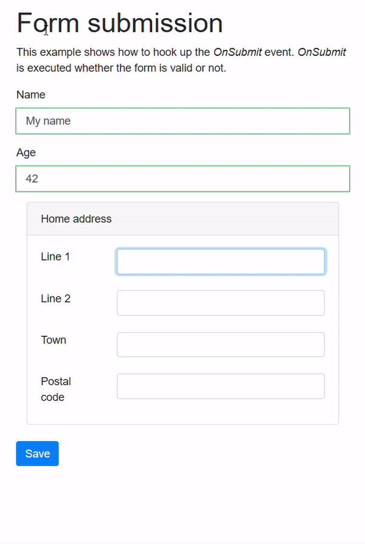
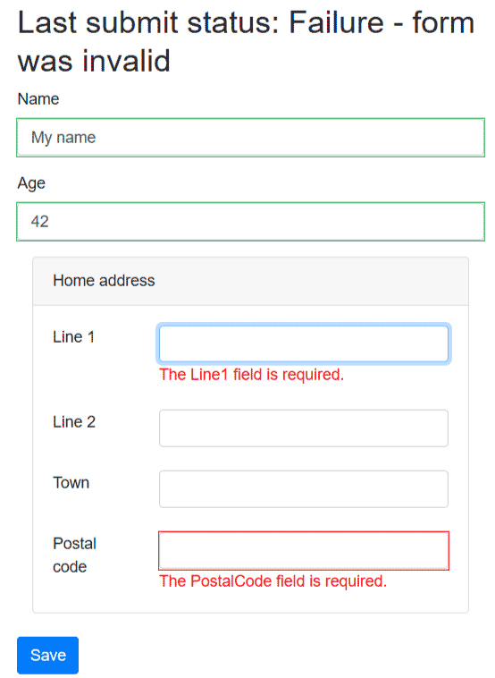

> 原文链接：https://blazor-university.com/forms/handling-form-submission/

# 处理表单提交
[源代码](https://github.com/mrpmorris/blazor-university/tree/master/src/Forms/HandlingFormSubmission)

呈现 `EditForm` 组件时，Blazor 将输出 HTML `<form>` 元素。由于这是一个标准的 Web 控件，我们可以通过添加 `type="submit"` 的 `<input>` 来为用户提供提交表单的能力。

```
<EditForm Model=@Person>
  <div class="form-group">
    <label for="Name">Name</label>
    <InputText @bind-Value=Person.Name class="form-control" id="Name" />
  </div>
  <div class="form-group">
    <label for="Age">Age</label>
    <InputNumber @bind-Value=Person.Age class="form-control" id="Age" />
  </div>
  <input type="submit" class="btn btn-primary" value="Save"/>
</EditForm>

@code {
  Person Person = new Person();
}
```

Blazor 将拦截表单提交事件并将它们路由回我们的 razor 视图。 `EditForm` 上有三个与表单提交相关的事件。

- OnValidSubmit
- OnInvalidSubmit
- OnSubmit

这些事件中的每一个都传递一个 `EditContext` 作为参数，我们可以使用它来确定用户输入的状态。

**注意：** 我们可以不使用这些事件或这些事件之一。我们可以使用两个事件的唯一情况是当我们同时设置 `OnValidSubmit` 和 `OnInvalidSubmit` 时。如果设置了 `OnSubmit`，则不能使用这两个事件。

## OnValidSubmit / OnInvalidSubmit
更改上述源代码，我们可以通过针对 `EditForm` 声明 `OnValidSubmit` 和 `OnInvalidSubmit` 事件来订阅它们。

```
@if (LastSubmitResult != null)
{
  <h2>
    Last submit status: @LastSubmitResult
  </h2>
}

<EditForm Model=@Person OnValidSubmit=@ValidFormSubmitted OnInvalidSubmit=@InvalidFormSubmitted>
  <DataAnnotationsValidator/>
  … other html mark-up here …
  <input type="submit" class="btn btn-primary" value="Save" />
</EditForm>

@code {
  Person Person = new Person();
  string LastSubmitResult;

  void ValidFormSubmitted(EditContext editContext)
  {
    LastSubmitResult = "OnValidSubmit was executed";
  }

  void InvalidFormSubmitted(EditContext editContext)
  {
    LastSubmitResult = "OnInvalidSubmit was executed";
  }
}
```

## OnSubmit
`OnSubmit` 事件在表单提交时执行，无论表单是否通过验证。可以通过执行 `editContext.Validate()` 来检查表单的有效性状态，如果表单有效则返回 `true`，如果无效（有验证错误）则返回 `false`。

```
@if (LastSubmitResult != null)
{
  <h2>
    Last submit status: @LastSubmitResult
  </h2>
}

<EditForm Model=@Person OnSubmit=@FormSubmitted>
  <DataAnnotationsValidator/>
  … other html mark-up here …
  <input type="submit" class="btn btn-primary" value="Save" />
</EditForm>

@code {
  Person Person = new Person();

  string LastSubmitResult;

  void FormSubmitted(EditContext editContext)
  {
    bool formIsValid = editContext.Validate();
    LastSubmitResult =
      formIsValid
      ? "Success - form was valid"
      : "Failure - form was invalid";
  }
}
```

## Blazor 验证限制
对于所有属性都是简单类型的简单表单，验证工作正常。但是当我们的 `EditForm.Model` 具有复杂类型的属性时，例如我们示例中的 `Person` 类具有属于 `Address` 类型的 `HomeAddress` 属性，除非用户编辑它们，否则不会验证子属性。

以下屏幕截图显示了上一个示例中的 `editContext.Validate()` 如何返回 `true` 以指示表单有效，即使 `Address.Line` 和 `Address.PostalCode` 都使用 `[Required]` DataAnnotation 属性进行了修饰。




我们真正想要的行为将导致类似于以下屏幕截图的用户体验。



**[下一篇 - EditContext、FieldIdentifiers 和 FieldState](/forms/editcontext-fieldidentifiers-and-fieldstate/)**