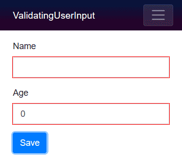
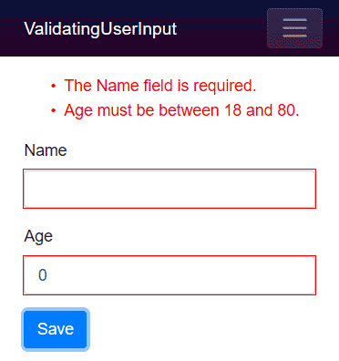
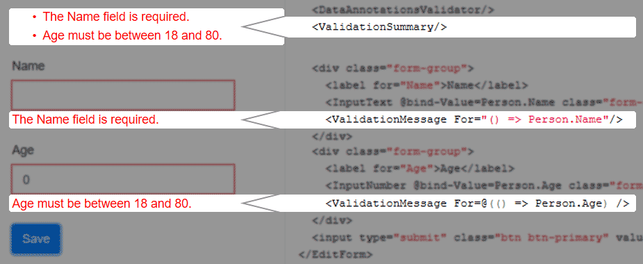

> 原文链接：https://blazor-university.com/forms/validation/

# 验证
[源代码](https://github.com/mrpmorris/blazor-university/tree/master/src/Forms/ValidatingUserInput)

`DataAnnotationsValidator` 是 Blazor 中的标准验证器类型。在 `EditForm` 组件中添加此组件将启用基于 `System.ComponentModel.DataAnnotations.ValidationAttribute` 的 .NET 属性的表单验证。

首先，我们将创建一个简短的示例，然后我们将了解幕后发生的事情。首先，创建一个我们可以编辑的模型，并用一些数据注释装饰它的属性以进行验证。

```
public class Person
{
  [Required]
  public string Name { get; set; }
  [Range(18, 80, ErrorMessage = "Age must be between 18 and 80.")]
  public int Age { get; set; }
}
```

- 第 3 行指定 `Name` 属性不能为 null 或为空。

- 第 5 行为 `Age` 属性指定了一个有效的值范围（从 18 到 80），并且还提供了一个合适的错误消息来显示给用户。

## 添加验证
在默认 Blazor 应用中编辑 **Index.razor** 页面，并提供一些标记来编辑 `Person` 的实例。

```
<EditForm Model=@Person>
  <div class="form-group">
    <label for="Name">Name</label>
    <InputText @bind-Value=Person.Name class="form-control" id="Name" />
  </div>
  <div class="form-group">
    <label for="Age">Age</label>
    <InputNumber @bind-Value=Person.Age class="form-control" id="Age" />
  </div>
  <input type="submit" class="btn btn-primary" value="Save"/>
</EditForm>

@code {
  Person Person = new Person();
}
```

现在运行应用程序将导致向用户显示一个不验证其输入的表单。为了确保表单得到验证，我们必须指定一个验证机制。在 `EditForm` 组件内添加一个 `DataAnnotationsValidator` 组件。

```
<EditForm Model=@Person>
  <DataAnnotationsValidator/>
  <div class="form-group">
    <label for="Name">Name</label>
    <InputText @bind-Value=Person.Name class="form-control" id="Name" />
  </div>
  <div class="form-group">
    <label for="Age">Age</label>
    <InputNumber @bind-Value=Person.Age class="form-control" id="Age" />
  </div>
  <input type="submit" class="btn btn-primary" value="Save"/>
</EditForm>
```

运行应用程序并单击“保存”按钮将更新用户界面，以提供用户输入中存在错误的视觉指示。



## 显示验证错误消息
可以通过两种方式向用户显示验证错误消息。我们可以添加一个 `ValidationSummary` 来显示表单中所有错误的完整列表。我们还可以使用 `ValidationMessage` 组件来显示表单上特定输入的错误消息。这些组件不是相互排斥的，因此可以同时使用它们。

`ValidationSummary` 组件可以简单地放入我们标记中的 `EditForm` 中；根本不需要额外的参数。



由于 `ValidationMessage` 组件显示单个字段的错误消息，它要求我们指定字段的标识。为了确保我们的参数值在重构后保持正确（例如，当我们重构 `Person` 类的属性名称时）Blazor 要求我们在识别字段时指定一个表达式。名为 `For` 的参数在 `ValidationMessage` 上定义如下：

```
[Parameter]
public Expression<Func<T>> For { get; set; }
```

这意味着我们应该使用 lambda 表达式来指定字段的标识，该表达式可以“双引号”或包裹在 `@(...)`

- 双引号

  ```
  <ValidationMessage For="() => Person.Name"/>
  ```

- Razor 表达式

  ```
  <ValidationMessage For=@( () => Person.Name )/>
  ```

两种形式是等价的。带引号的形式更容易阅读，而 razor 表达式使其他开发人员更清楚我们定义的是表达式而不是字符串。

```
@page "/"
@using Models

<EditForm Model=@Person>
  <DataAnnotationsValidator/>
  <ValidationSummary/>
  <div class="form-group">
    <label for="Name">Name</label>
    <InputText @bind-Value=Person.Name class="form-control" id="Name" />
    <ValidationMessage For="() => Person.Name"/>
  </div>
  <div class="form-group">
    <label for="Age">Age</label>
    <InputNumber @bind-Value=Person.Age class="form-control" id="Age" />
    <ValidationMessage For=@(() => Person.Age) />
  </div>
  <input type="submit" class="btn btn-primary" value="Save"/>
</EditForm>

@code {
  Person Person = new Person();
}
```



**[下一篇 - 处理表单提交](https://feiyun0112.github.io/blazor-university.zh-cn/forms/handling-form-submission/)**