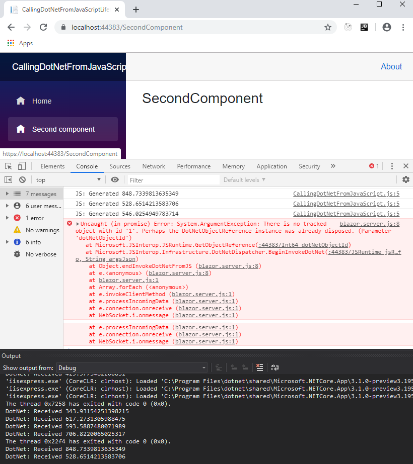

> 原文链接：https://blazor-university.com/javascript-interop/calling-dotnet-from-javascript/lifetimes-and-memory-leaks/

# 生命周期和内存泄漏
[源代码](https://github.com/mrpmorris/blazor-university/tree/master/src/JavaScriptInterop/CallingDotNetFromJavaScriptLifetimes)

如果我们运行我们在从 Javascript 调用 .NET 中创建的应用程序并检查浏览器控制台窗口，我们会看到当我们导航到另一个页面时，JavaScript 仍在回调我们的组件。更糟糕的是，如果我们查看 Visual Studio 输出窗口，我们会看到我们的组件仍在被调用并输出从 JavaScript 传递的值，这意味着我们的组件还没有被垃圾回收！

当我们创建一个 `DotNetObjectReference` 时，Blazor 将生成一个唯一 ID（WASM 为整数，服务器端为 GUID）并在当前 `JSRuntime` 中存储对我们对象的查找。这意味着除非我们正确处理我们的引用，否则我们的应用程序将会泄漏内存。

`DotNetObjectReference` 类实现了 `IDisposable`。要解决我们的内存泄漏问题，我们需要执行以下操作：

- 我们的组件应该保留对我们创建的 `DotNetObjectReference` 的引用。
- 我们的组件应该实现 `IDisposable` 并释放我们的 `DotNetObjectReference`。

```
@page "/"
@inject IJSRuntime JSRuntime
@implements IDisposable

<h1>Text received</h1>
<ul>
  @foreach (string text in TextHistory)
  {
    <li>@text</li>
  }
</ul>

@code
{
  List<string> TextHistory = new List<string>();
  DotNetObjectReference<Index> ObjectReference;

  protected override async Task OnAfterRenderAsync(bool firstRender)
  {
    await base.OnAfterRenderAsync(firstRender);
    if (firstRender)
    {
      ObjectReference = DotNetObjectReference.Create(this);
      await JSRuntime.InvokeVoidAsync("BlazorUniversity.startRandomGenerator", ObjectReference);
    }
  }

  [JSInvokable("AddText")]
  public void AddTextToTextHistory(string text)
  {
    TextHistory.Add(text.ToString());
    while (TextHistory.Count > 10)
      TextHistory.RemoveAt(0);
    StateHasChanged();
    System.Diagnostics.Debug.WriteLine("DotNet: Received " + text);
  }

  public void Dispose()
  {
    GC.SuppressFinalize(this);

    if (ObjectReference != null)
    {
      //Now dispose our object reference so our component can be garbage collected
      ObjectReference.Dispose();
    }
  }
}
```

- 第 3 行

  告诉编译器我们希望我们的组件实现 `IDisposable`。

- 第 16 行

  我们现在保留对 `DotNetObjectReference` 的引用。

- 第 21 行

  如果这是我们的第一次渲染，我们创建一个 `DotNetObjectReference` 并将其传递给我们的 JavaScript 方法，以便它可以在生成新的随机数时回调我们。

- 第 45 行

  当我们的组件被释放时，我们在 `DotNetObjectReference` 上调用 `Dispose()`。
  
如果你还记得我们的 JavaScript 警告，我们不能过早调用 JavaScript，所以我们只在 `OnAfterRender*` 事件中使用 `JSRuntime`，并且只有在 `firstRender` 为 `true` 时才使用。如果组件永远不会被渲染（例如，如果在服务器端 Blazor 应用程序中预渲染），那么我们的 `DotNetObjectReference` 将永远不会被创建，所以我们应该只在它不为 null 的情况下处理它。

**警告：避免在已处理的 .NET 引用上调用方法**

如果我们现在运行我们的应用程序，我们将看到我们的组件不再从 JavaScript 接收随机数。但是，如果我们查看浏览器的控制台窗口，我们会看到每秒都会出现一个错误。



一旦我们的 `DotNetObjectReference` 被释放，它就会从 `JSRuntime` 中移除，从而允许我们的组件被垃圾回收——因此引用不再有效并且不应该被 JavaScript 使用。接下来，我们将调整我们的组件，使其取消 JavaScript `setInterval`，以便在我们的组件被销毁后不再执行它。

首先，我们需要更新我们的 JavaScript 以便它返回在我们执行 `setInterval` 时创建的句柄。然后我们需要添加一个附加函数，该函数将接受该句柄作为参数并取消间隔。

```
var BlazorUniversity = BlazorUniversity || {};
BlazorUniversity.startRandomGenerator = function (dotNetObject) {
  return setInterval(function () {
    let text = Math.random() * 1000;
    console.log("JS: Generated " + text);
    dotNetObject.invokeMethodAsync('AddText', text.toString());
  }, 1000);
};
BlazorUniversity.stopRandomGenerator = function (handle) {
  clearInterval(handle);
};
```

- 第 3 行

  `setInteval` 创建的句柄从启动随机数生成器的函数返回。

- 第 9 行

  一个函数，它将接受我们创建的间隔句柄并将其传递给 JavaScript `clearInterval` 函数。

最后，我们需要我们的组件跟踪我们创建的 JavaScript 区间的句柄，并在我们的组件被释放时调用新的 `stopRandomGenerator` 函数。

```
@page "/"
@inject IJSRuntime JSRuntime
@implements IDisposable

<h1>Text received</h1>
<ul>
  @foreach (string text in TextHistory)
  {
    <li>@text</li>
  }
</ul>

@code
{
  List<string> TextHistory = new List<string>();
  int GeneratorHandle = -1;
  DotNetObjectReference<Index> ObjectReference;

  protected override async Task OnAfterRenderAsync(bool firstRender)
  {
    await base.OnAfterRenderAsync(firstRender);
    if (firstRender)
    {
      ObjectReference = DotNetObjectReference.Create(this);
      GeneratorHandle = await JSRuntime.InvokeAsync<int>("BlazorUniversity.startRandomGenerator", ObjectReference);
    }
  }

  [JSInvokable("AddText")]
  public void AddTextToTextHistory(string text)
  {
    TextHistory.Add(text.ToString());
    while (TextHistory.Count > 10)
      TextHistory.RemoveAt(0);
    StateHasChanged();
    System.Diagnostics.Debug.WriteLine("DotNet: Received " + text);
  }

  public async void Dispose()
  {
    GC.SuppressFinalize(this);

    if (GeneratorHandle != -1)
    {
      //Cancel our callback before disposing our object reference
      await JSRuntime.InvokeVoidAsync("BlazorUniversity.stopRandomGenerator", GeneratorHandle);
    }
    if (ObjectReference != null)
    {
      //Now dispose our object reference so our component can be garbage collected
      ObjectReference.Dispose();
    }
  }
}
```

- 第 16 行

  我们创建一个成员来保存对从 JavaScript `BlazorUniversity.startRandomGenerator` 函数返回的区间的引用。

- 第 25 行

  我们将返回的句柄存储在我们的新成员中。

- 第 46 行

  如果已设置句柄，我们将调用新的 JavaScript `BlazoUniversity.stopRandomGenerator` 函数，传递我们的区间句柄，以便将其传递给 `clearInterval`。

`Interval` 在我们的 `DotNetObjectReference` 被释放之前被取消，因此我们的 JavaScript 不会尝试使用无效的对象引用调用 .NET 对象上的方法。 根据良好的做法，我们在尝试清除之前检查 `GeneratorHandle` 成员是否已设置，以防在执行 `OnAfterRender*` 方法之前处理组件。

**[下一篇 - 类型安全](https://feiyun0112.github.io/blazor-university.zh-cn/javascript-interop/calling-dotnet-from-javascript/type-safety/)**