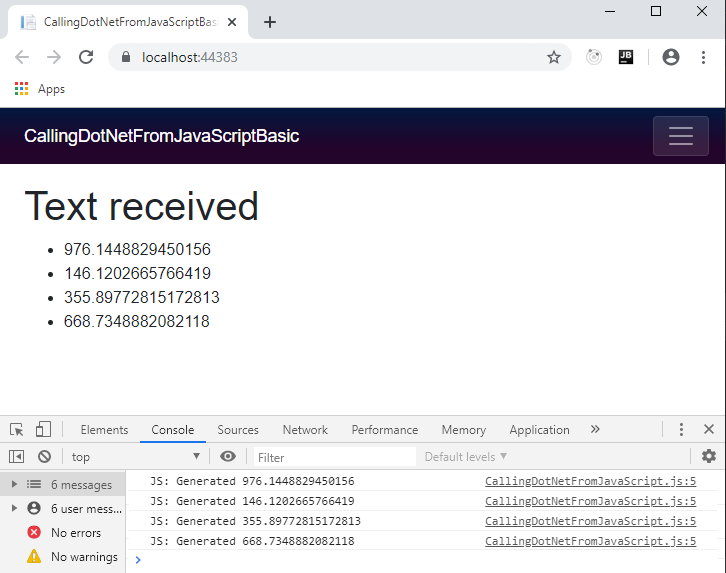
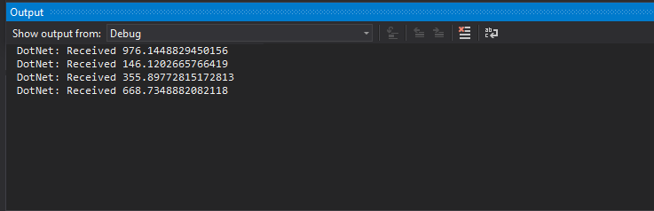

> 原文链接：https://blazor-university.com/javascript-interop/calling-dotnet-from-javascript/

# 从 JavaScript 调用 .NET
有时我们的 .NET 应用程序代码需要从 JavaScript 执行。 Blazor 使我们能够异步调用对象实例上的方法或类上的静态方法。

## 识别可调用的 .NET 代码
Blazor 不允许 JavaScript 随意调用 .NET 代码中的任何静态或实例方法。有以下条件

- 该方法必须使用 `JsInvokableAttribute` 进行修饰。
- 该方法必须是公开的。
- 方法的参数必须是 Json 可序列化的。
- 方法的返回类型必须是 Json 可序列化、`void`、`Task` 或 `Task<T>`，其中 `T` 是 Json 可序列化的。

如果在 `JsInvokable` 上指定标识符参数，则每个类层次结构的值必须是唯一的（如果是实例方法）或每个程序集是唯一的（如果是静态方法）。

## 使 .NET 代码可调用
[源代码](https://github.com/mrpmorris/blazor-university/tree/master/src/JavaScriptInterop/CallingDotNetFromJavaScriptBasic)

要在 .NET 对象实例上调用方法，我们首先需要将对该对象的引用传递给 JavaScript。我们不能直接传递我们的对象，因为我们想给 JavaScript 一个对我们对象的引用，而不是它的状态的 Json 序列化表示。我们通过创建 `DotNetObjectReference` 类的实例来做到这一点。为了演示这一点，我们将创建一个简单的 Blazor 应用程序，它每秒从 JavaScript 接收随机文本。

首先，创建一个新的 Blazor 应用程序并将 Index.razor 更改为以下标记。

**警告：以下代码存在内存泄漏，不应在生产中使用。这将在[生命周期和内存泄漏](/javascript-interop/calling-dotnet-from-javascript/lifetimes-and-memory-leaks/)中重点讲解和更正。**

```
@page "/"
@inject IJSRuntime JSRuntime

<h1>Text received</h1>
<ul>
  @foreach (string text in TextHistory)
  {
    <li>@text</li>
  }
</ul>

@code
{
  List<string> TextHistory = new List<string>();

  protected override void OnAfterRender(bool firstRender)
  {
    base.OnAfterRender(firstRender);
    if (firstRender)
    {
      // See warning about memory above in the article
      var dotNetReference = DotNetObjectReference.Create(this);
      JSRuntime.InvokeVoidAsync("BlazorUniversity.startRandomGenerator", dotNetReference);
    }
  }

  [JSInvokable("AddText")]
  public void AddTextToTextHistory(string text)
  {
    TextHistory.Add(text.ToString());
    while (TextHistory.Count > 10)
      TextHistory.RemoveAt(0);
    StateHasChanged();
    System.Diagnostics.Debug.WriteLine("DotNet: Received " + text);
  }
}
```

- 第 2 行

  注入 `IJSRuntime` 服务。我们使用它来初始化我们的 JavaScript，传递对将接收通知的组件的引用。

- 第 6 行

  遍历 `List<string>` 并将它们呈现为 HTML `<li> `元素。

- 第 22 行

  首次渲染组件时，我们调用名为 `BlazorUniversity.startRandomGenerator` 的 JavaScript 函数，通过调用 `DotNetObjectReference.Create(this)` 传递对当前组件的引用。

- 第 26 行

  我们用 `JSInvokable` 装饰我们的回调方法。给出了一个特定的标识符；这是推荐的做法，否则 Blazor 将根据方法的名称推断名称，因此将方法重构为新名称可能会破坏执行它的任何 JavaScript。

- 第 27 行

  我们的方法符合 Blazor 回调要求。它是公共的，具有 `void` 返回类型，并且它的唯一参数是可从 Json 序列化的。

- 第 29-32 行

  将接收到的文本添加到我们的 `List<string>`，确保不超过 10 个项目，然后调用 `StateHasChanged`，以便 Blazor 知道它需要重新创建其[渲染树](/components/render-trees/)。

- 第 33 行

  将 .NET 接收到的文本输出到 Visual Studio 输出窗口。

## 从 JavaScript 调用 .NET 代码
首先，我们需要编辑 **/Pages/_Host.cshtml**（服务器端）或 **/wwwroot/index.html**（WASM）并添加对我们将要创建的脚本的引用。

```
<script src="/scripts/CallingDotNetFromJavaScript.js"></script>
```

接下来，我们将创建函数 `BlazorUniversity.startRandomGenerator` 并让它每秒用一个随机数回调我们的 .NET 对象。

```
var BlazorUniversity = BlazorUniversity || {};
BlazorUniversity.startRandomGenerator = function(dotNetObject) {
  setInterval(function () {
    let text = Math.random() * 1000;
    console.log("JS: Generated " + text);
    dotNetObject.invokeMethodAsync('AddText', text.toString());
  }, 1000);
};
```

现在运行应用程序并按 F12 查看浏览器工具窗口。查看控制台，我们应该会看到如下内容：







**[下一篇 - 生命周期和内存泄漏](/javascript-interop/calling-dotnet-from-javascript/lifetimes-and-memory-leaks/)**