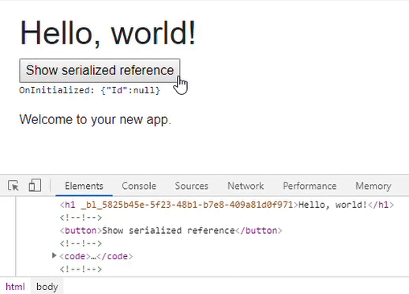

> 原文链接：https://blazor-university.com/javascript-interop/calling-javascript-from-dotnet/passing-html-element-references/

# 传递 HTML 元素引用
[源代码](https://github.com/mrpmorris/blazor-university/tree/master/src/JavaScriptInterop/HtmlElementReferences)

在编写 Blazor 应用程序时，不鼓励对文档对象模型 (DOM) 进行操作，因为它可能会干扰其[增量渲染树](https://feiyun0112.github.io/blazor-university.zh-cn/components/render-trees/incremental-rendertree-proof/)，对 HTML 的任何更改都应在我们组件内的 .NET 代码中进行管理。

有时我们可能希望继续让 JavaScript 与我们生成的 HTML 交互。实现这一点的标准 JavaScript 方法是给我们的 HTML 元素一个 id，并让 JavaScript 使用 `document.getElementById('someId')` 来定位它。在静态生成的 HTML 页面中，这非常简单，但是当通过组合许多组件的输出来动态创建页面时，很难确保 ID 在所有组件中都是唯一的。 Blazor 使用 `@ref` 元素标记和 `ElementReference` 结构解决了这个问题。

## @ref 和元素引用
当我们需要对 HTML 元素的引用时，我们应该使用 `@ref` 装饰该元素（或 Blazor 组件）。我们通过创建一个类型为 `ElementReference` 的成员并使用 `@ref` 属性在元素上识别它来识别我们组件中的哪个成员将持有对 HTML 元素的引用。

```
@page "/"

<h1 @ref=MyElementReference>Hello, world!</h1>
Welcome to your new app.

@code {
  ElementReference MyElementReference;
}
```

- 第 3 行

  定义一个 HTML 元素并使用 `@ref` 指定在引用该元素时我们将使用组件中的哪个成员 (`MyElementReference`)。

- 第 7 行

  引用用 `@ref` 装饰的元素时将使用的成员。

如果我们更改新 Blazor 应用程序的 **Index.razor** 文件以添加对 `h1` 元素的元素引用并运行应用程序，我们将看到类似于以下生成的 HTML 的内容。

```
<h1 _bl_bc0f34fa-16bd-4687-a8eb-9e3838b5170d="">Hello, world!</h1>
```

添加此特殊格式的属性是 Blazor 如何唯一标识元素而无需劫持元素的 `id` 参数。我们现在将使用 `@ref``、ElementReference` 和 JavaScript 互操作来解决一个常见问题。

## 案例：元素自动聚焦
HTML 规范有一个 `autofocus` 属性，可以应用于任何可聚焦的元素；当一个页面被加载时，浏览器会找到第一个用 `autofocus` 装饰的元素并给它焦点。由于 Blazor 应用程序不会真正导航（HTML 被简单地重写并且浏览器 URL 更改），当我们导航到新 URL 并向用户呈现新内容时，浏览器不会扫描 `autofocus` 属性。这意味着将 `autofocus` 属性放在输入上不起作用。这是我们将使用 JavaScript Interop、`@ref` 和 `ElementReference` 解决的问题。

## 观察自动聚焦问题
- 首先创建一个新的 Blazor 应用程序。
- 在每个页面中，用每个 `@page` 指令下方的相同标记替换内容。
```
Enter your name: <input autofocus />
```

运行应用程序并观察 `<input>` 元素如何不会自动获得焦点，甚至在第一页加载时也不会。

## 解决自动聚焦问题
- 在 `wwwroot` 文件夹中创建一个脚本文件夹。
- 在该文件夹中创建一个名为 `AutoFocus.js` 的新文件并输入以下脚本。
```
var BlazorUniversity = BlazorUniversity || {};
BlazorUniversity.setFocus = function (element) {
  element.focus();
};
```

确保在 **/Pages/_Host.cshtml**（服务器端 Blazor 应用程序）或 **/wwwroot/index.html**（WebAssembly Blazor 应用程序）中添加对此脚本的引用。

在 **Index.razor** 页面中更改标记如下：

```
@page "/"
@inject IJSRuntime JSRuntime
Enter your name
<input @ref=ReferenceToInputControl />

@code
{
  ElementReference ReferenceToInputControl;
  protected override async Task OnAfterRenderAsync(bool firstRender)
  {
    if (firstRender)
      await JSRuntime.InvokeVoidAsync("BlazorUniversity.setFocus", ReferenceToInputControl);
  }
}
```

- 第 4 行

  使用 `@ref` 装饰器为输入提供一个在组件内唯一的标识。

- 第 8 行

  这是将持有元素标识的成员，该成员必须是 `ElementReference` 类型。

- 第 12 行

  如果这是该组件第一次渲染，则元素引用将传递给我们的 JavaScript，它为元素提供焦点。

现在，在页面之间切换应该会导致第一页上的输入在呈现特定页面时获得焦点。

## 组件化我们的自动聚焦解决方案
添加 JavaScript 以在每个页面上设置焦点并不需要太多工作，但它是重复的。此外，根据显示的选项卡将自动对焦设置为选项卡控件中的第一个控件将需要更多工作。这是我们应该以可重用的形式编写的那种东西。

首先，更改我们其中一个页面的标记，使其使用新的 `AutoFocus` 控件。

```
@page "/"
Enter your name
<input @ref=ReferenceToInputControl />
<AutoFocus Control=ReferenceToInputControl/>

@code {
  ElementReference ReferenceToInputControl;
}
```
在 **/Shared** 文件夹中创建一个名为 **Autofocus.razor** 的新组件并输入以下标记。

```
@inject IJSRuntime JSRuntime
@code {
  [Parameter]
  public ElementReference Control { get; set; }

  protected override async Task OnAfterRenderAsync(bool firstRender)
  {
    if (firstRender)
      await JSRuntime.InvokeVoidAsync("BlazorUniversity.setFocus", Control);
  }
}
```

- 第 4 行

  为组件定义一个参数 `Control`，该参数接受一个 `ElementReference` 来标识哪个控件应该获得焦点。

- 第 9 行
  
  执行我们的 JavaScript 以将焦点设置到指定的控件。

这个解决方案的问题在于，组件参数的值是在渲染树构建过程中传递的，而元素引用在构建渲染树并且结果已经在浏览器中渲染为 HTML 之后才有效。此解决方案导致错误 `element.focus is not a function`，因为 `ElementReference` 在其值被传递给我们的 `AutoFocus` 组件时无效。

**注意：不要过早使用元素引用！**

正如我们在[渲染树](https://feiyun0112.github.io/blazor-university.zh-cn/render-trees/)部分中看到的，在其渲染阶段，Blazor 根本不会更新浏览器 DOM。只有在所有组件的渲染完成后，Blazor 才会比较新的和以前的渲染树，然后用尽可能少的更改更新 DOM。

这意味着在构建渲染树时，使用 `@ref `引用的元素可能还不存在于浏览器 DOM 中——因此任何通过 JavaScript 与它们交互的尝试都将失败。因此，我们不应该尝试在除 `OnAfterRender` 或 `OnAfterRenderAsync` 之外的任何组件生命周期方法中使用 `ElementReference` 的实例，并且由于组件的参数是在构建渲染树期间设置的，我们不能将 `ElementReference` 作为参数传递，因为它是在组件的生命周期中为时过早。当然，从用户事件（例如按钮单击）访问引用是可以接受的，因为该页面已经生成为 HTML。

事实上，直到调用 `OnAfterRender*` 方法之前，甚至不会设置 `ElementReference` 的实例。 Blazor 流程如下：

- 为页面生成虚拟渲染树。
- 将更改应用到浏览器的 HTML DOM。
- 对于每个 `@ref` 修饰元素，更新 Blazor 组件中的 `ElementReference` 成员。
- 执行 `OnAfterRender*` 生命周期方法。

我们可以通过更改标准 Blazor 应用程序的 Index.razor 组件来证明这个过程，在组件生命周期的各个点将 `ElementReference` 序列化为字符串，并将序列化的文本呈现到屏幕上。将新项目中的 Index.razor 更改为以下标记并运行应用程序。

```
@page "/"

<h1 @ref=MyElementReference>Hello, world!</h1>
<button @onclick=ButtonClicked>Show serialized reference</button>

<code><pre>@Log</pre></code>

Welcome to your new app.

@code {
  string Log;

  ElementReference MyElementReference;

  protected override void OnInitialized()
  {
    Log += "OnInitialized: ";
    ShowSerializedReference();
  }

  protected override void OnAfterRender(bool firstRender)
  {
    Log += "OnAfterRender: ";
    ShowSerializedReference();
  }

  private void ButtonClicked()
  {
    Log += "Button clicked: ";
    ShowSerializedReference();
  }

  private void ShowSerializedReference()
  {
    Log += System.Text.Json.JsonSerializer.Serialize(MyElementReference) + "\r\n";
  }
}
```

1. 我们的组件实例已创建。执行 `OnInitialized`（第 15 行）。
2. `MyElementReference` 的值被序列化为我们的 `Log` 字符串（第 33 行）。
3. 生成渲染树。
4. 浏览器的 DOM 已更新
5. Blazor 检查使用 `@ref` 修饰的元素并更新它们标识的 `ElementReference`。
6. `OnAfterRender` 在我们的组件上执行（第 21 行）。
7. `MyElementReference` 的值被序列化为我们的 `Log` 字符串，但不显示 - 我们必须调用 `StateHasChanged` 才能看到它，但 `Log` 的值已经更新。
8. 用户单击按钮。
9. `MyElementReference` 的值被序列化为我们的 `Log` 字符串。
10. Blazor 执行 `StateHasChanged` 以响应按钮单击。
11. 我们在屏幕上看到更新的 `Log` 以显示从第 7 步和第 9 步添加的值——这两个都显示了一个非空标识符。



## 完成 AutoFocus  组件
我们可以传入一个 `Func<ElementReference>`，而不是传入 `ElementReference` 本身，我们的 `AutoFocus` 组件然后可以在其 `OnAfterRender*` 生命周期方法中执行此 `Func`——此时返回的值将是有效的。

将 `AutoFocus` 控件更改为接受 `Func`，并确保设置的值不为空。

```
@inject IJSRuntime JSRuntime
@code {
  [Parameter]
  public Func<ElementReference> GetControl { get; set; }

  protected override async Task OnAfterRenderAsync(bool firstRender)
  {
    if (GetControl is null)
      throw new ArgumentNullException(nameof(GetControl));

    if (firstRender)
      await JSRuntime.InvokeVoidAsync("BlazorUniversity.setFocus", GetControl());
  }
}
```

该组件现在可以按如下方式使用：

```
@page "/"
Enter your name
<input @ref=ReferenceToInputControl />
<AutoFocus GetControl=@( () => ReferenceToInputControl)/>

@code {
  ElementReference ReferenceToInputControl;
}  
```

**注意：**未来的 Blazor 计划自动创建 `ElementReference` 成员。

**[下一篇 - 从 JavaScript 调用 .NET](https://feiyun0112.github.io/blazor-university.zh-cn/javascript-interop/calling-dotnet-from-javascript/)**