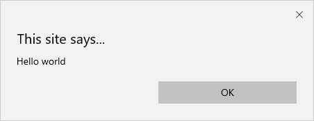
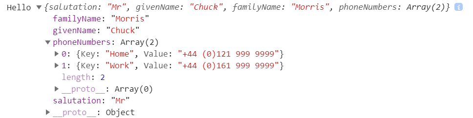

> 原文链接：https://blazor-university.com/javascript-interop/calling-javascript-from-dotnet/

# 从 .NET 调用 JavaScript
JavaScript 应添加到服务器端 Blazor 应用程序的 **/Pages/_Host.cshtml** 或 Web Assembly Blazor 应用程序的 **wwwroot/index.html** 中。

然后可以通过将 `IJSRuntime` 服务注入我们的组件来从 Blazor 调用我们的 JavaScript。

[源代码](https://github.com/mrpmorris/blazor-university/tree/master/src/JavaScriptInterop/CallingJavaScriptFromDotNet)


```
public interface IJSRuntime
{
  ValueTask<TValue> InvokeAsync<TValue>(string identifier, object[] args);
  ValueTask<TValue> InvokeAsync<TValue>(string identifier, CancellationToken cancellationToken, object[] args);
  // Via an extension class
  void InvokeVoid(string identifier, params object[] args);
}
```

`identifier` 必须是作用域为全局 `window` 变量的 JavaScript 函数，但不必在标识符中包含 `window`。因此，要调用 `window.alert`，我们只需要指定 `alert` 作为标识符。

```
@page "/"
@inject IJSRuntime JSRuntime

<button @onclick=ButtonClicked>Perform interop</button>

@code
{
   private async Task ButtonClicked()
   {
     await JSRuntime.InvokeVoidAsync("alert", "Hello world");
   }
}
```


## 传递参数
[源代码](https://github.com/mrpmorris/blazor-university/tree/master/src/JavaScriptInterop/PassingComplexObjectsToJavaScript)

前面的示例将字符串“Hello world”作为参数传递给 JavaScript 警报函数。也可以将复杂对象传递给 JavaScript。参数被序列化为 JSON，然后在 JavaScript 中反序列化，然后作为匿名对象类型按值传递给被调用的函数。

传递给 JavaScript 的所有参数类型必须是基本类型（string / int / 等）或者是 JSON 可序列化的。

创建一个新的 Blazor 应用程序，并添加以下 Person 类。

```
using System.Collections.Generic;

namespace PassingComplexObjectsToJavaScript.Models
{
  public class Person
  {
    public string Salutation { get; set; }
    public string GivenName { get; set; }
    public string FamilyName { get; set; }
    public List<KeyValuePair<string, string>> PhoneNumbers { get; set; }

    public Person()
    {
      PhoneNumbers = new List<KeyValuePair<string, string>>();
    }
  }
}
```

现在在我们的 **Index.razor** 页面中创建一个 `Person` 实例并将其传递给 `console.log`。

```
@page "/"
@inject IJSRuntime JSRuntime

<button @onclick=ButtonClicked>Perform interop</button>

@code
{
  private async Task ButtonClicked()
  {
    var person = new Models.Person
    {
      Salutation = "Mr",
      GivenName = "Chuck",
      FamilyName = "Morris"
    };
    person.PhoneNumbers.Add(new KeyValuePair<string, string>("Home", "+44 (0)121 999 9999"));
    person.PhoneNumbers.Add(new KeyValuePair<string, string>("Work", "+44 (0)161 999 9999"));

    await JSRuntime.InvokeVoidAsync("console.log", "Hello", person);
  }
}
```

如果我们查看浏览器的控制台输出，我们应该在单击按钮时看到以下内容。



## 访问 JavaScript 返回值
[源代码](https://github.com/mrpmorris/blazor-university/tree/master/src/JavaScriptInterop/AccessingJavaScriptReturnValues)

到目前为止，我们只使用了 `IJSRuntime` 扩展方法 `InvokeVoidAsync`。如果我们想从 JavaScript 函数接收返回值，我们需要使用 `InvokeAsync<TValue>` 方法。在以下示例中，我们将调用标准 JavaScript 确认函数（返回布尔值）和提示函数（返回字符串）。

```
@page "/"
@inject IJSRuntime JSRuntime

<p>
  Status: @Result
</p>
<p>
  <button @onclick=ShowConfirm>Confirm popup</button>
</p>
<p>
  <button @onclick=ShowPrompt>Prompt popup</button>
</p>

@code
{
  private string Result;

  private async Task ShowConfirm()
  {
    bool confirmed = await JSRuntime.InvokeAsync<bool>("confirm", "Are you sure?");
    Result = confirmed ? "You clicked OK" : "You clicked Cancel";
  }

  private async Task ShowPrompt()
  {
    string name = await JSRuntime.InvokeAsync<string>("prompt", "What is your name?");
    Result = "Your name is: " + name;
  }
}
```

**[下一篇 - 更新 document title](https://feiyun0112.github.io/blazor-university.zh-cn/javascript-interop/calling-javascript-from-dotnet/updating-the-document-title/)**