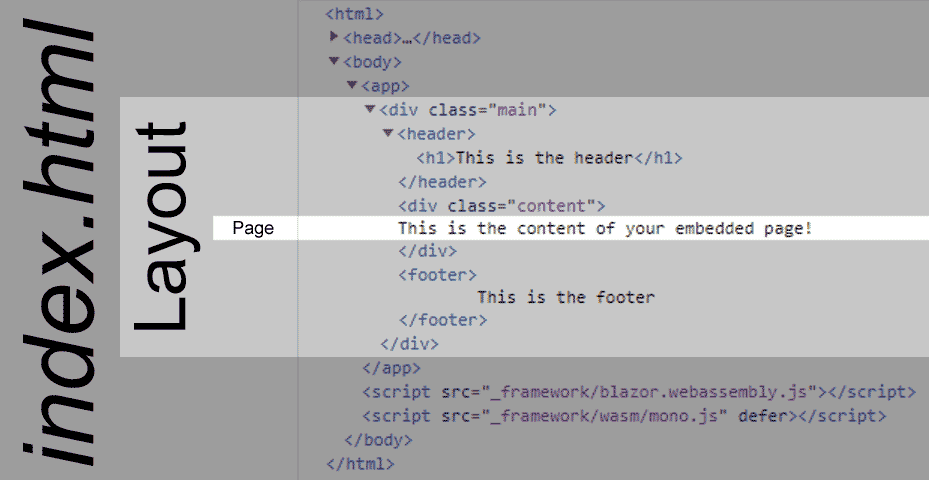

> 原文链接：https://blazor-university.com/javascript-interop/calling-javascript-from-dotnet/updating-the-document-title/

# 更新 document title
[源代码](https://github.com/mrpmorris/blazor-university/tree/master/src/JavaScriptInterop/UpdatingDocumentTitle)

在[创建 Blazor 布局](https://feiyun0112.github.io/blazor-university.zh-cn/layouts/creating-a-blazor-layout/)部分中，我们看到了 Blazor 应用程序如何存在于 HTML（或 cshtml）文档中，并且只能控制主应用程序元素中的内容。




不是单页应用程序的网站可以通过在 `<head>` 部分中添加 `<title>` 元素来指定要在浏览器选项卡中显示的文本，但我们的 Blazor 应用程序实际上并不导航到不同的服务器页面，因此它们都有与我们的应用程序启动时加载的文档标题相同。

我们现在将使用一个新的 `<Document>` 组件来解决这个问题，该组件将使用 JavaScript 互操作来设置 `document.title`，这将反映在浏览器的选项卡中。我们将其创建为 Blazor 服务器应用程序；它可以很容易地在可重用的组件库中创建，但我将把它作为练习留给你。

创建一个新的 Blazor 服务器应用程序，然后在 `wwwroot` 文件夹中创建一个 `scripts` 文件夹，并在其中使用以下脚本创建一个名为 `DocumentInterop.js` 的脚本。

```
var BlazorUniversity = BlazorUniversity || {};
BlazorUniversity.setDocumentTitle = function (title) {
  document.title = title;
};
```

这将创建一个名为 `BlazorUniversity` 的对象，该对象具有一个名为 `setDocumentTitle` 的函数，该函数接受一个新标题并将其分配给 `document.title`。

接下来，编辑 **/Pages/_Host.cshtml** 文件并添加对我们新脚本的引用。

```
<script src="_framework/blazor.server.js"></script>
<script src="~/scripts/DocumentInterop.js"></script>
```

最后，我们需要 `Document` 组件本身。在 **/Shared** 文件夹中创建一个名为 **Document.razor** 的新组件并输入以下标记。

```
@inject IJSRuntime JSRuntime
@code {
  [Parameter]
  public string Title { get; set; }

  protected override async Task OnParametersSetAsync()
  {
    await JSRuntime.InvokeVoidAsync("BlazorUniversity.setDocumentTitle", Title);
  }
}
```

这段代码有一个故意的错误。运行应用程序，您将在调用 `JSRuntime.InvokeVoidAsync` 的行上看到 `NullReferenceException`。

原因是 Blazor 在将控制权交给客户端之前在服务器上运行预渲染阶段。此预渲染的目的是从服务器返回有效的渲染 HTML，以便

- 网络爬虫，例如谷歌，可以索引我们的网站。
- 用户立即看到结果。

这里的问题是，当预渲染阶段运行时，没有浏览器可供 `JSRuntime` 进行互操作。可能的解决方案是

1. 编辑 **/Pages/_Host.cshtml** 并将 `<component type="typeof(App)" render-mode="ServerPrerendered" />` 更改为 `<component type="typeof(App)" render-mode="Server"/>`

  **优点：** 一个简单的修复。

  **缺点：** 谷歌等在访问我们网站的页面时不会看到任何内容。

2. 重写 `OnAfterRenderAsync` 而不是 `OnParametersSetAsync`。

＃2是解决问题的正确方法。

```
@inject IJSRuntime JSRuntime
@code {
  [Parameter]
  public string Title { get; set; }

  protected override async Task OnAfterRenderAsync(bool firstRender)
  {
    if (firstRender)
      await JSRuntime.InvokeVoidAsync("BlazorUniversity.setDocumentTitle", Title);
  }
}
```

正如在 JavaScript 启动过程一节中所解释的，当服务器在发送网站之前预渲染网站时，客户端浏览器将在没有任何 JavaScript 的情况下渲染 App 组件。只有在浏览器中呈现 HTML 后，才会调用 `OnAfterRender*` 方法并将 `firstRender` 设置为 `true`。

## 使用新的 Document 组件
编辑 **/Pages** 文件夹中的每个页面，并添加我们的新元素 `<Document Title="Index"/>` - 但显然您希望在浏览器的选项卡中显示正确的文本。

**[下一篇 - 传递 HTML 元素引用](https://feiyun0112.github.io/blazor-university.zh-cn/javascript-interop/calling-javascript-from-dotnet/passing-html-element-references/)**