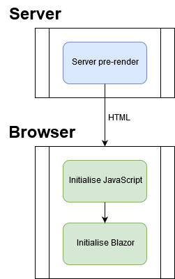

> 原文链接：https://blazor-university.com/javascript-interop/javascript-boot-process/

# JavaScript 启动过程
在 Blazor 启动过程中，浏览器将在 Blazor 初始化之前创建 HTML 文档，这意味着从引导 HTML 引用的任何 JavaScript 都将立即加载，并且在这些 JavaScript 文件中自动执行的任何代码都将在 Blazor 有机会在初始化之前执行。

[源代码](https://github.com/mrpmorris/blazor-university/tree/master/src/JavaScriptInterop/JavaScriptBootProcess)

要观察这一点，请创建一个新的 Blazor 服务器端应用程序：

- 编辑 /App.razor
- 添加以下 `OnInitialized` 方法。

```
@code {
  protected override void OnInitialized()
  {
    System.Diagnostics.Debug.WriteLine("Blazor initialised: " + DateTime.Now.ToString("mm:ss.fff"));
    base.OnInitialized();
  }
}
```

- 在 **/wwwroot** 文件夹下创建一个名为 **scripts** 的文件夹
- 在该文件夹中创建一个名为 **JavaScriptBootProcess.js** 的文件
-添加以下脚本
```
const now = new Date();
console.log('JavaScript initialised: ' + now.getMinutes() + ":" + now.getSeconds() + "." + now.getMilliseconds());
```
- 编辑 /Pages/_Host.cshtml
- 找到文本“ServerPrerendered”并将其更改为“Server”
- 在页面底部附近现有的 `<script>` 标记下方，添加以下标记
```
<script src="~/scripts/JavaScriptBootProcess.js"></script>
```

运行应用程序并查看浏览器的控制台输出和 Visual Studio 的输出窗口。比较输出，我们将看到如下内容：

```
JavaScript initialised: 15:20.317
Blazor initialised: 15:20.466
```

由于这种行为，JavaScript 不可能立即调用 .NET 方法。使用 JavaScript 互操作时，我建议尽可能从 Blazor 端启动通信。

## ServerPrerendering
如果我们现在编辑同一个项目并将渲染模式更改回 `ServerPrerendered`，我们将看到如下内容：

```
Blazor initialised: 42:22.559
JavaScript initialised: 42:22.631
Blazor initialised: 42:22.690
```

当用户第一次访问我们应用的 URL 时，Blazor 将在浏览器之外呈现 **App.razor** 组件并将生成的 HTML 发送到浏览器。之后，初始化 JavaScript，最后初始化 Blazor 以供客户端交互。



**[下一篇 - 从 .NET 调用 JavaScript](https://feiyun0112.github.io/blazor-university.zh-cn/javascript-interop/calling-javascript-from-dotnet/)**