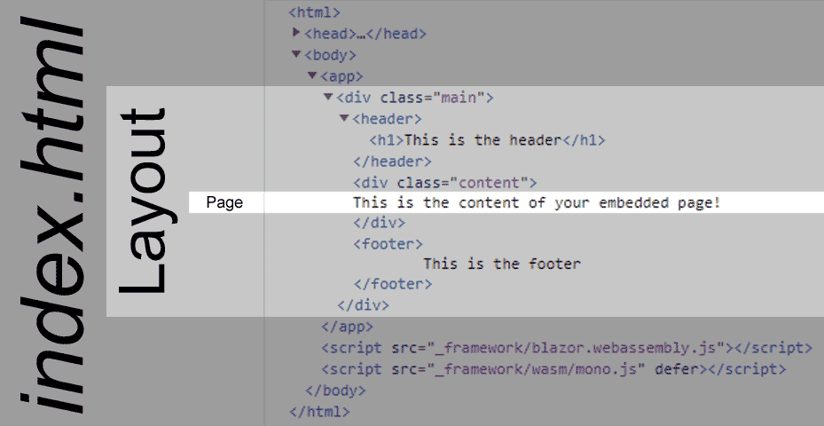

> 原文链接：https://blazor-university.com/layouts/creating-a-blazor-layout/

# 创建 Blazor 布局

[源代码](https://github.com/mrpmorris/blazor-university/tree/master/src/Layouts/CreatingALayout)

您打算用作页面布局模板的任何内容都必须来自 `LayoutComponentBase` 类。 要指示您希望页面内容出现在哪里，您只需输出 `Body` 属性的内容。

```
@inherits LayoutComponentBase
<div class="main">
  <header>
    <h1>This is the header</h1>
  </header>
  <div class="content">
    @Body
  </div>
  <footer>
    This is the footer
  </footer>
</div>
```

请注意，这不是整个 HTML 页面。 Blazor 布局仅适用于 Blazor 在 `wwwroot\index.html` 页面中定义的 HTML 部分，在默认的 Blazor 应用程序中，这是 `<app>` 元素中的所有内容。 目前无法在此范围之外更改 HTML 元素的属性，除非使用 [JavaScript 互操作](/javascript-interop/)。



**[下一篇 - 使用布局](/layouts/using-layouts)**
 