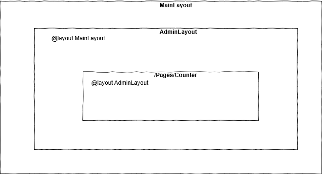

> 原文链接：https://blazor-university.com/layouts/nested-layouts/

# 嵌套布局
[源代码](https://github.com/mrpmorris/blazor-university/tree/master/src/Layouts/NestedLayouts)

指定 `@layout`（显式或通过 **_Imports.razor** 文件）时，Blazor 将使用 `LayoutAttribute` 装饰生成的目标类。

```
[Microsoft.AspNetCore.Components.LayoutAttribute(typeof(MainLayout))]
public class AdminUsers : Microsoft.AspNetCore.Components.ComponentBase
{
}
```

**注意：** 生成的 `.cs` 文件可以在项目的 obj\Debug\netstandard2.0\Razor\ 文件夹中找到。

Blazor 将为任何 `ComponentBase` 的子类使用 `LayoutAttribute`。不仅页面来自这个类，而且 `LayoutComponentBase` 也是如此！这意味着自定义布局也可以有自己的父布局。

接下来，我们将创建一个自定义布局

1. 编辑 **/Shared/AdminLayout.razor** 文件。
2. 通过添加 `@layout MainLayout` 明确声明它使用 **MainLayout** 作为其父级。
```
@inherits LayoutComponentBase
@layout MainLayout
<h1>Admin</h1>
@Body
```

首先，我们从 `LayoutComponentBase` 继承视图，然后告诉 Blazor 我们希望此布局包含在 **MainLayout** Razor 视图中，最后我们通过输出 Body 属性的内容来呈现使用者视图声明的任何内容。

为了确保 **AdminUsers** 页面使用 **AdminLayout**，请确保 **AdminUsers.razor** 文件顶部没有显式的 `layout`。这将告诉 Blazor 使用 **Pages/Admin/_Imports.razor** 中指定的布局。

```
@page "/admin/users"

<h2>Users</h2>
```



**[下一篇 - 组件](/components)**