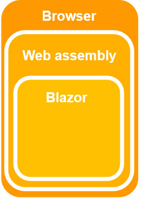
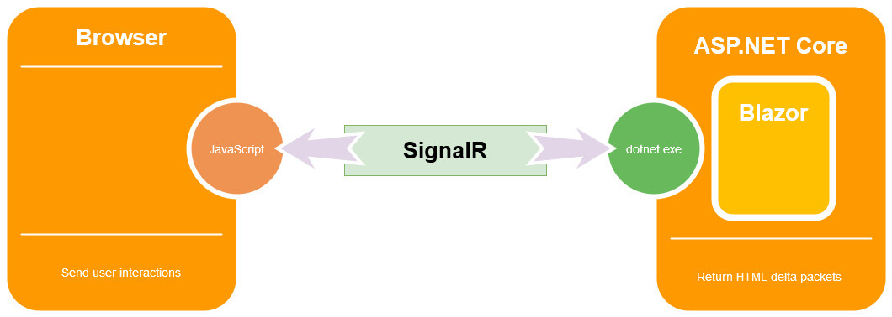
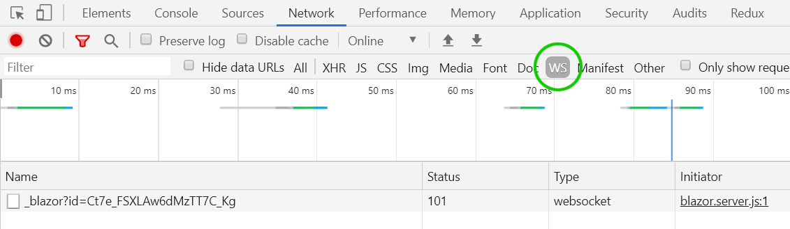
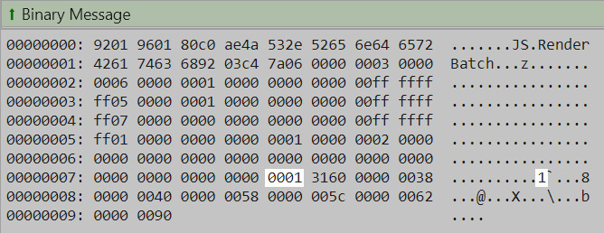

> 原文链接：https://blazor-university.com/overview/blazor-hosting-models/

# Blazor 托管模型
Blazor 目前有两种托管模型，  Blazor Server和 Blazor WebAssembly。服务端托管于 2019 年 9 月发布，WebAssembly 于 2020 年 5 月正式发布。

## Blazor WebAssembly




### 优点
WebAssembly 在客户端的浏览器内部运行，因此可以部署为静态文件。尽管如此，由于浏览器安全限制，Blazor Wasm 应用程序不会直接从本地文件系统运行。


Blazor Wasm 可以离线工作。当与服务器的网络连接丢失时，客户端应用程序可以继续运行（显然它将无法与服务器通信以检索新数据）。


它还可以很容易地作为[渐进式 Web 应用程序](https://web.dev/progressive-web-apps/)运行，这意味着客户可以选择将我们的应用程序安装到他们的设备上，并在需要时运行它，而无需任何网络访问。


在客户端机器上运行代码，这意味着服务器负载显著降低。

### 缺点
`blazor.webassembly.js`文件用于引导客户端应用程序。它会下载所有必需的 .NET DLL 程序集，这使得应用程序的启动时间在您的应用程序第一次运行时比服务器端慢（DLL 然后会由浏览器缓存，从而使后续启动更快）。

Mono 框架用于解释 .NET 中间语言，因此比运行  Blazor Server慢。计划在未来的版本中进行提前 (Ahead-of-time AOT) 编译。

Blazor Wasm 尚不支持多个线程，因此所有处理都发生在 UI 线程上——尽管对服务器/JavaScript 等的调用是异步发生的，所以不要阻止 UI 的响应。

此外，Blazor Wasm 仅适用于较新的浏览器，对搜索引擎不友好（除非我们启用服务器端预渲染）。

##  Blazor Server


### 优点
  Blazor Server 在将 HTML 内容发送到客户端浏览器之前对其进行预渲染。这使它对搜索引擎友好，并且没有可察觉的启动时间。

  Blazor Server 应用程序可以在较旧的浏览器（例如 Internet Explorer 11）上运行，因为不需要 WebAssembly，只需要 HTML 和 JavaScript。当代码在服务器上执行时，还可以在 Visual Studio 中调试我们的 .NET 代码。

### 缺点
  Blazor Server为当前客户端设置内存中会话，并使用 SignalR 在服务器上运行的 .NET 和客户端浏览器之间进行通信。对于所有用户，所有内存和 CPU 的使用都会以服务器为代价。这也意味着客户端与首先为其提供服务的服务器绑定，因此无法使用负载均衡。


初始页面被渲染并发送到浏览器后，`blazor.server.js` 文件将 hook 浏览器中的任何相关用户交互事件，以便它可以在用户和服务器之间进行通信。例如，如果呈现的元素注册了 `@onclick` 事件，则 `blazor.server.js` 将 hook 到其 JavaScript `onclick` 事件，然后使用其 SignalR 连接将该事件发送到服务器并执行相关的 .NET 代码。
 
 ```
 <p>
  Current count = @CurrentCount
</p>
<button @onclick=IncrementCount>Click me</button>
@code
{
  private int CurrentCount;
  public void Increment()
  {
    CurrentCount++;
  }
}
```

.NET 代码执行完成后，Blazor 将重新渲染页面上的组件，然后将 HTML 的增量包发送回客户端的浏览器，以便它可以更新其显示，而无需重新加载整个页面。

**注意：** 稍后将深入介绍[渲染树](/components/render-trees/)。

如果我们运行一个标准的 Blazor 应用程序，单击菜单中的 **Counter** 链接，然后单击 **Click me** 按钮，我们可以观察到与服务器之间的 SignalR 数据通信。

1. 在 Chrome 浏览器中运行应用程序。
2. 单击应用程序菜单中的 **Counter** 链接。
3. 按 F12 打开浏览器的开发者工具。
4. 在开发人员工具窗口中，单击网络选项卡。
5. 重新加载页面。
6. 接下来，单击 WS 选项卡（WebSocket 的缩写）。

7. 单击 _blazor 项以显示套接字数据。
8. 单击 **Click me** 按钮将显示类似于以下内容的网络流量（为便于阅读而进行了删减和格式化）。

```
DispatchBrowserEvent
  {
    "browserRendererId": 0,
    "eventHandlerId": 3,
    "eventArgsType": "mouse",
    "eventFieldInfo": null
  }
  {
    "type": "click",
    "detail": 1,
    "screenX": 338,
    "screenY": 211,
    "clientX": 338,
    "clientY": 109,
    "button": 0,
    "buttons": 0,
    "ctrlKey": false,
    "shiftKey": false,
    "altKey": false,
    "metaKey": false
  }
```

相应的来自服务器的响应如下所示：


**注意：** 突出显示的 `1` 表示增量 HTML，并且是计数器的新值。

如果客户端的浏览器和服务器没有关闭或者它们之间的网络连接很慢，特别是当触发状态更改的事件频繁时，这种往返会提供缓慢的体验。例如，诸如 `onmousemove` 之类的事件会经常触发。

此外，需要大量 HTML 增量更新的更改也可能很慢。例如，如果我们的页面中有一个 HTML `<textarea>` 组件，它更新了显示区域以在用户键入时预览用户的输入，那么来自服务器的 delta HTML 将随着添加到 `<textarea>` 中的每个字符而增加。当输入内容变大时，会导致每次按键都进行较大的网络传输。

与 Blazor Wasm 不同，一旦从浏览器到服务器的连接丢失，应用程序就会无响应。 Blazor 将尝试重新建立与服务器的连接，但在成功之前，应用程序会显示消息“正在尝试重新连接到服务器……”并阻止所有鼠标与用户界面的交互。

## Blazor Mobile Bindings
2020 年 1 月，Microsoft 宣布了 Blazor Mobile Bindings，这是一个实验性项目，允许开发人员结合使用 Blazor 和 Xamarin.Forms (XAML) 的 Razor 变体来构建本机移动应用程序。

你可以在[这里](https://devblogs.microsoft.com/aspnet/mobile-blazor-bindings-experiment/)找到官方公告。

**[下一篇 - 安装 Blazor](/overview/installing-blazor)**