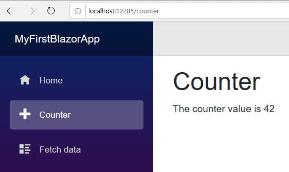
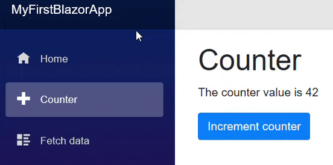

> 原文链接：https://blazor-university.com/overview/creating-a-page/

# 创建页面
在 Blazor 中，页面是可以通过 URL 访问的顶级视图。在本练习中，我们将从头开始重新创建 `Counter.razor` 页面。

- 在解决方案资源管理器窗口中，展开 `MyFirstBlazorApp.Client` 项目。
- 展开 `Pages` 文件夹。
- 右键单击 ·Counter.razor· 并将其删除。
- 右键单击`Pages` 文件夹。
- 选择 **添加->Razor 页面** 并创建一个名为 `Counter.razor` 的新页面。如果您收到“脚手架”错误，您可以选择另一种文件格式并为其指定 `.razor` 文件扩展名。

Razor 页面是一个独立的视图。我们可以包含 HTML 和 Razor 视图标记，以及事件等所需的任何 C# 方法。使用以下内容启动新的 Razor 页面。

```
@page "/counter"
<h1>Counter</h1>
<p>The counter value is @currentCount</p>
@code {
     private int currentCount= 42;
}
```

第一行标识呈现此页面内容所需的 URL。[路由](https://feiyun0112.github.io/blazor-university.zh-cn/routing/)部分将介绍更高级的路由技术。

接下来是一些标准的 HTML，一个带有页面标题的 H1 和一个带有一些内容的段落。就像使用标准 ASP.NET Razor 页面一样，可以通过使用 `@` 符号对其进行转义来插入可编程内容。在本示例中，我们将显示 `currentCount` 私有成员的值。

最后，声明页面的 `@code` 节。这是我们编写属性/方法、事件处理程序或其他任何我们需要的代码的地方。这里我们声明了 `currentCount` 私有成员和设置它的初始值。运行应用程序，单击页面左侧的 **Counter** 链接，您应该会看到如下内容：


## 与页面交互
到目前为止，我们已经绑定了页面的私有成员，以便在呈现 Razor 视图时将其值作为 HTML 输出。接下来，我们将更新该值作为对用户操作的响应。

更改 razor 视图以包含以下按钮标记。

```
<button class="btn btn-primary" @onclick=IncrementCount>Increment counter</button>
```

这将添加一个 HTML 按钮并使用一些 Bootstrap 样式使其看起来更漂亮。它还将其 `onclick` 事件设置为执行名为 `IncrementCounter` 的方法。方法实现非常简单，放在 `@code` 节。

```
@page "/counter"
<h1>Counter</h1>
<p>The counter value is @currentCount</p>
<button class="btn btn-primary" @onclick=IncrementCounter>Increment counter</button>
@code {
  private int currentCount = 42;
  private void IncrementCounter()
  {
    currentCount++;
  }
}
```

现在再次运行应用程序，导航到 **Counter** 页面，然后单击按钮查看页面更新的值。



**[下一篇 - 布局](https://feiyun0112.github.io/blazor-university.zh-cn/layouts)**