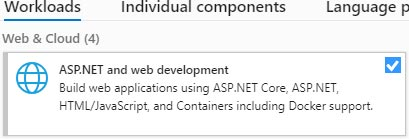

> 原文链接：https://blazor-university.com/overview/installing-blazor/

# 安装 Blazor
 Blazor Server 和 Blazor WebAssembly 现在都作为 .NET Core 3.1.0 的一部分发布。 安装 Blazor 现在就像安装 Visual Studio 16.6 或更高版本一样简单！ 您可以通过[此链接](https://visualstudio.microsoft.com/vs/)下载最新版本的 Visual Studio。

安装时，请确保在 **Workloads** 选项卡下选择选项 **ASP.NET 和 Web 开发**。

**[下一篇 - 创建项目](/overview/creating-a-new-project)**
 