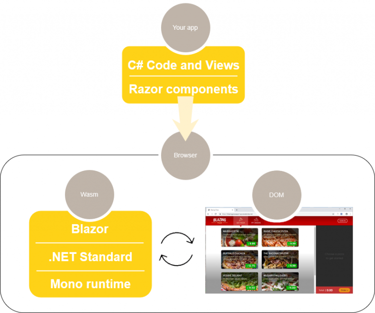
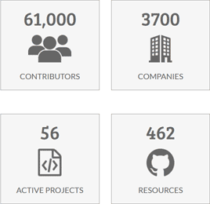

> 原文链接：https://blazor-university.com/overview/what-is-blazor/

# 什么是 Blazor？
Blazor 是一个单页应用程序开发框架。Blazor 这个名称是单词 Browser 和 Razor（.NET HTML 视图生成引擎）的组合/变异。这意味着 Blazor 不必在服务器上执行 Razor 视图以便将 HTML 呈现给浏览器，而是能够在客户端上执行这些视图。

Blazor 还支持[在服务器上执行 SPA](https://feiyun0112.github.io/blazor-university.zh-cn/overview/blazor-hosting-models/)。

## Blazor 不是什么
Blazor 不像 Silverlight，微软之前在浏览器内托管应用程序的尝试。Silverlight 需要一个浏览器插件才能在客户端上运行，这阻止了它在 iOS 设备上运行。

Blazor 不需要在客户端上安装任何类型的插件即可在浏览器中执行。Blazor 要么运行在服务器端，在这种情况下，它在服务器上执行，浏览器仅作为一个终端，要么通过使用 [WebAssembly](https://feiyun0112.github.io/blazor-university.zh-cn/overview/what-is-webassembly/) 在浏览器本身中运行。

因为 WebAssembly 是一种 Web 标准，它在所有主要浏览器上都受支持，这意味着 Blazor 客户端应用程序可以在 Windows/Linux/Mac/Android 和 iOS 上的浏览器中运行。

## Blazor 是开源的
Blazor 源代码可在[此处](https://github.com/dotnet/aspnetcore/tree/master/src/Components)获得。源代码归 [.NET 基金会](https://dotnetfoundation.org/)所有，该基金会是一个非营利组织，旨在支持基于 .NET 框架的开源项目。

据 .NET 基金会称，在撰写本文时，它得到了 3,700 家公司的支持，并有 61,000 名贡献者。

**[下一篇 - 什么是 WebAssembly？](https://feiyun0112.github.io/blazor-university.zh-cn/overview/what-is-webassembly)**