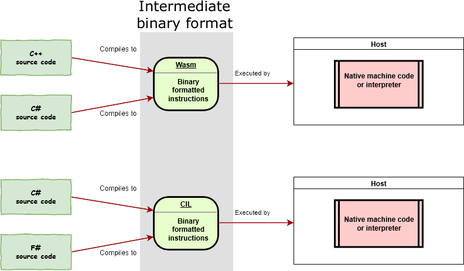

> 原文链接：https://blazor-university.com/overview/what-is-webassembly/

# 什么是 WebAssembly？

WebAssembly（简称为“Wasm”）是一个指令集，旨在运行在任何能够解释这些指令或将它们编译为本机机器代码并执行它们的主机上。

Wasm 是一种以特定二进制格式格式化的指令集。因此，任何遵守本规范的主机（硬件或软件）都能够读取二进制文件并执行它们——无论是解释的，还是直接编译成特定于设备的机器语言。

Wasm 类似于 .NET 源代码编译成的通用指令集（通用中间语言）。就像 .NET 一样，Wasm 可以从 C# 等高级语言生成。

Blazor 不需要在客户端上安装 .NET 即可通过 WebAssembly 运行。

## 支持的浏览器
浏览器 |	最低版本
--- | ---
Android browser	 |	67
Chrome	 |	57
Chrome for Android	 |	74
Edge	 |	16
Firefox	 |	52
Firefox for Android	 |	66
iOS Safari	 |	11
Opera	 |	44
Opera mobile	 |	46
Safari	 |	11
Samsung Internet	 |	7.2

数据来自 [CanIUse.com](https://caniuse.com/#search=wasm)

**[下一篇 - Blazor 托管模型](https://feiyun0112.github.io/blazor-university.zh-cn/overview/blazor-hosting-models)**