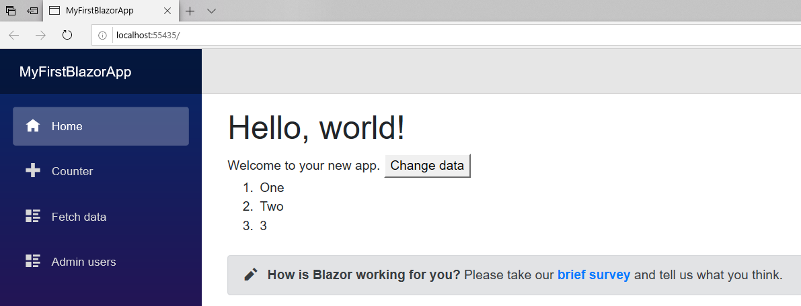
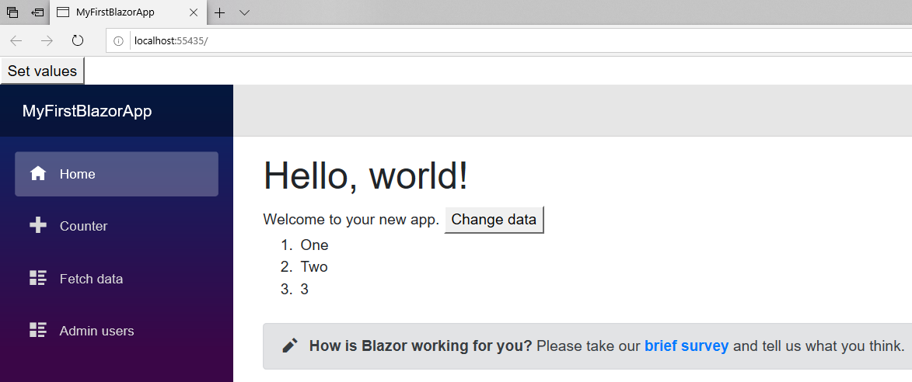

> 原文链接：https://blazor-university.com/components/render-trees/incremental-rendertree-proof/

# 增量渲染树证明
[源代码](https://github.com/mrpmorris/blazor-university/tree/master/src/RenderTrees/IncrementalRenderTreeProof)

为了证明 Blazor 更新了现有的浏览器 DOM 元素，我们将创建一些 JavaScript，这些 JavaScript 将采用 Blazor 生成的元素并以 Blazor 不知道的方式更新它们。然后，我们将让 Blazor 更新其视图并观察 JavaScript 更改并没有丢失。

创建一个默认应用，然后在 **/Pages/Index.razor** 中进行以下更改：

1. 添加具有一些初始值的 `List<string>` 成员。

2. 添加一些标记以呈现该列表的值。

3. 添加一个按钮，单击该按钮将调用 C# 方法来更新列表中的值。

```
@page "/"

<h1>Hello, world!</h1>

Welcome to your new app.
<button @onclick=@ChangeData>Change data</button>

<ol>
    @foreach(string item in Items)
    {
        <li>@item</li>
    }
</ol>

<SurveyPrompt Title="How is Blazor working for you?" />

@code {
    List<string> Items = new List<string> { "One", "Two", "3" };

    void ChangeData()
    {
        Items[0] = "1";
        Items[1] = "2";
        Items.Add("4");
    }
}
```




现在我们有了一些 Blazor 生成的元素，我们需要使用一些 JavaScript 来更改这些元素。编辑 **/wwwroot/index.html**，在开始的 `<body>` 元素内添加一个按钮，在结束的 `</body>` 上方添加对 jQuery 的引用和一些脚本来更新现有的`<li>` 元素。

```
<!DOCTYPE html>
<html>
<head>
    <meta charset="utf-8" />
    <meta name="viewport" content="width=device-width" />
    <title>MyFirstBlazorApp</title>
    <base href="/" />
    <link href="css/bootstrap/bootstrap.min.css" rel="stylesheet" />
    <link href="css/site.css" rel="stylesheet" />
</head>
<body>
    <button id="setValues">Set values</button>
    <app>Loading...</app>

    <script src="_framework/blazor.webassembly.js"></script>

    <script src="https://code.jquery.com/jquery-3.4.1.min.js"
            integrity="sha256-CSXorXvZcTkaix6Yvo6HppcZGetbYMGWSFlBw8HfCJo="
            crossorigin="anonymous"></script>

    <script>
        $(function () {
            $('#setValues').click(function () {
                $('li').each(function () {
                    var $elem = $(this);
                    $elem.attr('originalValue', $elem.text());
                });
            });
        });
    </script>
</body>
</html>
```

- 第 12 行在 HTML 中添加了一个按钮。
- 第 17 行引用了 jQuery。
- 第 21 行添加了一个脚本，该脚本查找所有 `<li>` 元素，获取它们的当前文本，然后将其分配给名为 `originalValue` 的新属性。

运行应用程序，然后右键单击页面上的第一个 `<li>` 元素并检查它。最初，元素将如下所示：

```
<ol>
  <li>One</li>
  <li>Two</li>
  <li>3</li>
</ol>
```

接下来单击页面顶部的新设置值按钮，这将执行 JavaScript 为每个 `<li>` 添加一个新属性以记录它帮助的原始文本。




您现在应该看到浏览器的元素检查器中的元素更改为以下内容：

```
<ol>
  <li originalValue="One">One</li>
  <li originalValue="Two">Two</li>
  <li originalValue="3">3</li>
</ol>
```

最后，单击更改数据按钮。这将执行 C# 代码以更改 `List<string>` 中的值，然后 Blazor 将重新呈现其视图。现在检查元素应显示以下内容：


```
<ol>
  <li originalValue="One">1</li>
  <li originalValue="Two">2</li>
  <li originalValue="3">3</li>
  <li>4</li>
</ol>
```

1. 带有文本“One”的项目的文本更改为“1”。
2. 带有文本“Two”的项目的文本更改为“2”。
3. 带有文本“3”的项目保持不变。
4. 添加带有文本“4”的新项目。

我们可以看到现有元素被重用，因为元素的 `originalValue` 属性不是由 Blazor 生成的，但它们仍然存在。由 Blazor 新创建的新元素没有 `originalValue` 属性。

**[下一篇 - 使用 @key 优化](https://feiyun0112.github.io/blazor-university.zh-cn/render-trees/optimising-using-key)**