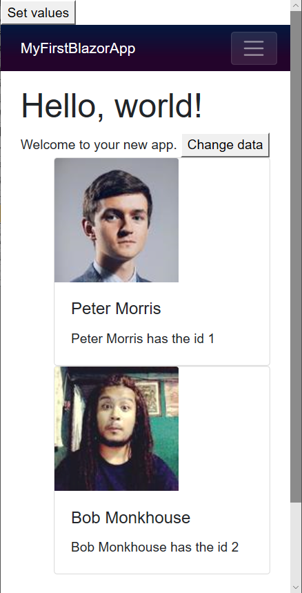

> 原文链接：https://blazor-university.com/components/render-trees/optimising-using-key/

# 使用 @key 优化
[源代码](https://github.com/mrpmorris/blazor-university/tree/master/src/RenderTrees/OptimisingUsingKeys)

**提示：** 对于在运行时循环生成的组件，始终使用 `@key`。

前面的示例运行良好，因为 Blazor 能够轻松地将虚拟 DOM 元素与浏览器 DOM 中的正确元素匹配，当元素匹配成功时，使用更少的更改更容易更新它们。

但是，当重新排列元素时，这变得更加困难。以用户 ID 卡列表为例。



使用[增量渲染树证明](https://feiyun0112.github.io/blazor-university.zh-cn/components/render-trees/incremental-rendertree-proof)作为起点，编辑 **/Pages/Index.razor** 并输入以下标记。


```
@page "/"

<h1>Hello, world!</h1>

Welcome to your new app.
<button @onclick=@ChangeData>Change data</button>

<style>
    .card-img-top {
        width: 150px;
        height: 150px;
    }
</style>
<ol>
    @foreach (Person person in People)
    {
        <li class="card">
            
            <div class="card-body">
                <h5 class="card-title">
                    @person.GivenName @person.FamilyName
                </h5>
                <p class="card-text">
                    @person.GivenName @person.FamilyName has the id @person.ID
                </p>
            </div>
        </li>
    }
</ol>

@code {
    List<Person> People = new List<Person>
    {
        new Person(1, "Peter", "Morris"),
        new Person(2, "Bob", "Monkhouse"),
        new Person(3, "Frank", "Sinatra"),
        new Person(4, "David", "Banner")
    };

    void ChangeData()
    {
        var person = People[0];
        People.RemoveAt(0);
        People.Add(person);    }

    class Person
    {
        public int ID { get; set; }
        public string GivenName { get; set; }
        public string FamilyName { get; set; }

        public Person(int id, string givenName, string familyName)
        {
            ID = id;
            GivenName = givenName;
            FamilyName = familyName;
        }
    }
}
```

该页面与之前显示简单整数列表时的页面基本相同，但现在有以下更改。

- 第 46 行

  定义了一个名为 `Person` 的新类。

  **注意：** 这个新类通常在它自己的源文件中，但为了简单起见，在这个例子中被放置在行内。

- 第 32 行

  定义一个名为 `People` 的私有成员并添加两个项目以显示在视图中。

- 第 40 行

  删除列表开头的人员，并将其添加到列表末尾。

- 第 15 行

  将人员列表呈现为 Bootstrap 提示卡。

现在运行应用程序。单击设置值按钮并检查列表中的元素，我们将看到如下内容：


```
<ol>
  <li class="card" originalValue=" Peter Morris Peter Morris has the id 1">
    ...Html for Peter Morris
  </li>
  <li class="card" originalValue=" Bob Monkhouse Bob Monkhouse has the id 2">
    ...Html for Bob Monkhouse
  </li>
  <li class="card" originalValue=" Frank Sinatra Frank Sinatra has the id 3">
    ...Html for Frank Sinatra
  </li>
  <li class="card" originalValue=" David Banner David Banner has the id 4">
    ...Html for David Banner
  </li>
</ol>
```

但是当我们单击更改数据按钮然后再次检查元素时，我们看到尽管数据中的元素是相同的（只是重新排序），但 HTML 中的所有元素都已更新。从 `originalValue` 表示该元素先前持有的人这一事实可以明显看出这一点，这意味着必须更新许多子元素才能显示正确的 HTML 标记。

```
<ol>
  <li class="card" originalValue=" Peter Morris Peter Morris has the id 1">
    ...Html for Bob Monkhouse
  </li>
  <li class="card" originalValue=" Bob Monkhouse Bob Monkhouse has the id 2">
    ...Html for Frank Sinatra
  </li>
  <li class="card" originalValue=" Frank Sinatra Frank Sinatra has the id 3">
    ...Html for David Banner
  </li>
  <li class="card" originalValue=" David Banner David Banner has the id 4">
    ...Html for Peter Morris
  </li>
</ol>
```

这些更改的增量如下所示：

- 元素 1

  1.jpg => 2.jpg

  Peter Morris => Bob Monkhouse

- 元素 2

  2.jpg => 3.jpg

  Bob Monkhouse => Frank Sinatra

- 元素 3

  3.jpg => 4.jpg

  Frank Sinatra => David Banner

- 元素 4

  4.jpg => 1.jpg

  David Banner => Peter Morris

HTML 元素已针对每个人进行了更改。如果 Blazor 能够检测到元素何时重新排列，那就更好了。这样，当数据重新排列时，从 Virtual DOM 到浏览器 DOM 的 delta 变化也将是一个简单的重新排列。

## 使用@key 识别元素

这正是 `@key` 指令的用途。编辑第 17 行，更改 `<li class=”card”>` 并添加一个键，如下所示：

```
<li class="card" @key=person>
```

1. 运行应用程序。
2. 单击设置值按钮。
3. 单击更改数据按钮。
4. 右键单击列表中的第一项并检查该元素。

现在，我们不会看到元素 1 包含 person 2 的内部 HTML，而是看到内部 HTML 完全保持原样，并且 <li> 元素已简单地重新排列。

```
<ol>
  <li class="card" originalValue=" Bob Monkhouse Bob Monkhouse has the id 2">
    ...Html for Bob Monkhouse
  </li>
  <li class="card" originalValue=" Frank Sinatra Frank Sinatra has the id 3">
    ...Html for Frank Sinatra
  </li>
  <li class="card" originalValue=" David Banner David Banner has the id 4">
    ...Html for David Banner
  </li>
  <li class="card" originalValue=" Peter Morris Peter Morris has the id 1">
    ...Html for Peter Morris
  </li>
</ol>
```

显然，当您希望重新排列数据或从列表末尾以外的任何位置添加/删除任何项目时，在您从列表中呈现项目时使用 `@key` 指令是有利的。

用于 `@key` 的值可以是任何类型的对象。我们可以使用 `Person` 实例本身，或者，如果列表中的实例会发生变化，那么我们可以使用 `Person.ID` 之类的东西。

**[下一篇 - 使用 RenderFragments 模板化组件](https://feiyun0112.github.io/blazor-university.zh-cn/templating-components-with-renderfragements)**