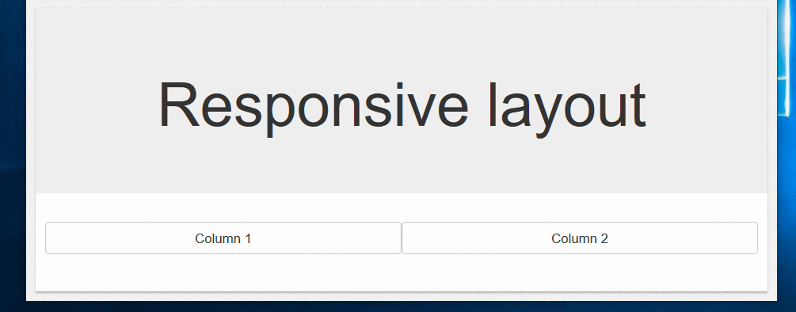
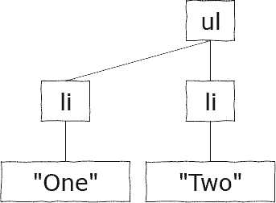
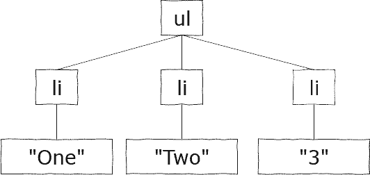
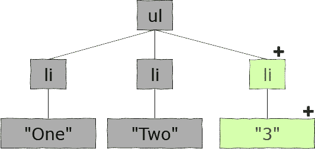
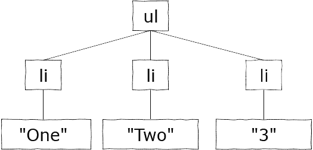
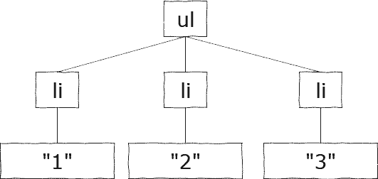
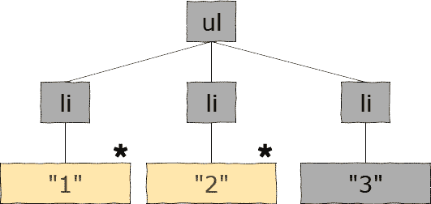

> 原文链接：https://blazor-university.com/components/render-trees/

# 渲染树
当浏览器呈现内容时，它不仅绘制 HTML 中定义的元素，还必须根据页面大小（元素流）计算绘制它们的位置。例如，以下 Bootstrap HTML 将在调整浏览器窗口大小时将元素放置在不同的位置。

```
<div class="jumbotron text-center">
  <h1>Responsive layout</h1>
</div>
  
<div class="container">
  <div class="row">
    <div class="col-sm-6 col-xs-12 btn btn-default">
      Column 1
    </div>
    <div class="col-sm-6 col-xs-12 btn btn-default">
      Column 2
    </div>
  </div>
</div>
```




每当 HTML 元素的属性发生变化（宽度、高度、内边距、边距等）时，浏览器必须在呈现它们之前重排页面上的元素。更新浏览器的文档对象模型 (DOM) 可能会占用大量 CPU，因此速度很慢，尤其是在执行大量更新时。

## 虚拟 DOM
其他客户端工具（例如 React 和 Angular）通过实现虚拟 DOM 和增量 DOM 方法来规避这个问题。

虚拟 DOM 是组成 HTML 页面的元素的内存表示。此数据创建 HTML 元素树，就好像它们已由 HTML 标记页面指定一样。 Blazor 组件通过名为 `BuildRenderTree` 的虚拟方法在其 Razor 视图中创建此虚拟 DOM。例如，标准 **Pages/Index.razor** 页面的 `BuildRenderTree` 如下所示。


```
protected override void BuildRenderTree(Microsoft.AspNetCore.Components.Rendering.RenderTreeBuilder builder)
{
  builder.AddMarkupContent(0, "<h1>Hello, world!</h1>\r\n\r\nWelcome to your new app.\r\n\r\n");
  builder.OpenComponent<MyFirstBlazorApp.Client.Shared.SurveyPrompt>(1);
  builder.AddAttribute(2, "Title", "How is Blazor working for you?");
  builder.CloseComponent();
}
```

构建表示要呈现的视图的数据树有两个显著的好处：

1. 在复杂的更新过程中，这些虚拟 HTML 元素的属性值可以在代码中多次更新，而浏览器不必重新渲染和重排其视图，直到该过程完成。

2. 可以通过比较两棵树并构建一个新树来创建渲染树，该树是两者之间的差异。这使我们能够利用增量 DOM 方法。

## 增量 DOM
增量 DOM 是一种技术，可以最大限度地减少更新浏览器视图中的元素所需的工作量。

能够创建差异树使我们能够使用更新 DOM 所需的尽可能少的更改来表示对视图的更改。这可以在更改显示时节省时间（因此用户体验更好），并且在服务器端 Blazor 应用程序中，这意味着网络上的字节数更少 - 使 Blazor 应用程序在慢速网络或非常偏远的位置更有用。

## 示例 1 – 添加新列表项
假设我们的用户正在使用显示项目列表的 Blazor 应用程序。他们单击一个按钮将一个新项目添加到列表中——自动给出文本“3”。

浏览器中视图的当前虚拟 DOM 由一个包含两个项目的列表组成。



应用程序将一个新项目添加到列表中。 Blazor 在新的虚拟 DOM 中表示这一点。



以下差异树被确定为所需的最少更改次数。在本示例中，是一个新的 `<li>` 和一个新的文本元素“3”。



然后使用差分渲染树来更新浏览器中的实际 HTML DOM。

## 示例 2 – 更改显示文本
用户看到列表“One”、“Two”、“3”并决定他们更愿意看到数字。他们单击另一个按钮，该按钮将每个列表项的文本更改为其在列表中的索引。

浏览器中视图的当前虚拟 DOM 由一个包含三个项目的列表组成。



应用程序更改列表中所有项目的文本。同样，Blazor 在新的虚拟 DOM 中表示这一点。



以下差异树被确定为所需的最少更改次数。在本示例中，只需对现有文本元素进行两次更改。



然后使用差分渲染树来更新浏览器中的实际 HTML DOM。


**[下一篇 - 增量渲染树证明](https://feiyun0112.github.io/blazor-university.zh-cn/render-trees/incremental-rendertree-proof)**