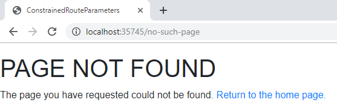

> 原文链接：https://blazor-university.com/routing/404-not-found/

# 404 – Not found
[源代码](https://github.com/mrpmorris/blazor-university/tree/master/src/Routing/PageNotFound)

当 Blazor 无法将 URL 与组件匹配时，我们可能想告诉它要显示什么内容。

`Router` 组件有一个名为 `NotFound` 的 [RenderFragment 参数](https://feiyun0112.github.io/blazor-university.zh-cn/templating-components-with-renderfragements)，它是一个 [RenderFragment](https://feiyun0112.github.io/blazor-university.zh-cn/templating-components-with-renderfragements/)。 当尝试访问无法与任何组件匹配的 URL 时，将显示在 `Router` 组件的此参数中定义的任何 Razor 标记。

```
<Router AppAssembly="typeof(Program).Assembly">
  <Found Context="routeData">
    <RouteView RouteData="routeData" />
  </Found>
  <NotFound>
    <div class="content">
      <h1>PAGE NOT FOUND</h1>
      <p>
        The page you have requested could not be found. <a href="/">Return to the home page.</a>
      </p>
    </div>
  </NotFound>
</Router>
```




**[下一篇 - 通过 HTML 导航](https://feiyun0112.github.io/blazor-university.zh-cn/routing/navigating-our-app-via-html)**