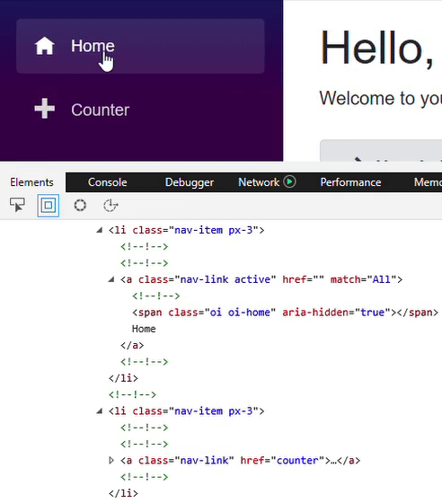
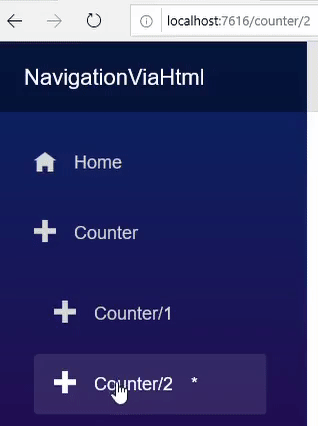
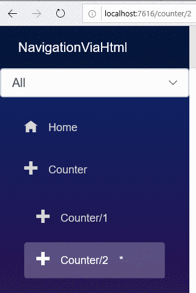

> 原文链接：https://blazor-university.com/routing/navigating-our-app-via-html/

# 通过 HTML 导航
[源代码](https://github.com/mrpmorris/blazor-university/tree/master/src/Routing/NavigatingViaHtml)

链接到 Blazor 组件中的路由的最简单方法是使用 HTML 超链接。

```
<a href="/Counter">This works just fine</a>
```

Blazor 组件中的超链接会被自动拦截。当用户单击超链接时，浏览器不会向服务器发送请求，而是 Blazor 将更新浏览器中的 URL 并呈现与新地址关联的任何页面。

## 使用 NavLink 组件
Blazor 还包括一个用于呈现超链接的组件，并额外支持在地址与 URL 匹配时更改 HTML 元素的 CSS 类。

如果我们查看默认 Blazor 应用程序中的 **/Shared/NavMenu.razor** 组件，我们将标记如下所示：

```
<NavLink class="nav-link" href="counter">
  <span class="oi oi-home" aria-hidden="true"></span> Counter
</NavLink>
```

NavLink 组件使用 HTML 超链接装饰其子内容。所有属性，如 `class`、`href` 等，都通过[属性展开](/components/code-generated-html-attributes/)直接呈现给 `<a>` 元素。 NavLink 组件有两个参数可以提供额外的行为。

`ActiveClass` 参数指定当浏览器的 URL 与 `href` 属性的 URL 匹配时，将哪个 CSS 类应用于呈现的 `<a>` 元素。如果未指定，Blazor 将应用名为“active”的 CSS 类。



## URL 匹配
`Match` 参数标识浏览器的 URL 应如何与 `href` 进行比较，以确定是否应将 `ActiveClass` 添加到元素的类属性中。

在新的 Blazor 应用中编辑 **/Pages/Counter.razor** 文件，以便可以从三个 URL 访问它。

```
@page "/counter"
@page "/counter/1"
@page "/counter/2"
```

然后编辑 **/Shared/NavMenu.razor** 组件，使 `Counter` 菜单项有两个子菜单链接。

```
<li class="nav-item px-3">
  <NavLink class="nav-link" href="counter" Match=@NavLinkMatch.All>
    <span class="oi oi-plus" aria-hidden="true"></span>Counter
  </NavLink>
  <ul class="nav flex-column">
    <li class="nav-item px-3">
      <NavLink class="nav-link" href="counter/1" Match=@NavLinkMatch.All>
        <span class="oi oi-plus" aria-hidden="true"></span>Counter/1
      </NavLink>
    </li>
    <li class="nav-item px-3">
      <NavLink class="nav-link" href="counter/2" Match=@NavLinkMatch.All>
        <span class="oi oi-plus" aria-hidden="true"></span>Counter/2
      </NavLink>
    </li>
  </ul>
</li>
```

同时编辑 `/wwwroot/site.css` 并添加以下内容，以便我们轻松查看哪些 NavLink 元素被认为是“活动的”。

```
.nav-item a.active::after
{
  content: " *";
  margin-left: 1em;
}
```

三个 NavLink 组件导航到 `/counter`、`/counter/1` 和 `/counter/2`，如果我们运行应用程序并单击各种链接，我们将看到以下内容。



## NavLinkMatch
NavLink 组件的 `Match` 参数接受 `NavLinkMatch` 类型的值。这告诉 NavLink 组件您希望浏览器的 URL 与它呈现的 `<a>` 元素的 href 属性如何比较以确定它们是否相同。

在前面的示例中，我们为每个 NavLink 组件的 `Match` 参数指定了 `NavLinkMatch.All`。这意味着我们希望 Blazor 仅在其 `href` 与浏览器的 URL 完全匹配时才认为每个 NavLink 都是活动的。如果我们现在更改链接到 `/counter` 的 NavLink，使其匹配参数为 `NavLinkMatch.Prefix`，我们将看到只要 URL 以 `/counter` 开头，它就会被视为匹配，因此它也会匹配 `/counter/1` 和 `/counter/2`.

为了说明区别，请在 **/Shared/NavMenu.razor** 的代码部分中声明一个字段

```
NavLinkMatch MatchMode = NavLinkMatch.All; 
```

找到 `<div class="@NavMenuCssClass"...` 元素，并在 `<ul>` 元素之前添加以下标记以将 `<select>` 绑定到新字段。

```
<select @bind=MatchMode class="form-control">
  <option value=@NavLinkMatch.All>All</option>
  <option value=@NavLinkMatch.Prefix>Prefix</option>
</select>
```

最后，找到其 `href` 链接到 `/counter` 的 NavLink，并将其 `Match` 参数更改为`@MatchMode`。您的标记现在应该看起来像这样。

```
<div class="top-row pl-4 navbar navbar-dark">
  <a class="navbar-brand" href="">NavigationViaHtml</a>
  <button class="navbar-toggler" @onclick=ToggleNavMenu>
    <span class="navbar-toggler-icon"></span>
  </button>
</div>

<div class="@NavMenuCssClass" @onclick=ToggleNavMenu>
  <select @bind=MatchMode class="form-control">
    <option value=@NavLinkMatch.All>All</option>
    <option value=@NavLinkMatch.Prefix>Prefix</option>
  </select>
  <ul class="nav flex-column">
    <li class="nav-item px-3">
      <NavLink class="nav-link" href="" Match=@NavLinkMatch.All>
        <span class="oi oi-home" aria-hidden="true"></span> Home
      </NavLink>
    </li>
    <li class="nav-item px-3">
      <NavLink class="nav-link" href="counter" Match=@MatchMode>
        <span class="oi oi-plus" aria-hidden="true"></span>Counter
      </NavLink>
      <ul class="nav flex-column">
        <li class="nav-item px-3">
          <NavLink class="nav-link" href="counter/1" Match=@NavLinkMatch.All>
            <span class="oi oi-plus" aria-hidden="true"></span>Counter/1
          </NavLink>
        </li>
        <li class="nav-item px-3">
          <NavLink class="nav-link" href="counter/2" Match=@NavLinkMatch.All>
            <span class="oi oi-plus" aria-hidden="true"></span>Counter/2
          </NavLink>
        </li>
      </ul>
    </li>
  </ul>
</div>

@code {
  NavLinkMatch MatchMode = NavLinkMatch.All;

  bool collapseNavMenu = true;

  string NavMenuCssClass => collapseNavMenu ? "collapse" : null;

  void ToggleNavMenu()
  {
    collapseNavMenu = !collapseNavMenu;
  }
}
```

选择 `Counter/1` 或 `Counter/2` 链接后，切换 `<select>` 的值。



尽管浏览器 URL 保持不变，但我们可以看到第一个 Counter NavLink 根据其 `Match` 参数的设置在活动/非活动之间切换。

**[下一篇 - 通过代码导航](/routing/navigating-our-app-via-code)**