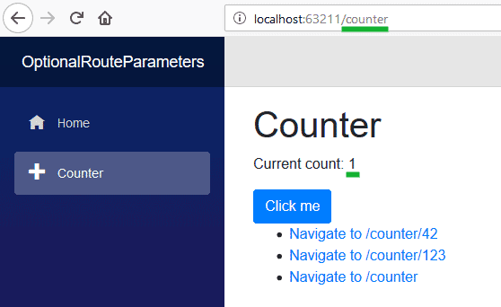
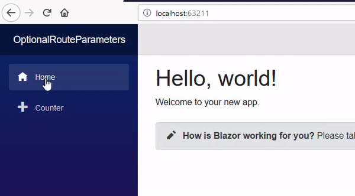
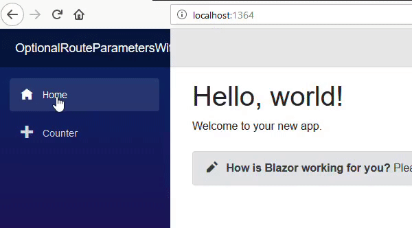

> 原文链接：https://blazor-university.com/routing/optional-route-parameters/

# 可选路由参数
Blazor 不明确支持可选路由参数，但可以通过在组件上添加多个 `@page` 声明轻松实现等效。例如，更改标准 **Counter.razor** 页面以添加额外的 URL。

```
@page "/counter"
@page "/counter/{CurrentCount:int}"
```

将 `int currentCount` 字段更改为参数，如下所示
```
[Parameter] public int CurrentCount { get; set; }
```


然后用 `CurrentCount` 替换所有对 `currentCount` 的引用。还在页面上添加一些导航，以便我们可以快速测试我们的路由

```
@page "/counter"
@page "/counter/{CurrentCount:int}"

<h1>Counter</h1>

<p>Current count: @CurrentCount</p>

<button class="btn btn-primary" @onclick=IncrementCount>Click me</button>

<ul>
  <li><a href="/counter/42">Navigate to /counter/42</a></li>
  <li><a href="/counter/123">Navigate to /counter/123</a></li>
  <li><a href="/counter/">Navigate to /counter</a></li>
</ul>

@code {
  [Parameter]
  public int CurrentCount { get; set; }

  void IncrementCount()
  {
    CurrentCount++;
  }
}
```

当我们运行这个应用程序时，我们看到我们可以导航到 `/counter`（不需要参数）或 `/counter/AnyNumber`（指定参数值）。当 URL 中没有指定值时，将使用属性类型的默认值。

## 为可选参数指定默认值
如果我们希望参数的默认值不是 C# 默认值怎么办？例如，当没有指定 `CurrentCount` 的值时，我们可能希望它默认为 `1` 而不是 `0`。

首先，我们需要将参数属性的类型更改为可空，这样我们就可以区分 `/counter/0` 和只是 `/counter` 之间的区别——如果它为空，则将默认值分配给该属性。

```
[Parameter]
public int? CurrentCount { get; set; }

protected override void OnInitialized()
{
  base.OnInitialized();
  CurrentCount = CurrentCount ?? 1;
}
```
起初这似乎可行，导航到 `/counter` 实际上会将我们的 `CurrentCount` 值默认为 `1`。



但是，这仅在页面第一次显示时有效。如果我们现在使用其中一个链接导航到 `/counter` 而不先导航到另一个页面（例如 `Home`），我们将看到 `CurrentCount` 默认为 `null`。



[源代码](https://github.com/mrpmorris/blazor-university/tree/master/src/Routing/OptionalRouteParameters)


当组件是 `@page` 并且我们的 Blazor 应用导航到呈现相同页面的新 URL 时，Blazor 不会创建组件的新实例来呈现页面，而是将其视为具有更改参数的相同页面.因为这个 `OnInitialized` 只会在第一次创建页面时执行。有关详细信息，请参阅[组件生命周期](/components/component-lifecycles/)。

上一个 URL  | 当前 URL | 是否执行 Counter.OnInit 
--- | --- |---  
/ | /counter  | 是 – 不同的页面
/counter |  /counter/42  | 否 - 同一页面
/counter/42 |  counter/123 |  否 – 同一页面
/counter |  / |  是 - 不同的页面

正确的解决方案是在 `SetParametersAsync` 中设置默认值——只要参数发生变化并且它们的值被推送到组件的属性中，例如在导航期间，就会调用该值。

```
[Parameter]
public int? CurrentCount { get; set; }

public async override Task SetParametersAsync(ParameterView parameters)
{
  await base.SetParametersAsync(parameters);
  CurrentCount = CurrentCount ?? 1;
}
```



**[下一篇 - 404 – Not found](/routing/404-not-found)**