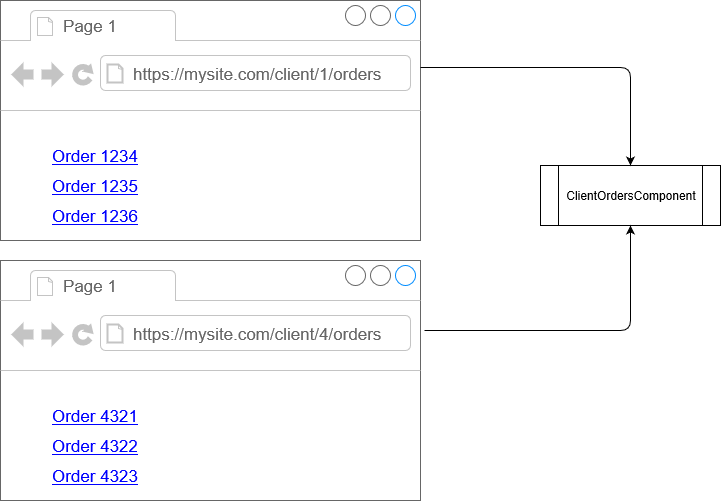

> 原文链接：https://blazor-university.com/routing/

# 路由
与标准 ASP.NET MVC 一样，Blazor 路由是一种用于检查浏览器 URL 并将其匹配到要呈现的页面的技术。

路由比简单地将 URL 匹配到页面更灵活。它允许我们根据文本模式进行匹配，例如，上图中的两个 URL 都将映射到同一个组件并传入一个 ID 用于上下文（在本例中为 1 或 4）。

## 模拟导航
当 Blazor 应用导航到同一应用中的新 URL 时，它实际上并没有在传统的 WWW 意义上导航。不会向请求新页面内容的服务器发送请求。相反，Blazor 会重写浏览器的 URL，然后呈现相关内容。

另请注意，当导航到解析为与当前页面相同类型的组件的新 URL 时，组件不会在导航之前被销毁，并且不会执行 `OnInitialized*` 生命周期方法。导航被简单地视为对组件参数的更改。

**[下一篇 - 定义路由](/routing/defining-routes)**