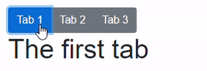

> 原文链接：https://blazor-university.com/templating-components-with-renderfragements/creating-a-tabcontrol/

# 创建一个 TabControl 组件
[源代码](https://blazor-university.com/templating-components-with-renderfragements/creating-a-tabcontrol/)

接下来我们将创建一个 TabControl 组件。这将教您如何实现以下目标：

1. 将数据传递到 `RenderFragment` 以为其提供上下文。
2. 使用 `CascadingParameter` 将父 `TabControl` 组件传递到其子 `TabPage` 组件。



## 使 TabPage 知道其父级
第一步是创建两个组件。一个命名为 `TabControl`，另一个命名为 `TabPage`。 `TabPage` 组件将需要对其父 `TabControl` 的引用，这将通过 `TabControl` 将自身设置为 `CascadingValue` 中的值来实现，并且 `TabPage` 将通过 `CascadingParameter` 获取该值。

```
<div>This is a TabControl</div>
<CascadingValue Value="this">
  @ChildContent
</CascadingValue>

@code {
  // Next line is needed so we are able to add <TabPage> components inside
  [Parameter]
  public RenderFragment ChildContent { get; set; }
}
```
```
<div>This is a TabPage</div>
@ChildContent

@code {
  [CascadingParameter]
  private TabControl Parent { get; set; }

  [Parameter]
  public RenderFragment ChildContent { get; set; }

  protected override void OnInitialized()
  {
    if (Parent == null)
      throw new ArgumentNullException(nameof(Parent), "TabPage must exist within a TabControl");
    base.OnInitialized();
  }
}
```

## 使 TabControl 知道其所属页面
更改 `TabPage` 组件，以便通过在其 `OnInitialized` 方法的末尾添加以下行来通知其父级它的存在。

```
Parent.AddPage(this);
```

更改 `TabControl` 组件以添加 `AddPage` 方法并存储引用。另外，让我们添加一个 `ActivePage` 属性。

```
public TabPage ActivePage { get; set; }
List<TabPage> Pages = new List<TabPage>();

internal void AddPage(TabPage tabPage)
{
  Pages.Add(tabPage);
  if (Pages.Count == 1)
    ActivePage = tabPage;
  StateHasChanged();
}
```

## 为每个 TabPage 呈现一个选项卡
向 `TabPage` 组件添加一个 `Text` 参数，以便其父 `TabControl` 知道要在激活每个页面的按钮内显示什么文本。

```
[Parameter]
public string Text { get; set; }
```


然后将以下标记添加到 `TabControl`（就在呈现 `ChildContent` 的位置上方），这将呈现选项卡，并在单击选项卡时更改选择哪个 `TabPage`。

```
<div class="btn-group" role="group">
  @foreach (TabPage tabPage in Pages)
  {
    <button type="button"
      class="btn @GetButtonClass(tabPage)"
      @onclick=@( () => ActivatePage(tabPage) )>
      @tabPage.Text
    </button>
  }
</div>
```

标记将创建一个标准的 `Bootstrap` 按钮组，然后为每个 `TabPage` 创建一个具有以下显著特征的按钮：

1. CSS 类设置为“btn”，由 `GetButtonClass` 方法返回附加内容。如果选项卡是 `ActivePage`，这将是“btn-primary”，如果不是，则为“btn-secondary”。

2. 单击按钮时，它将激活为其创建按钮的页面。

  **注意：** `@onclick` 需要一个无参数的方法，所以在 `@() ` 中使用了一个 `lambda` 表达式来使用正确的 `TabPage` 执行 `ActivatePage`。

3. 按钮的文本设置为 `TabPage` 的 `Text` 属性的值。

并将以下内容添加到 `TabControl` 的代码部分。

```
string GetButtonClass(TabPage page)
{
  return page == ActivePage ? "btn-primary" : "btn-secondary";
}

void ActivatePage(TabPage page)
{
  ActivePage = page;
}
```

## 使用选项卡控件
将以下标记添加到页面并运行应用程序。

```
<TabControl>
  <TabPage Text="Tab 1">
    <h1>The first tab</h1>
  </TabPage>
  <TabPage Text="Tab 2">
    <h1>The second tab</h1>
  </TabPage>
  <TabPage Text="Tab 3">
    <h1>The third tab</h1>
  </TabPage>
</TabControl>
```

## 仅显示活动页面
此时 `TabControl` 将显示所有 `TabPages`。要解决此问题，只需更改 `TabPage` 中的标记，使其仅在它是其父 `TabControl` 的 `ActivePage` 时才呈现其 `ChildContent`。

```
@if (Parent.ActivePage == this)
{
  @ChildContent
}
```

**[下一篇 - 将数据传递给 RenderFragment](https://feiyun0112.github.io/blazor-university.zh-cn/templating-components-with-renderfragements/passing-data-to-a-renderfragement)**