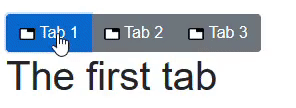

> 原文链接：https://blazor-university.com/templating-components-with-renderfragements/passing-data-to-a-renderfragement/

# 将数据传递给 RenderFragment
[源代码](https://github.com/mrpmorris/blazor-university/tree/master/src/TemplatedComponents/PassingDataToARenderFragment)


到目前为止，我们使用了仅包含子标记的 `RenderFragments`，然后在渲染组件时按原样包含子标记。除了标准的 `RenderFragment` 类之外，还有一个通用的 `RenderFragment<T>` 类，可用于将数据传递到 `RenderFragment`。

## 允许用户指定模板
更改 `TabControl` 组件并在 `ChildContent` 参数下添加一个新的 `TabTextTemplate` 参数属性。

```
[Parameter]
public RenderFragment ChildContent { get; set; }

[Parameter]
public RenderFragment<TabPage> TabTextTemplate { get; set; }
```

然后更改 foreach 循环中的标记。我们需要做的是检查是否设置了 `TabTextTemplate`；如果没有，那么我们照常渲染，如果已经设置，那么我们执行 `TabTextTemplate RenderFragment`，从 `foreach` 循环中传入 `TabPage`。

```
<CascadingValue Value="this">
  <div class="btn-group" role="group">
  @foreach (TabPage tabPage in Pages)
  {
    <button type="button"
      class="btn @GetButtonClass(tabPage)"
      @onclick=@( () => ActivatePage(tabPage) )>

    @if (TabTextTemplate != null)
    {
      @TabTextTemplate(tabPage)
    }
    else
    {
      @tabPage.Text
    }
  </button>
    }
  </div>
  @ChildContent
</CascadingValue>
```

要设置 `TabTextTemplate`，我们需要在使用 `TabControl` 的页面中编辑标记。只需在 `<TabControl>` 元素内添加 `<TabTextTemplate>` 元素即可完成此操作，只要将 `TabPage` 的标记呈现到 `TabControl` 的选项卡中，该模板内的所有内容都将被视为要使用的 `RenderFragment`。

```
<TabControl>

  <TabTextTemplate>
    Hello
  </TabTextTemplate>

  <TabPage Text="Tab 1">
    <h1>The first tab</h1>
  </TabPage>
  <TabPage Text="Tab 2">
    <h1>The second tab</h1>
  </TabPage>
  <TabPage Text="Tab 3">
    <h1>The third tab</h1>
  </TabPage>
</TabControl>
```

但是，一旦您这样做，编译器就会抱怨以下错误消息。

```
组件“TabControl”内无法识别的子内容。组件“TabControl”通过以下顶级项目接受子内容：“ChildContent”、“TabTextTemplate”。
```

当您的组件中只有一个 `RenderFragment` 参数并且它被命名为 `ChildContent` 时，Blazor 将假定每当我们使用该组件并在我们想要将其分配给 `ChildContent` 的开始和结束标记之间包含内容。但是一旦我们在消费者的标记中有两个 `RenderFragment`，Blazor 就不能假定所有内容都应该分配给 `ChildContent` 参数。此时，组件的用户必须显式创建一个 `<ChildContent>` 元素来保存内容。

为了明确意图，可以将 `ChildContent` 属性重命名为 `Tabs`。

```
<TabControl>

  <TabTextTemplate>
    Hello
  </TabTextTemplate>

  <ChildContent>
    <TabPage Text="Tab 1">
      <h1>The first tab</h1>
    </TabPage>
    <TabPage Text="Tab 2">
      <h1>The second tab</h1>
    </TabPage>
    <TabPage Text="Tab 3">
      <h1>The third tab</h1>
    </TabPage>
  </ChildContent>
</TabControl>
```

## 在 RenderFragment 中访问上下文
到目前为止，`TabControl` 组件将为每个 `TabPage` 的选项卡只显示文本“Hello”。我们需要的是访问正在呈现的 `TabPage`，以便我们可以输出其 `Text` 属性的值。注意 `TabControl` 组件中 `TabTextTemplate` 的使用。

```
 @if (TabTextTemplate != null)
 {
  @TabTextTemplate(tabPage)
 }
 else
 {
   @tabPage.Text
 }
 ```

在 `foreach` 循环中创建了一个 HTML `<button>`，并且在该按钮中，前面的代码用于输出应显示给用户单击的内容。如果 `TabTextTemplate` 为空，则呈现 `@tabPage.Text`，但如果 `TabTextTemplate` 不为空（组件用户已指定模板），则呈现模板，并传入循环的当前 `tabPage` 以获取上下文。

当使用 `RenderFragment<T>` 类的通用版本时，我们必须在渲染该片段时传递 `<T>` 的值。传递给片段的值可通过名为 `context` 的特殊变量获得。然后可以使用它来准确确定要渲染的内容。在我们的例子中，我们希望使用一些额外的标记来呈现 `TabPage.Text` 属性。

```
<TabTextTemplate>
   @context.Text
</TabTextTemplate>
```



## 避免 @context 名称冲突
如果名称 `context` 与组件中的另一个标识符冲突，则可以通过在 `RenderFragment` 上使用 `Context` 属性来指示 Blazor 逐个使用不同的名称。

例如，前面演示的 TabTextTemplate 标记可以改为如下编写。

```
<TabTextTemplate Context="TheTab">
   @TheTab.Text
</TabTextTemplate>
```

**[下一篇 - 使用 @typeparam 创建通用组件](https://feiyun0112.github.io/blazor-university.zh-cn/templating-components-with-renderfragements/using-typeparam-to-create-generic-components)**