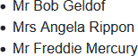
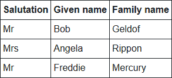

> 原文链接：https://blazor-university.com/templating-components-with-renderfragements/passing-placeholders-to-renderfragments/

# 将占位符传递给 RenderFragments
[源代码](https://github.com/mrpmorris/blazor-university/tree/master/src/TemplatedComponents/PassingPlaceholdersToRenderFragments)

说明：此页面的灵感来自用户 ℳisterℳagoo 的 Twitter 帖子。

首先，声明 `RenderFragment<RenderFragment>` 类型的 `[Parameter] `属性可能看起来不直观，或者可能有点奇怪。

```
[Parameter]
public RenderFragment<RenderFragment> ChildContent { get; set; }
```

事实上，如果您曾经创建过自定义 Blazor 布局，那么您已经熟悉了类似的概念。

`RenderFragment<T>` 中的 `<T>` 作为 `@context` 变量传递给用户指定的标记。布局使用名称 `@Body` 而不是 `@context`，但 `@Body` 实际上是一个 `RenderFragment`。为了证明这一点，编辑 `/Shared/MainLayout.razor` 文件并将 `@Body` 更改为以下内容。

```
@Body.GetType().Name
```

现在我们将看到类名，而不是显示 `@Body` 渲染的内容，它恰好是 `RenderFragment`。

虽然这并不是 Blazor 布局的工作原理，但它是一个有用的比较，有助于理解声明 `RenderFragment<RenderFragment>` 类型的 `[Parameter]` 属性背后的原理。

```
<div class="our-main-layout">
  @Body
</div>
```

在前面的虚构布局中，我们可以将整个标记想象为某个父组件的 `ChildContent RenderFragment`，而第 3 行的 `@Body` 相当于 `@context（命名为 Body）`，我们可以选择在我们希望的任何地方注入。 在本示例中，我们选择将 `Body` 注入 HTML `<div>` 元素中。。

对应的等价代码

```
<OurComponent>
  <p>
    @context
  </p>
</OurComponent>
```

或者，如果我们想使用名称 `Body（或任何其他名称）` 而不是上下文，我们可以指定用于上下文的名称。请参阅将[数据传递给 RenderFragment](/templating-components-with-renderfragements/passing-data-to-a-renderfragement/) 末尾的**避免 @context 名称冲突**部分。

```
<OurComponent Context="FragmentWeNeedToRender">
  <div class="our-wrapped-fragment">
    @FragmentWeNeedToRender
  </div>
</OurComponent>
```

## 创建一个工作示例
首先，创建一个我们可以用来绑定一些数据的类。

```
public class Person
{
  public string Salutation { get; set; }
  public string GivenName { get; set; }
  public string FamilyName { get; set; }
}
```

### 创建一个简单的模板化重复组件
此详细信息类似于[使用 @typeparam 创建通用组件](/templating-components-with-renderfragements/using-typeparam-to-create-generic-components/)一节中介绍的内容。

接下来，我们需要在 **/Shared** 中创建一个名为 **DataList.razor** 的新组件。该组件将是一个通用组件（使用 `@typeparam`），并将采用一个 `IEnumerable<TItem>` 并迭代可枚举以使用其使用者指定的模板呈现每个项目的内容。

```
@typeparam TItem
<ul>
  @foreach (TItem item in Data ?? Array.Empty<TItem>())
  {
    @ItemTemplate(item)
  }
</ul>
@code
{
  [Parameter]
  public IEnumerable<TItem> Data { get; set; }

  [Parameter]
  public RenderFragment<TItem> ItemTemplate { get; set; }
}
```

这个组件可能会被我们的 `Index` 页面使用，如下所示：

```
@page "/"

<DataList Data=@Data>
  <ItemTemplate>
    <li @key=context>@context.Salutation @context.GivenName @context.FamilyName</li>
  </ItemTemplate>
</DataList>

@code
{
  private IEnumerable<Person> People;
  protected override void OnInitialized()
  {
    base.OnInitialized();
    People = new Person[]
    {
      new Person { Salutation = "Mr", GivenName = "Bob", FamilyName = "Geldof" },
      new Person { Salutation = "Mrs", GivenName = "Angela", FamilyName = "Rippon" },
      new Person { Salutation = "Mr", GivenName = "Freddie", FamilyName = "Mercury" }
    };
  }
}
```

**注意：** `<li>` 元素中的 `@key=context` 用于优化性能，应在呈现列表时使用。有关更多信息，请参阅[使用 @key 进行优化](/render-trees/optimising-using-key/)。

### 问题
如果我们的 `DataList` 组件不仅输出项目列表怎么办。也许它有一个页脚，允许用户使用“上一个”/“下一个”按钮一次显示一页元素，还有一个页脚显示总共有多少项目？

我们可以简单地将这个额外的标记添加到我们的 `DataList` 组件中，但是如果我们的组件的使用者也想要以不同的方式呈现列表怎么办？也许他们需要在一个地方将分页列表显示为 HTML `<table>`，而在其他地方显示 HTML `<ul>`？

```
<div class="paged-data-list">
  <div class="paged-data-list_header">
    @Data.Count() item(s)
  </div>
  <div class="paged-data-list_body">
    <!-- Consumer wants either a <table> or a <ul> here -->
    @foreach(TItem item in CurrentPageOfData)
    {
      @ItemTemplate(item)
    }
    <!-- Consumer wants either a </table> or a </ul> here -->
  </div>
  <div class="paged-data-list_footer">
    <button type="button" etc>Prev</button>
    <button type="button" etc>Next</button> 
  </div>
</div>
```
这正是需要我们让用户传入 `RenderFragment<RenderFragment>` 的原因。

### 在 RenderFragment 中渲染 RenderFragment
现在我们的 `ItemTemplate` 接收了 `Person` 类型的 `@context` 以呈现每个元素，我们需要允许我们的组件的使用者指定在第一个元素之前和最后一个元素之后要包含的内容 - 如前面的代码中突出显示的那样第 6 行和第 11 行的示例。

组件使用代码看起来类似于以下两个示例中的任何一个
```
<DataList Data=@People>
   <ItemTemplate Context="person">
    <li @key=person>
      @person.Salutation @person.FamilyName, @person.GivenName
    </li>
  </ItemTeplate>
</DataList>

<DataList Data=@People>
  <ListTemplate Context="allPeople">
    <ul Type="A">
      @allPeople
    </ul>
  </ListTemplate>
  <ItemTemplate Context="person">
    <li @key=person>
      @person.Salutation @person.FamilyName, @person.GivenName
    </li>
  </ItemTemplate>
</DataList>
```


- 第 2 行

  定义要用于列表的模板。在这种情况下，我们用 `<ul>` 和 `</ul>` 包装我们的内部内容（我们的数据项“allPeople”）。

- 第 4 行

  执行通过我们选择称为“allPeople”的上下文变量传递的 `RenderFragment` 来指示在何处渲染项目标记。

- 第 7 行

  为每个项目指定一个模板。在这种情况下，上下文将是 `Person` 的一个实例，因此我们选择通过指定 `Context="person"` 以名称“person”来引用上下文。

### 将渲染的内容作为占位符传递给消费者显示
`DataList` 组件需要呈现 `Data` 属性中的每个项目，然后将其传递给使用者以决定在其 `ListTemplate` 中的哪个位置呈现该输出。或者，更准确地说，`DataList` 需要传递一个 `RenderFragment`，它会在执行时呈现项目的标记。

首先，我们将 `ListTemplate` 属性添加到我们的 `DataList` 组件中。

```
[Parameter]
public RenderFragment<RenderFragment> ListTemplate { get; set; }
```

接下来，我们将更改我们的 `DataList`，以便当消费者没有指定 `ListTemplate` 时它使用 `<ul>` 和 `<li>` 作为默认值，之后我们将处理组件使用者确实想要使用自定义 `ListTemplate` 的场景.

### 使用默认列表模板进行渲染
这是简单的部分。我们需要做的就是编写我们的标记，就好像组件上没有 `ListTemplate` 这样的东西，就像我们通常那样——但前提是 `ListTemplate` 属性为空。

```
@typeparam TItem
@if (ListTemplate == null)
{
  <ul>
    @foreach (TItem item in Data ?? Array.Empty<TItem>())
    {
      @ItemTemplate(item)
    }
  </ul>
}

@code
{
  [Parameter]
  public IEnumerable<TItem> Data { get; set; }

  [Parameter]
  public RenderFragment<TItem> ItemTemplate { get; set; }

  [Parameter]
  public RenderFragment<RenderFragment> ListTemplate { get; set; }
}
```

- 第 2 行

  检查 `ListTemplate` 是否为空

- 第 4-9 行

  如果 `ListTemplate` 为 null，那么我们渲染一个标准的 `<ul>` 列表，然后使用 `ItemTemplate` 渲染 `Data` 中的元素。

### 使用自定义 ListTemplate 进行渲染
`RenderFragment<TItem>` 期望我们在每次渲染它时传递一个 `TItem` 实例。这很简单，因为我们有一个 `IEnumerable<TItem>` ，我们可以从中提取要渲染的值，但是当我们需要将 `RenderFragment` 的实例传递给我们的模板时该怎么办？

要定义非泛型 `RenderFragment`，我们可以使用标准 Razor 转义序列来表示 HTML，即`@`：

```
RenderFragment rf = @<h1>Hello</h1>;
```

要定义 `RenderFragment<T>`，我们需要使用传入 `T` 实例的 lambda 表达式

```
RenderFragment<Person> rf = 
  person => @<h1>Hello @person.Name</h1>;
```
那么我们如何返回一个 `RenderFragment`，它只会在渲染时循环遍历 `Data` 属性中的项目？为此，我们需要使用 `wig-pig` 语法。


### wig-pig

`wig-pig` 是 Razor 渲染引擎可用于表示 C# 文件中的 Razor 标记块的一组字符。出于显而易见的原因，此字符序列仅适用于 `.razor` 文件。如有雷同，纯属巧合。

**注意：** `@:@{` 实际上是两个字符序列。第一个 `@:` 告诉 Razor 解析器将以下文本视为 Razor 标记，然后 `@{` 是 C# 代码块的开始——它显然会在某个地方以补充 `}` 结束。最终，这给了我们一大块 Razor 标记，它相当于一个带有 C# 代码的 `RenderFragment`，它可以执行诸如循环之类的操作。

在 Razor 文件中调用 `@ListItem(...)` 时，我们可以使用 `wig-pig` 语法将 `RenderFragment` 作为参数传递。

```
@ListTemplate(
  @:@{
    foreach (TItem item in Data ?? Array.Empty<TItem>())
    {
      @item.ToString()
    }
  }
)
```
使用这种语法，我们渲染组件使用者在 `<ListTemplate>` 中指定的标记，并传入一个 `RenderFragment`，该 `RenderFragment` 将渲染 `Data` 中的所有元素。在前面的代码中，它只是对 `Data` 中的每个项目调用 `ToString()`。但是，理想情况下，我们希望组件使用者为我们提供的 `ItemTemplate`。

```
@ListTemplate(
  @:@{
    foreach (TItem item in Data ?? Array.Empty<TItem>())
    {
      @ItemTemplate(item)
    }
  }
)
```

**DataList.razor**
```
@typeparam TItem
@if (ListTemplate == null)
{
  <ul>
    @foreach (TItem item in Data ?? Array.Empty<TItem>())
    {
      @ItemTemplate(item)
    }
  </ul>
}
else
{
  @ListTemplate(
    @:@{
      foreach (TItem item in Data ?? Array.Empty<TItem>())
      {
        @ItemTemplate(item)
      }
    }
  )
}

@code
{
  [Parameter]
  public IEnumerable<TItem> Data { get; set; }

  [Parameter]
  public RenderFragment<TItem> ItemTemplate { get; set; }

  [Parameter]
  public RenderFragment<RenderFragment> ListTemplate { get; set; }
}
``` 

## 使用我们的 DataList
### 示例 1：一个简单的列表
```
<DataList Data=@People>
  <ItemTemplate>
    <li @key=context>@context.Salutation @context.GivenName @context.FamilyName</li>
  </ItemTemplate>
</DataList>
```

生成以下 HTML

```
<ul>
    <li>Mr Bob Geldof</li>
    <li>Mrs Angela Rippon</li>
    <li>Mr Freddie Mercury</li>
</ul>
```




### 示例 2：一个 HTML 表格
```
<DataList Data=@People>
  <ListTemplate Context="listOfPeople">
    <table border=1 cellpadding=4>
      <thead>
        <tr>
          <th>Salutation</th>
          <th>Given name</th>
          <th>Family name</th>
        </tr>
      </thead>
      <tbody>
        @listOfPeople
      </tbody>
    </table>
  </ListTemplate>
  <ItemTemplate Context="person">
    <tr @key=@person>
      <td>@person.Salutation</td>
      <td>@person.GivenName</td>
      <td>@person.FamilyName</td>
    </tr>
  </ItemTemplate>
</DataList>
```

生成以下 HTML

```
<table cellpadding="4" border="1">
  <thead>
    <tr>
      <th>Salutation</th>
      <th>Given name</th>
      <th>Family name</th>
    </tr>
  </thead>
  <tbody>
    <tr>
      <td>Mr</td>
      <td>Bob</td>
      <td>Geldof</td>
    </tr>
    <tr>
      <td>Mrs</td>
      <td>Angela</td>
      <td>Rippon</td>
    </tr>
    <tr>
      <td>Mr</td>
      <td>Freddie</td>
      <td>Mercury</td>
    </tr>
  </tbody>
</table>
```



## 未指定 RenderFragments 时分配默认值
目前，我们必须在视图中使用 `@if` 语句检查 `ListTemplate` 是否为 null，我们甚至没有检查 `ItemTemplate` 是否已设置。这些方法都不是理想的。

相反，如果组件使用者没有设置我们的 `RenderFragment` 属性，我们应该将它们设置为所需的默认值。这样我们组件的渲染逻辑就可以变得更加简单。

```
@ListTemplate(
  @:@{
    foreach(TItem item in CurrentPage)
    {
      @ItemTemplate(item)
    }
  }
)
```

在我们的组件中重写 `OnParametersSet()` 并确保 `ItemTemplate` 属性不为空。为此，我们创建一个接收 `TItem` 并返回 `RenderFragment` 的 lambda（使用 `wig-pig` 语法）。

```
  protected override void OnParametersSet()
  {
    if (ItemTemplate == null)
    {
      ItemTemplate = (item) => @:@{ 
      <li @key=item>@item.ToString()</li>}
      ;
    }
}
```

为了确保 `ListTemplate` 不为空，我们创建了一个接收 `RenderFragment` 的 lamba，并返回我们自定义的 `wig-pig RenderFragment`。

```
    if (ListTemplate == null)
    {
      ListTemplate = _ => @:@{ 
      <ul>
        @foreach(TItem item in CurrentPage)
        {
          @ItemTemplate(item)
        }
      </ul>
      }
    ;
    }
```
**注意：** ;不能与前面的 } 在同一行，否则 Razor 解析器无法正确解析源。这已被报告为一个错误，并有望在不久的将来得到修复。

## 总结
当组件使用者希望在其标记中为将在渲染期间传递给他们的内容识别占位符时，应使用 `RenderFragment<RenderFragment>` 技术 - 例如 Blazor 布局中的 `Body` 占位符。

希望本节可以帮助您了解何时使用此技术，以及如何使用 `wig-pig @:@{` 语法来就地生成 `RenderFragments`。

## 补充阅读
本节的源代码包括一个[使用 `PagedDataList` 组件](https://github.com/mrpmorris/blazor-university/blob/master/src/TemplatedComponents/PassingPlaceholdersToRenderFragments/Shared/PagedDataList.razor)的附加示例页面。

**[下一篇 - 路由](/routing/)**