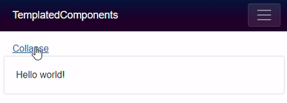

> 原文链接：https://blazor-university.com/templating-components-with-renderfragements/

# 使用 RenderFragments 模板化组件
[源代码](https://github.com/mrpmorris/blazor-university/tree/master/src/TemplatedComponents/TemplatedComponents)

到目前为止，我们已经创建了基于参数生成 100% 渲染输出的组件，但组件并不总是那么简单。有时我们需要创建将组件使用者提供的标记与他们自己的渲染输出混合的组件。

将内容作为 HTML 编码的字符串参数传递给组件会非常混乱（更不用说难以管理）：

```
<Collapsible content="Lots of encoded HTML for your entire view here"/>
```

而且，除了维护的噩梦之外，嵌入的 HTML 也只能是基本的 HTML 标记，没有 Blazor 组件。基本上，它是没有用的，而且显然不应该这样做。正确的方法是使用 `RenderFragment`。

## 子内容
如果我们创建一个名为 `Collapsible` 的新组件（一个完全空的 .razor 文件），如您所见，我们可以在 **Index.razor** 页面中使用它，如下所示：

```
<Collapsible/>
```

但是如果我们想嵌入一些内容呢？试一试，然后查看浏览器控制台输出中的错误。

```
<Collapsible>Hello world!</Collapsible>
```

```
WASM：System.InvalidOperationException：“TemplatedComponents.Components.Collapsible”类型的对象没有与名称“ChildContent”匹配的属性。
```


## RenderFragment 类

现在更改 `Collapsible` 组件，使其具有名为 `ChildContent` 的属性，一种 `RenderFragment` 类型，并确保使用 `[Parameter]` 属性对其进行修饰。

```
@code {
  [Parameter]
  public RenderFragment ChildContent { get; set; }
}
```

这些是 Blazor 用于将嵌入内容注入组件的标准。嵌入的内容可能是您想要的任何内容；纯文本、HTML 元素、更多 razor 标记（包括更多组件）以及嵌入内容的内容，可以通过添加 `@ChildContent` 输出到组件标记中的任何位置。

```
<div class="row">
  <a href="#" @onclick=Toggle class="col-12">@ActionText</a>
  @if (!Collapsed)
  {
    <div class="col-12 card card-body">
      @ChildContent
    </div>
  }
</div>

@code
{
  [Parameter]
  public RenderFragment ChildContent { get; set; }

  [Parameter]
  public bool Collapsed { get; set; }

  string ActionText { get => Collapsed ? "Expand" : "Collapse"; }

  void Toggle()
  {
    Collapsed = !Collapsed;
  }
}
```


## 多个渲染片段
当我们在组件内编写标记时，Blazor 将假定它应该分配给组件上的一个参数，该参数是从 `RenderFragment` 类派生的并命名为 `ChildContent`。如果我们希望使用不同的名称或多个渲染片段，那么我们必须在标记中明确指定参数的名称。

```
<MyComponent>
  <Header>
    <h1>The header</h1>
  </Header>
  <Footer>
    This is the footer
  </Footer>
  <ChildContent>
    The ChildContent render fragment must now be explicitly named because we have
    more than one render fragment parameter in MyComponent.

    It doesn't have to be named ChildContent.
  </ChildContent>
</MyComponent>
```

在前面的示例中，我们只需要显式指定 `<ChildContent>`，因为我们显式使用了一个或多个其他渲染片段（页眉和页脚）。如果我们不想指定 `<Header>` 和 `<Footer>` 则无需显式命名 `<ChildContent>`，Blazor 将假定 `<MyComponent>` 和 `</MyComponent>` 之间的所有标记都是为 `ChildContent` 渲染片段。

有关详细信息，请参阅[将数据传递给 RenderFragment](/templating-components-with-renderfragements/passing-data-to-a-renderfragement/)。


**[下一篇 - 创建一个 TabControl 组件](/templating-components-with-renderfragements/creating-a-tabcontrol)**